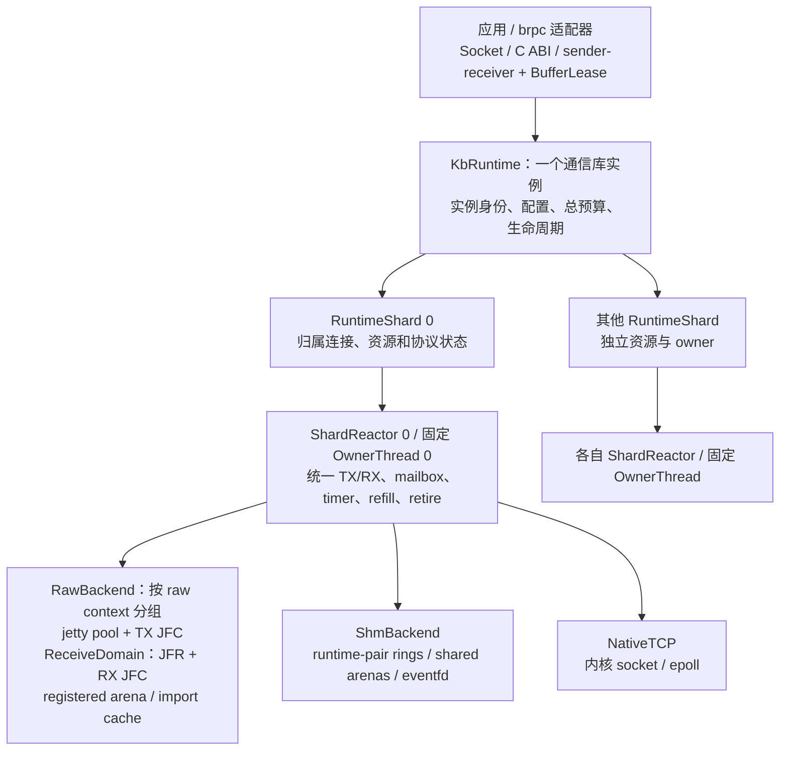

# kbsocket 架构设计 V1

> 状态：设计提案，尚未完成实现及性能验收。本文记录当前会话的约束、架构演进、源码分析和用户提供的测试结果，不把设计目标写成已经验证的能力。
>
> 初稿整理日期：2026-09-14；tracing 细化更新：2026-09-15；tail-based sampling 增补：2026-09-16；shard/reactor 与资源所有权细化：2026-09-18。目标：替换 `ubs-comm/src/ubsocket`，在单容器 40k 连接规模下提供低开销的 UB 加速，并以 40k 次建链/秒为验收目标。

## 1. 最终决策与适用边界

V1 定位为：**连接内有序、故障显式失败的 socket 加速库；跨机加速基于 raw URMA RM_CTP，同机增加有授权门禁的 SHM 后端，NativeTCP 保留为兼容路径及性能基线；既有连接不做无损传输迁移。** 同机 TCP 核验、SHM spec 与上线门禁见第 18 节。

| 主题 | V1 决策 | 原因与代价 |
|---|---|---|
| UB 传输模式 | 仅 RM_CTP | RM_TP 的 TP 内存开销不能满足当前 40k 连接约束；不保留依赖它的扩展方案 |
| 设备访问 | 直接操作 raw 设备/context | 去掉 bonding 正常路径的 WR shadow、引用与锁开销；放弃 bonding 内部逐 WR 故障重发 |
| 故障语义 | 旧加速连接失败，上层决定重连；新连接重新选择 SHM/UB/TCP | 删除跨传输重放和恢复状态；上层必须处理请求执行结果不确定性 |
| 同宿主机 | 规划 runtime-pair SHM；通过授权、正确性及性能门禁后优先使用，不可用则选本机 TCP | 常见同机 TCP 不必经过物理网卡；SHM-copy 主要省协议栈，真正零拷贝另需共享 BufferLease |
| socket 语义 | 保留连接内有序读取、部分读写、反压、明确错误 | 不向现有 socket 调用者暴露 RM_CTP 的接收乱序 |
| 物理资源 | 逻辑连接与 jetty/JFR/JFC 解耦，按 owner shard 和 raw context 池化 | 资源规模不再与逻辑连接一一对应；接受共享 lane 的故障影响范围 |
| 并发模型 | 一个 shard、一个 reactor、一个固定 owner 线程，统一推进所属 TX/RX；外部通过有界提交队列接入 | 以资源所有权分片消除队列争用，不按业务收发方向拆线程；跨 owner 提交仍有成本 |
| 小包 | inline / registered copy，按负载批处理 | inline、CQ moderation 和批量 post 各有独立条件，不假定“越大越快” |
| 流控 | peer runtime 共享的长期小基础窗口＋弹性池；RNDV 独立做字节与 DMA 准入 | 避免逐 socket 小窗口卡住首请求；基础授信是有限容量承诺，不是无限首发 |
| 大包 | RNDV READ 为基础，增加有能力门禁的主动 WRITE | WRITE 更适配本地多 SGE 的 writev；远端可见性与 grant 回收必须验证 |
| TX CQE | 全 signal 建立正确性基线，验证后按物理 SQ 自适应 selective signaling | 不直接把 consumer index 前进解释为跨目标、跨 opcode 的累计成功 |
| multi-rail | 保留路径抽象，当前负载先按 peer runtime 归属接收域，不默认单消息跨 rail 条带化 | 避免把一份基础授信复制到四个 JFR；当前数据也未证明双物理端口收益 |
| 运行模式 | busy-poll 与事件模式共用同一 progress 状态机 | 正确性不依赖持续忙轮询；仅等待策略不同 |
| 可观测性 | 常驻 metrics；启用因果诊断时全请求有界轻量暂存、尾部优先保留慢/错请求及少量正常对照；高成本 detail 限时采集 | 尾采样主要减少导出而非前置埋点开销；以 Perfetto 展示/查询，预算丢弃与缺失可见，详见第 19 节及 19.17 |
| 依赖 | 核心不依赖 brpc；C ABI、socket 兼容层、可选 P2300 风格接口分层 | sender/receiver 提供组合与生命周期模型，不替代网络运行时 |

### 1.1 从“无损 TCP 切换”收敛到“失败后重连”

会话最初考虑维护未完成 WR 列表，UB 故障后经原 TCP fd 重发，进而构建可跨传输恢复的可靠字节流。最终选择不实施这一方案。

原因不只是代码复杂：CQE 与对端应用执行结果不是同一件事。没有 CQE 的 WR 可能已经到达；有本地 CQE 也不能普遍解释为远端应用已经接收或处理。只重发“没有 CQE 的 WR”无法同时避免重复和遗漏。无损切换还需要连接级交付确认、重放缓存、去重、恢复握手，以及 UB/TCP 并发到达时的统一顺序。

V1 删除：

- 为跨传输恢复维护的发送重放日志、连接级数据 ACK/SACK、恢复 offset 和迁移握手。
- UB 故障后的库内业务重发，以及后台将既有 TCP 连接重新升级为 UB。
- 为了未来重放而长期保留已经满足源内存复用条件的 buffer。

V1 仍保留：

- 已接受 WR 的完成账本、内存租约和故障清理状态；它们服务于资源安全，不服务于业务重放。
- RM_CTP 乱序重组、RNDV 完成通知、接收 credits、连接身份与代际。
- 设备错误传播、路径健康缓存、新连接降级协商。

### 1.2 是否提高“包的利用率”

需要区分三种收益：

1. **CPU、内存与状态效率：有明确的结构性改善。** 删除重放、恢复确认和切换状态，减少持有 buffer 的时间及异常分支。
2. **线速有效载荷占比：可能改善，但不能直接量化。** 可以减少仅为无损恢复而存在的确认/恢复控制流量；普通数据仍需 demux、顺序与长度等元信息。不能承诺每个 4 KiB 包都因此增加多少 payload。
3. **故障期间业务有效吞吐：可能变差。** 已建立连接必须失败，上层重连与重试可能重新执行或重传整个请求。这是主动接受的取舍。

“packet-based”并不意味着有序 socket 必须额外复制一遍所有数据。V1 用轻量顺序适配和 slice 队列满足 socket 语义，不在其上再构建一套跨故障重传协议。若未来提供 message API，可暴露消息边界，但它不能直接取代已有字节流调用者。

## 2. 约束、证据与验收目标

### 2.1 硬件约束

以下来自用户描述，是本设计的输入；实施时应通过设备能力查询和硬件文档确认，而不是硬编码为所有 UB 设备的通则。

- 可实际采用的模式只有 RM_CTP。
- RM_CTP 双边 SEND 的单 WR 最大数据量为 4 KiB；协议头占用其中空间。
- 单边 READ/WRITE 不受这一 4 KiB 限制，当前设备单次可操作约“200M”数据。原始描述未明确 MB/MiB，能力字段必须以查询到的字节数记录。
- 单个共享 JFR 最大深度为 32,768。以每个 WR 4 KiB 计算，承载的接收 buffer 总量上限约为 128 MiB，不是无限的连接级缓存。
- 后续流控讨论按一个端点可配置 4 个这样的接收域计算：最大合计 131,072 RQE、约 512 MiB 接收 buffer。它们仍是四个独立预算，不能把某一域的空额度用于向另一已满 JFR 发送；最大值也不意味着必须满配。
- 现有 bonding 对外暴露聚合设备，底层涉及 4 个 raw 设备/端口资源，分布在 2 个 IOdie，每个 IOdie 有 2 个 port。设备、context、EID 和物理 port 的实际映射需要运行时确认。
- 旧 jetty pool 为 100 时，曾以一半 `{0,1}`、一半 `{1,0}` 的 port 优先序分散正常流量。这是 bonding 的选择策略，不能原样当作 raw 的物理映射。

### 2.2 证据等级与源码快照

本文使用三个等级：

- **实测记录**：用户贴出的结果，完整保留在第 14 节；没有在本次文档整理中重新跑性能测试。
- **源码确认**：本地实现中可直接观察到的控制流或数据结构，不自动扩展为完整硬件保证。
- **设计/假设**：拟实现机制或待实验验证的解释，不能作为已达标能力。

源码基线：

| 仓库 | 基线与范围 |
|---|---|
| `umdk` | `c164b85668ad51b0c022ed707bc07fe3ca472e27` |
| `ubs-comm` 历史问题分析 | 从 `5dfb3ae64071f56be443a65bf5f68bcc9cc13388` 之后，选取修复分析至 `7d62be17078589b7e630bb9252c349ce3f2c6c5b`；不是该区间每个提交的完整审计 |
| `ubs-comm` 初稿整理时 HEAD | `d0669a66d68daec58ee659ff8479f5c9637c9ed5`；对 ArraySet、cooldown 和相关建链路径做了增量复核，不是对新 HEAD 的全面审计 |
| `ubs-comm` 流控增补时 HEAD | `d5127e13bf229545f56fea5418e925f9b2b82ba9`；只增量复核初始授信、低水位申请、WR 截断和相关历史修复，未全面审计新增提交 |
| `ubs-comm` tracing 核验 HEAD | `acbaa8eddd3ce3511cfa3c0388b8c19f6ee60631`；核验 PROF、SplitTrace、packet/stage trace 与离线 join，不将旧文档中的打点接线视为当前仍有效 |
| `brpc` 压测语义补充 | `fa93433265827196490182271b2af6fda9ae1153`；检查 `example/ub_test` 等当前工具，不认定现场必然使用此版本 |
| Linux 同机 TCP 核验 | 上游 `torvalds/linux` 的 `v6.16` tag 及 6.16 内核文档；是指定版本的源码结论，不代表已核验测试机的厂商补丁、CNI、路由或实际数据路径，详见第 18 节 |
| 测试机二进制/驱动/固件 | 未提供准确版本；perftest 语义分析以本地 `umdk` 为条件依据 |

### 2.3 性能目标必须定义口径

“40k 连接”和“40k 次建链/秒”是两个独立目标：前者衡量稳态资源，后者衡量准入与握手能力。

建链成功必须至少满足双方 READY、接收路由已发布，并能完成首个有效数据交换；不能只数 `socket()`、TCP connect 或本地句柄创建。需要分别测量：

- 热运行时、已预建池、相同 peer 的大量逻辑连接。
- 新 peer 引入的 endpoint import、协商与缓存未命中。
- 冷启动时设备/context、注册内存、物理池初始化。
- 40k 常驻连接与 40k/s 创建/关闭并存时的内存、尾延迟和回收滞后。

物理队列尽量按 `O(shards × raw contexts × lanes)` 增长；逻辑连接状态仍是 `O(connections)`。若 40k 连接对应 40k 个不同远端 endpoint，远端导入与路由状态不可能凭池化自动变成常数。

FD 上限、backlog、临时端口、容器 CPU 配额、内核 socket 内存和双方 CPU 成本也属于验收口径。目前没有数据证明 40k/s 已经实现。

### 2.4 已确认的 full-mesh 目标负载

本节来自用户后续明确补充，是第 9 节流控基线的依据，不是已经完成的 full-mesh 测试结果。

| 参数 | 已确认含义 |
|---|---|
| 组网 | 3000 个客户端与 3000 个服务端 full-mesh |
| 连接关系 | 合计 900 万条逻辑连接；该实验中每个端点有 3000 个对端，不是每容器 900 万条连接 |
| 客户端 QPS | 每个客户端进程总共 1000 请求/s；每秒可以向 1000 个服务端各发一个请求，不是每个 peer 1000 QPS |
| `queue_depth=10` | 每个客户端进程跨全部 peer 合计最多 10 个在途请求，不是每条连接各 10 个 |
| 消息大小 | 1K、10K、100K、1M 分别压测，不是四种大小等比例混合 |
| 响应 | 与请求等长；请求与响应都要配置相应数据路径和预算 |
| 容器 | 每个客户端、服务端均为 4 CPU、16G 内存 |
| 与 40k 目标的关系 | 40k 是库需承载的连接规模；本负载最多约 3000 个活跃客户端。逻辑连接数、peer runtime 数、已准入暖窗口数不能混为一谈 |

下述容量计算统一用 KiB/MiB；部署时应以实际字节配置确认用户所称 K/M 的单位。假设请求长期均匀分布到全部服务端，则：

- 全局请求率为 300 万 QPS，每服务端平均为 1000 QPS。
- 每对 client/server 平均约 1/3 QPS，即约 3 秒一次请求。
- 稳态客户端合计在途请求上限为 30000，不是 `3000×3000×10`。每服务端的实际在途取决于分布与时延，不能由此认为每个服务端也被硬限制为 10。
- 每客户端以 QD=10 达到 1000 QPS，要求平均请求驻留时间满足约 10 ms 的必要上界；这不是 p99 SLA，也不是实际性能保证。

均匀 1000 QPS、请求响应等长时，每端点的 payload 吞吐如下。客户端 TX 为请求、RX 为响应，服务端相反；TX+RX 只是主机双向处理量，不是单方向线速需求。

| 请求/响应各自大小 | TX MiB/s | RX MiB/s | TX+RX MiB/s | 数据路径基线 |
|---|---:|---:|---:|---|
| 1 KiB | 0.9766 | 0.9766 | 1.9531 | eager，通常 1 个 SEND WR |
| 10 KiB | 9.7656 | 9.7656 | 19.5313 | eager，通常 3 个 SEND WR |
| 100 KiB | 97.6563 | 97.6563 | 195.3125 | 请求和响应均走 RNDV |
| 1 MiB | 1000.0000 | 1000.0000 | 2000.0000 | 请求和响应均走 RNDV |

实际 WR 数还受协议头、SGE 限制和打包效果影响，表中不含控制/协议流量。上述长期平均不能排除同步 incast，也不能与第 14 节的持续小工作集 raw READ 带宽直接对比。

## 3. 总体架构与所有权



图中展开一个 shard，其余 shard 遵循相同所有权约束，但不要求复制全部 raw context。每个逻辑连接固定归属一个 shard 和已选 backend；TCP/本地协商、授权、健康探测与事件同样纳入有界推进。每线程执行环境称为 reactor，进程内通信实例称为 runtime，详见第 3.3 节。

### 3.1 模块边界

| 模块 | 负责 | 不负责 |
|---|---|---|
| `SocketAdapter` | fd、errno、部分读写、epoll 兼容 | 直接持有 provider queue 指针作为连接身份 |
| `Connection` | 顺序空间、可读区间、发送额度、FIN/错误 | 一连接独占一个 JFR 或 jetty |
| `KbRuntime` | 实例身份、shard 集合、配置、总预算与生命周期协调 | 把所有数据面操作集中到一个全局锁或队列 |
| `RuntimeShard` | 一组连接、物理资源、协议状态及本地账本的所有权 | 与其他 shard 共同修改同一热队列或连接状态 |
| `ShardReactor` | 在固定 owner 线程推进 mailbox、CQ、refill、timer、retire | 在 hot poller 内执行阻塞操作或无界用户回调 |
| `RawBackend` | 能力查询、post、CQE、flush、设备对象生命周期 | 推断业务是否执行或跨连接重放 |
| `ShmBackend` | runtime-pair ring、共享 slab/lease、eventfd、pair 生命周期 | 把任意进程指针当共享地址，或把同机误当同一信任域 |
| `LocalRendezvous` | 本地身份和策略校验、会话绑定、FD 交换 | 进入 payload 热路径，或绕过容器隔离与服务授权 |
| `TraceFacade / TraceRecorder` | 稳定事件、操作关联、非阻塞有界候选记录；尾部保留决定、预算/丢失统计；adapter 注入 RPC 上下文 | 解析业务 payload、阻塞数据面等待日志写盘、把尾采样误作事后补录或零埋点成本 |
| `LanePool` | 物理 SQ 调度、AttemptLedger、故障隔离范围 | “当前借用 socket”式唯一归属 |
| `ReceiveDomain` | 共享 JFR、接收槽和 credits | 给每个空闲连接预留固定大窗口 |
| `MemoryManager` | 注册内存、slice、lease、grant 安全回收 | 将普通裸指针隐式视作可异步 zero-copy |
| `HealthRegistry` | 故障分类、抑制、有限探测、新连接准入 | 到期自动证明健康或批准释放 DMA 内存 |

### 3.2 单 owner 不等于所有调用都多一次线程切换

- 调用线程已经是目标 shard owner 时允许直接提交，避免给低延迟场景固定增加 mailbox 跳转。
- 其他线程使用有界 MPSC；高频注册生产者可使用 SPSC 分片，最终由 owner 合并。
- 不把 40k 个连接每轮扫描一遍；只调度 active connection、到期 timer、待回收队列。
- 用户 completion 默认投递到约定 scheduler；只有明确接受执行预算的回调才能在 progress 上内联。
- 禁用 provider 锁的前提是相关队列的所有 post/poll/refill 真正由同一 owner 操作，而不是只让 TX 单线程。

这样优先消除“共享可变状态”，再优化必须跨线程的入口，不把全库宣称为 wait-free。

### 3.3 Runtime、shard、reactor 与线程

本文采用以下术语，避免把通信端点身份与本地线程数量混为一谈：

| 术语 | 含义 | V1 关系 |
|---|---|---|
| `KbRuntime / RuntimeInstance` | 一个通信库实例，通常每进程一个；拥有独立 incarnation 和生命周期 | 包含 N 个 shard；同进程若创建多个实例，身份与预算仍需显式区分 |
| `Shard / RuntimeShard` | 连接、队列、buffer 和协议状态的所有权分区，回答“哪些状态归谁” | 一个 shard 有一个 reactor |
| `ShardReactor` | 事件循环与本地调度器，回答“如何推进工作” | 固定运行于一个 owner 线程 |
| `OwnerThread` | 执行该 reactor 的 OS 线程，回答“谁实际执行” | V1 不迁移 reactor，不允许其他线程同时代跑 |
| CPU core | 线程获得执行时间的硬件资源 | 可按 NUMA/CPU 预算绑核；线程绑定与独占 CPU 配额不是同一保证 |

因此，用户提出的“一 shard、一线程、一个本地 runtime”在本文表述为 **一个 shard、一个 reactor、一个固定 owner thread**。三者在 V1 一一对应，但概念不同；实现可以由一个 `RuntimeShard` 对象聚合这些成员，不必人为增加多层抽象。

`peer runtime`、授信关系中的 runtime instance、SHM runtime-pair 和 tracing 的 `runtime_instance_id` 均指 `KbRuntime` 实例身份，不指每线程 reactor。增加 shard 不自动增加远端 peer 数、基础窗口或 SHM pair。进程级身份/配置不要求热路径集中执行：队列、额度子账和内存缓存仍由 shard 本地持有。

V1 在建链/绑定阶段选择稳定 owner，优先让同一 peer runtime 的相关连接归属同一 shard，以复用授信和 SHM pair。owner 选择需检查实际资源与准入预算，不假定哈希必然均匀；活跃连接不做动态迁移。热点需要跨 shard 扩展时，必须显式增加资源域、子额度或 pair lane，不能直接搬动仍有在途操作的连接。

### 3.4 执行模型的取舍与完整所有权

高性能框架没有唯一线程模型。以下是架构参考，不是 kbsocket 已获得同等性能的证据：

| 模型 | 收益与代价 | 对 kbsocket 的选择 |
|---|---|---|
| 全栈按核分片 | 网络、协议和业务尽量同核，减少交接；业务必须非阻塞、可分片并协作让出 CPU | 保留受控同 owner 直通能力，不要求已有 brpc 业务整体改造 |
| I/O shard + 独立业务执行器 | 通信进度不被普通业务回调拖住，易接入现有 RPC 框架；需要提交/完成交接 | V1 默认：reactor 管通信，业务回到约定 scheduler |
| 按接收、处理、发送阶段划分流水线 | 可独立配置阶段吞吐，但增加 ring、排队、同步与缓存迁移 | 作为未来有测量依据的对照，不默认拆成 TX/RX 两线程 |

Seastar 使用按核分片、协作式任务调度与显式跨核消息；SPDK 强调状态由单一执行上下文拥有，通过消息请求 owner 操作，并把逻辑执行上下文与底层 OS 线程框架解耦；DPDK 同时描述同核 run-to-completion 和跨核 pipeline。这些机制提供取舍依据，不要求引入其库依赖。[Seastar](https://docs.seastar.io/master/tutorial.html#_seastar)、[SPDK](https://spdk.io/doc/concurrency.html)、[DPDK](https://doc.dpdk.org/guides/prog_guide/ethdev/ethdev.html)

对每个 shard，单 owner 必须覆盖完整资源闭环，而不是仅限制 `poll_jfc()`：

- SQ 的 post、TX CQ 消费、AttemptLedger、错误/flush 和退休协调属于同一 owner。
- JFR 的 RX CQ 消费、refill、已投递数量和授信总账属于同一 owner。
- Connection 的 RNDV、接收重组、连续可读边界与控制消息由该 owner 修改；应用领取 slice 不成为协议状态的第二个修改者。
- 其他线程经有界 mailbox 提交请求，buffer 归还也有明确通道。V1 不让 timer/reaper 线程通过 try-lock 临时协助 poll 同一 CQ，不让通用线程池偷取 owner-affine 操作。
- 可阻塞的创建、导入、注册等控制操作进入有界控制执行器；半成品完成后交回 owner 发布，不并发修改活动队列。销毁仍遵守第 12.3 节的物理终结顺序。
- 单线程可管理大量异步在途操作，不阻塞等待单个 READ/WRITE；协程或 sender/receiver 不改变 owner 约束。状态在挂起/回调重入前必须一致，单线程不消除取消、重入和生命周期问题。

这个模型降低共享状态竞争，但不自动解决热连接不公平、物理 SQ 的 HOL、设备带宽上限或 owner 被 OS/cgroup 延迟调度。它必须与第 12 节的有界公平推进配套，也不能仅凭“每 shard 一线程”就关闭共享 context 对象表、MR 注册或 provider 全局状态的同步。

## 4. FD 查询、ABA 与生命周期

### 4.1 ArraySet 的问题不是只换一个无锁 deferred 队列

现有 [ArraySet](ubs-comm/src/ubsocket/csrc/common/ubsocket_set.h) 的核心风险是：读线程原子加载对象指针后，再增加引用计数；两者之间，写线程可能已移除对象。额外引用和 deferred 队列只有在真正覆盖所有旧读者之后才能安全释放。单纯“延迟一点再减引用”没有建立这个证明。

V1 建议：

- fd 表槽位发布不可变 `FdBinding`，读侧使用成熟的 hazard-pointer 保护与重检机制；不要手写未经验证的 acquire/release 组合。
- 安全取得引用或投递到 owner 后尽早退出 hazard 保护；不跨任意用户阻塞长期持有保护。
- retire 分片到 owner/domain，批量回收；高频查询不访问一个全局 deferred mutex。
- 明确 idle、线程退出、运行时关闭时的回收推进，不能依赖“未来总有新的网络流量”。
- 内部完成路径使用稳定 ID/ledger，不再通过 fd 查询连接。

选 hazard pointers 是为了适配任意应用线程和可能阻塞的 socket 调用；受控 owner 内部可以采用更便宜的局部 epoch/QSBR，但必须保证 quiescent point，不能被停顿读者无限拖住整个全局回收域。标准 hazard-pointer 提案提供保护/退休模型，并不自动提供本库所需的及时、可控 shutdown 回收策略。[P2530R3](https://www.open-std.org/jtc1/sc22/wg21/docs/papers/2023/p2530r3.pdf)

### 4.2 身份必须分层

| 身份 | 作用 |
|---|---|
| `fd + binding_generation` | 区分同一整数 fd 的不同绑定，防止旧 readiness/关闭事件命中新对象 |
| `ConnId / SessionId` | 每次新连接唯一；重连不是旧 session 的恢复 |
| `LaneId + lane_epoch` | 区分物理 jetty 重建前后的提交、完成与健康事件 |
| `OpId + op_generation` | 定位已接受 WR/操作记录，避免槽位循环复用的 ABA |
| `GrantId + grant_generation` | 区分 RNDV 暴露的内存区间及其授权周期 |

wire demux ID 应在接收域和会话中可校验，关闭后保留必要 tombstone/代际信息；整数 fd 不能作为远端连接身份。代际宽度与回绕策略要明确，不允许带有迟到事件的 ID 被快速重新分配。

### 4.3 CPU 回收和 DMA 回收是两套条件

```text
逻辑 close / failure
  → fd 解绑、拒绝新操作、发布连接错误状态
  → 已 post 的 AttemptLedger 继续存活
  → 硬件终结 + 必需 CQ/flush 处理 + 远端 grant 终结
  → provider 对象 / 注册内存具备释放条件
  → CPU reader grace 条件也满足后，最终释放软件对象
```

fd 可以先被系统复用，旧 DMA 不可以因此失去归属。现有 raw CQE 解析会解引用 provider 内部 queue 地址；仅给 kbsocket 的 `OpId` 加 generation，无法挽救已经提前释放的 provider queue。[raw CQ 解析](umdk/src/urma/hw/udma/udma_u_jfc.c)

发布连接错误不等于归还借用内存。借用用户源或目标 buffer 的 I/O，无论以成功、错误还是取消完成，都必须满足接口约定的不再访问条件；不能先完成操作，让用户复用 buffer，再由后台继续 DMA。库自有 staging 可以隔离，用户借用的 buffer 则必须继续持有其有效租约。

物理对象销毁、内存 deregister、buffer 复用必须分别有条件；“对象已从表中移除”“引用计数暂时为零”“冷却 60s 已到”都不是设备不会再访问的证明。

## 5. 异步建链、P2300 与 TCP 兼容

### 5.1 建链状态机

```text
NEW → TCP_CONTROL_CONNECTED → NEGOTIATING
                              ├─ 同机、获授权且 SHM 门禁通过
                              │             → 映射/路由就绪 → 双方 READY → SHM_ACTIVE
                              ├─ UB 可准入 → endpoint/import 就绪
                              │             → RX 路由发布 → 双方 READY → UB_ACTIVE
                              └─ 双方同意 TCP 且 wire 干净 → TCP_ACTIVE

任何阶段失败 / timeout / stop → 恰好一次完成 → 独立资源清理
```

协商至少携带版本、能力、session、endpoint/接收域信息、协商结果及最大帧/内存限制。不要先对外宣布 READY，再发布 fd/ConnId 到 RX demux 表；历史上这会使第一包落入黑洞。

SHM 是同一协商边界内的新增候选，不是在发送业务字节后再探测升级。可信本地 rendezvous 可以承载已部署的能力发现/控制；初版仍兼容已有 TCP 控制入口。确认同机但 SHM 不可用时，默认候选为 NativeTCP，不为该本机连接强制初始化 UB 资源；细化选择规则见第 18.3 节。

### 5.2 sender/receiver 的正确角色

用 P2300 风格描述 `async_connect / async_accept / async_read / async_write / async_close` 的异步组合、scheduler 与停止请求。C ABI 和 socket 兼容层不暴露模板实现细节，也不要求所有用户工具链已经提供可用的标准库实现。

`KbRuntime` 组织各 shard 的 reactor，后者负责所属 nonblocking TCP、epoll/JFCE、timer 和 UB progress。无法非阻塞化的 URMA 导入/控制调用进入有界控制线程池；不能因为包装成 sender 就在 poller 里执行阻塞调用。

关键约束：

- 操作启动后，正常、错误、超时、取消竞争只能产生一次 completion。
- receiver completion 可能立即销毁 operation state；调用 completion 后不能继续访问该 state。
- stop 是请求，不等于已经取消硬件访问；已提交 DMA 的内存终结仍走后台安全回收。
- 需要返回给用户源或目标内存复用权的操作，不能仅为快速响应 stop/error 而提前结束借用生命周期；这也覆盖 async_read、READ 本地目标和原生 WRITE 接收目标。

这些约束与 P2300 的 operation-state/异步完成模型一致；网络后端和具体取消协议仍需自行实现。[P2300R10](https://www9.open-std.org/JTC1/SC22/WG21/docs/papers/2024/p2300r10.html)

### 5.3 达到 40k/s 的建设重点

- 启动或扩容时预建有界 lane、共享接收域、注册 slab，不在每个 connect 上创建整套物理资源。
- 同 peer endpoint import 使用缓存和 single-flight；引用与淘汰跟随 endpoint generation。
- endpoint 交换与互不依赖的本地准备并行；保留最终双方一致的 READY/降级结果。
- 准入有界，timeout 使用 timer wheel/堆等 owner 定时器，不每连接一线程。
- listener、native TCP 和 synthetic readiness 都有公平预算，避免内部事件压住内核 accept。

### 5.4 降级只能发生在清晰的协商边界

V1 每条连接 backend 在建立成功后固定。旧 UB/SHM 断开后，上层建立一条新连接；重新检查同机授权、SHM 资源及 raw 路径健康，再选择 SHM、UB 或 TCP。已处于 TCP 的连接不随健康恢复自动升级；SHM 也不在故障后原地转为 TCP。

不能向未知的纯 TCP 应用随意写入私有 UB 探测字节，再声称“透明降级”：对方可能已经把它当业务数据。部署需明确协商入口/能力发现与旧协议兼容策略。若握手失败导致 TCP wire 不再干净，应关闭并按协议重新建连，不能把残留协商字节交给应用。

兼容层必须用测试矩阵声明支持范围：至少覆盖 read/write/readv/writev、nonblocking connect、accept、close/shutdown、SO_ERROR、epoll LT/ET/ONESHOT，以及原生 TCP 不受拦截逻辑干扰。其他 socket 选项、dup/fork 等行为必须明确支持或限制，不能默认全 POSIX 等价。

## 6. 连接内顺序：保留薄适配，不构建重放协议

RM_CTP 的发送有序不能直接推出接收有序。接收端还可能遇到“大包 RNDV 尚未完成，后续 eager 小包已到达”。要替换字节流调用者，仍需共同的逻辑顺序空间。

建议每连接使用单调逻辑字节区间，或能无歧义映射到字节区间的 frame sequence。帧头至少表达会话/demux、类型、长度与顺序；RNDV 控制另带 transfer/grant 身份。具体字段压缩留待 wire-format 设计与测量，不先承诺固定头长。

- 顺序到达的快路径：比较期望位置，挂入 slice 队列，推进连续可读边界。
- 乱序慢路径：有界保存缺口后的 frame/已完成区间，不向用户越洞交付。
- RNDV 在预留的逻辑区间完成后才能推进可读边界；后续 eager 不能穿过它。
- 缺口持续超过策略期限或底层报告致命错误时，连接失败；V1 不发起软件 ARQ。
- FIN 携带最终顺序位置，只有前缀连续完整才成为干净 EOF。传输错误不能伪装成正常 FIN。

乱序缓存保存 slice/描述符，不必再复制全部 payload；其内存仍必须计入接收预算。事件通知基于“连续可读字节”，不是“来了一个 RX CQE”。

## 7. Raw 资源池、multi-rail 与故障隔离

### 7.1 一个 jetty 可以服务多个 socket 和多个目标

本地 raw provider 非 RC 路径逐 WR 使用 `wr->tjetty`，表明 RM 物理发送队列具备逐 WR 选择远端目标的接口基础。现有“一个 jetty 借给某 socket，直到它的 CQE 收干净才换人”的做法不是必须保留的抽象。[逐 WR 目标选择](umdk/src/urma/hw/udma/udma_u_jfs.c)

V1 以 `AttemptLedger` 记录每个被 provider 接受的 WR：lane epoch、提交序号/WQEBB 范围、OpId、ConnId、目标、opcode、buffer/grant 租约、signal 状态。批量 post 部分成功时，仅已接受的前缀进入在途集合；未接受后缀仍是待提交操作。

逻辑连接关闭只撤销该连接的新提交与未提交工作，不销毁共享 jetty/JFR。已 post 的记录直到满足完成/终结条件才退休，不需要让 lane 一直“归关闭的 socket 借用”。

### 7.2 JFC/JFR 的共享边界

同一 raw context 内，可以给多个 jetty 配置已有 TX JFC 和共享 JFR；共享 JFR 的 trans_mode/order_type 等参数必须一致。创建对象最终使用所属 context 的设备句柄，RX CQE 查找也使用该 context 的对象表。[共享配置](umdk/src/urma/lib/urma/core/urma_cp_api.c)、[对象创建](umdk/src/urma/lib/urma/core/urma_cmd.c)

因此采用：

- 每个 `{raw context, owner shard, pool}` 少量 TX JFC，优先一池一个 TX JFC。
- 每个接收域一个共享 JFR，配套 RX JFC；TX/RX CQ 分开便于不同预算和故障处理，但仍由同一个所属 shard reactor 推进，不代表拆成两个线程。
- 不同 raw 设备/context 各自有物理 JFC，可由一个 owner 软件聚合轮询，不宣称跨四个设备共用一个硬件 CQ。
- 同一共享 JFR 的所有 RX completion 与 refill 归同一 owner。V1 在不同 owner 间分配独立接收域，可分配已有域或另建域，不让多个 worker 共同消费原 JFR，也不以共享 mutex 作为常规数据面扩展方式。

一个巨大 CQ 可以减少对象数，却增加竞争、错误风暴和单 owner 工作量。池大小按实际 SQ 利用率、CPU 预算、CQ 安全容量和故障隔离测量，不继承固定 `pool=100`。

#### 7.2.1 三元组表示共享边界，不是三层线程

| 维度 | 含义 | 不能作出的推论 |
|---|---|---|
| `raw context` | 裸设备相关的 URMA 对象上下文，限定队列/CQ 所属硬件上下文 | 一个线程管理四个 context，不等于它们能共用一个硬件 JFC；context 也不是端口编号 |
| `owner shard` | post、poll、协议账本与回收的唯一修改者 | 两个 shard 使用同一 context，不等于可以共同消费其中同一个 CQ |
| `pool` | 同 context、同 owner 下的一组 jetty/SQ，用于调度和资源分组 | pool 不是额外线程，也不天然保证硬件故障完全隔离 |

若 pool 已记录唯一的 context 和 owner，实现中不必再重复维护三层目录。每 pool 一个 TX JFC 是首版策略，不是硬件强制的一一对应关系；同 context、同 owner 的多个软件 pool 可在能力允许时评估共享 TX JFC，CQ 容量或调度压力也可能要求拆分。任何共享都保持唯一消费者，故障影响仍按第 7.5 节验证。

TX pool 与 `ReceiveDomain` 分开：前者组织 SQ/TX 完成，后者组织 JFR/RX 完成及接收授信。同 context、同 owner 且参数兼容的多个 pool 可以共享一个接收域，不机械地“一新增 pool 就新增 JFR”。context 句柄是否跨 shard 共用另行核验 provider 契约；即便共用，队列仍各有 owner，注册/导入/对象表生命周期也不能因此省略同步。

#### 7.2.2 四个 raw context 的布局示例

以下假设每个实际使用的 `{context, shard}` 配置一个 pool、一个 TX JFC、一个 JFR 和一个 RX JFC；仅作数量推导，不承诺设备或容器允许任意复制对象：

| 布局 | Owner 线程 | Pool | TX JFC | JFR | RX JFC | 取舍 |
|---|---:|---:|---:|---:|---:|---|
| 1 shard 管四个 context | 1 | 4 | 4 | 4 | 4 | 首版基线，同线程聚合多组 CQ |
| 2 shards，各管两个 context | 2 | 4 | 4 | 4 | 4 | 不复制接收域，但各 shard 可直接使用的路径受分配约束 |
| 2 shards，每个都使用四个 context | 2 | 8 | 8 | 8 | 8 | 各 shard 路径选择更灵活，队列、内存及轮询成本增加 |

若每个 pool 含 J 个 jetty，三种布局分别需要 4J、4J、8J 个 jetty；不是按逻辑 socket 数建立 pool。各 shard 使用的本地路径还须与建链协商出的远端接收域可达性一致，不能只按本地设备数推导可用路径。

按每 JFR 深度 8192、每 RQE 配 4 KiB buffer，四域的已投递接收 buffer 容量为 128 MiB，复制到八域为 256 MiB；这是 buffer 容量而非扣除协议头后的净 payload，均未计 CQ/SQ、备用 slab、应用持有 RX buffer 和 RNDV 内存。单 JFR 最大 32768 不证明设备总资源无限。第 9 节原有容量表继续按四个实际接收域计算，新增 shard 时必须重新按实际域数/深度、能力与总预算核算，不能复制原表中的可用额度。

### 7.3 Raw 替代 bonding 的收益与失去的能力

现有 bonding 的正常发送路径保存 WR shadow 并进行引用/锁操作。`BOND_ENABLE_FAILOVER=false` 主要关闭故障后的重发动作，不等于绕过正常 shadow 管理；STANDALONE 才有不同的无 store 路径。因而“关闭 failover 后 send_lat 基本不变”与代码结构相符。[bond datapath](umdk/src/urma/lib/urma/bond/bondp_datapath.c)、[bond jetty 创建](umdk/src/urma/lib/urma/bond/bondp_cp_jetty.c)

bonding 当前按单条完成回收 shadow 的假设，也解释了不能只在旧 bonding 路径上把大量 `complete_enable` 清零。直接 raw 给 selective signaling 留出空间，但还需通过第 10 节的完成语义门禁。

同时失去 bonding 的路径选择、逐 WR 恢复、部分软 RNR 通知/重试以及虚拟字段转换。V1 显式实现资源准入和错误分类，不照搬 bonding 私有状态码。raw 选择也不保证 URMA provider 初始化时完全不创建 bonding 后台线程，需要部署时单独确认。

### 7.4 multi-rail 的当前决策

当前同 EID 两进程已取得约 1.85 倍于单进程的 read_bw；不同 EID 不是这次扩展的必要条件。EID 不是物理 port 编号，尚无两端物理计数器证明每个测试用了哪些 rail。因此：

1. 先实现同路径多 owner/多队列扩展，确认 CPU、doorbell 和队列瓶颈。
2. 保留明确的 `Rail/Path` 描述：raw context、实际端口/EID 映射、NUMA/IOdie、远端 endpoint、健康与额度。
3. 对第 2.4 节负载，先让一个 peer runtime 稳定归属一个远端 ReceiveDomain/JFR，其多个 socket 共用授信；不同 peer 分散到健康接收域。不要求一端口一个 worker，也不让每个小包跨 rail 调度。后续若一个 peer 使用多个接收域，必须分别授权、分别扣账，不能把基础窗口复制四份。
4. 单 RNDV transfer 的跨 rail striping 延后，需先证明带宽收益，再承担跨 lane 可见性、重排与 grant 终结复杂度。

这不等于放弃第二个 port：只是把“利用两端口”与“增加进程/队列”分开验证，不把未经确认的拓扑当性能解释。

### 7.5 共享 lane 的隔离边界

per-connection 配额可以隔离软件排队和内存占用，不能保证共享物理 SQ 没有 HOL、ERROR 或 reset 波及。一个目标导致 lane 进入错误状态时，该 lane 上其他连接的在途操作也可能结果不确定。

V1 策略是按受影响 Attempt/连接传播失败，关闭其 UB 连接，让上层决定重连；绝不自动重放。隔离要求高、长时间 RNR 或不稳定 peer 可以分配独立 lane/子池。lane 池化的收益与故障影响范围必须一同测量。

## 8. Buffer、注册内存池、inline 与 RNDV

### 8.1 内存模型

拆分四层：`Storage` 管理实际分配，`Slice` 描述区间，`Registration` 管理设备注册，`Lease/Grant` 管理使用权与远端访问权。brpc 的 Block/BlockCache 只存在于适配器，不能成为核心 ABI。

`Storage` 增加 SHM backing 类型，设备 `Registration` 对它不是必需项；SHM 使用 region/offset 和跨进程 lease，不伪造 URMA grant/CQE。以下 8.2–8.5 主要描述 UB 数据路径，SHM-copy/lease 的复制次数与内存语义另见第 18 节。

- 按 NUMA/context 建 registered slab，避免热路径临时注册和大范围跨 NUMA 访问。
- 明确 payload、协议头、allocator 元信息布局及对齐；例如 4096 字节加 32 字节头不能无意落入 64 KiB size class。
- 本地 freelist、跨线程归还、TLS 退出和 runtime 退出均有明确所有者与容量上限。
- 分配失败时反压/报错，不能退回未经注册的 malloc buffer 后仍发给设备。
- RX 可将完成 buffer 交给 slice 队列并用备用 slab refill；credit 计算同时覆盖槽位和实际保留内存。

### 8.2 三条数据路径

| 路径 | 使用条件 | 生命周期 |
|---|---|---|
| inline eager | wire 长度满足真实设备 inline 能力，且测量有益 | 以 provider 的 inline 源复制契约为准 |
| copy eager | 小包不适合 inline，或调用者只有普通临时 buffer | 拷入已注册 buffer；本地 DMA 完成后回收 |
| RNDV READ/WRITE | 大包、已注册 lease，或 copy 成本高于协议成本 | grant、数据完成与远端访问终结决定复用时机 |

4 KiB 是双边总量限制，不是默认应用 payload：若头长为 H，单 eager payload 至多 `4096-H`。可把同连接连续小写入合并成一个帧来提高利用率，但合并有等待与拷贝成本，必须设置字节和时间预算。

普通 POSIX `writev` 返回已接受字节后，调用者可以复用源内存；库若还需要异步读取它，就必须先复制，或等到安全后再返回。真正异步 zero-copy 需要显式 `BufferLease` API，将借用保持到 `source_reusable`。不能用“没有追求无损切换”取消这个要求。

### 8.3 接收端 READ RNDV

```text
发送端保留源 lease / 暴露 grant
  → RTS(source grant, logical range)
  → 接收端准入并 READ 一个或多个 chunk
  → 接收端确认数据完整且可交付，推进顺序区间
  → DONE / grant 终结通知
  → 发送端在满足远端访问终结条件后释放源 lease
```

RTS 的 SEND CQE 不是远端 READ 已结束的证据。连接失败时，远端仍可能持有有效访问能力；源内存不能仅凭本地控制 SEND 终结就复用。

READ 也说明硬件 TX/RX 方向不能直接用作业务所有权边界：

| 接收端动作 | 本地资源 | 所属 reactor 推进的状态 |
|---|---|---|
| 收到 RTS/OFFER | JFR / RX JFC | 校验 grant、建立并准入接收 transfer |
| 提交 READ | 本地 SQ | 记录 OpId、源/目标 lease 和在途 attempt |
| 收到 READ completion | **本地 TX JFC** | 更新接收 transfer；全部必要 chunk 成功后提交完整逻辑区间，按连续前缀发布可读 |
| 提交 DONE/终结通知 | 本地 SQ | 按协议结束对端源 grant 的使用，控制发送也计入账本 |

上述动作由接收连接所在 shard 的同一个 reactor 处理，不为 TX CQ 到接收重组再增加固定线程交接。CQE 按 `OpKind/OpId + generation` 归类，而不是把 TX CQ 一律解释成“发送 buffer 回收”。内部协议推进完成后，再把应用完成通知投递到约定 scheduler；不在此路径执行无界 RPC decode 或业务回调。

### 8.4 发送端主动 WRITE RNDV

```text
发送端 RTS(length, logical range)
  → 接收端准入、分配连续目标区间并返回 grant
  → 发送端本地多 SGE，WRITE 到一个远端目标区间
  → 经验证的远端可见性/完成通知
  → 接收端确认 transfer 完整后发布可读区间
  → grant 终结与回收
```

本地类型和 provider 编码确认 READ 远端 source、WRITE 远端 destination 分别只能使用一个远端 SGE；WRITE 可编码多个本地源 SGE，符合 writev 的形状。具体本地 SGE 数量仍受设备能力限制。[WR 类型](umdk/src/urma/lib/urma/core/include/urma_types.h)、[WRITE 编码](umdk/src/urma/hw/udma/udma_u_jfs.c)

“200M 单操作能力”不是调度 chunk 的默认值。大 chunk 减少 WR，却加大占用时间、取消粒度及共享 lane 的不公平；应按吞吐、尾延迟和活跃连接数确定 chunk 上限。

### 8.5 WRITE 发布是独立能力门禁

不能只看到了 WRITE CQE，就跨设备或 TCP 发一个 COMMIT 并假定远端 CPU 已看到全部数据。类型中的 `fence` 注释针对先前 READ/atomic，不自动提供 WRITE 发布屏障。`WRITE_IMM` 的存在也不自动证明最后一个 chunk 的通知覆盖其他 SQ/port 的 chunk。

先验证单 lane、单 transfer 的数据可见性契约，再定义通知；多 chunk 需要完整性 bitmap/计数，每块完成证据本身必须满足可见性保证。若无法获得契约和测试证据，WRITE 功能不进入默认路径，保留 READ。

错误重连不消除这项风险：旧连接的迟到 WRITE 若命中新连接复用的 buffer，仍会破坏新数据。旧 grant/slab 必须隔离到撤销与 DMA 终结得到证明；本地 SQ flush 不自动撤销远端授权。隔离内存达到上限时应限流或拒绝新 RNDV，不能用固定等待时间冒险释放。

### 8.6 注册内存池的职责与分配器边界

V1 使用专门的 registered slab 管理通信 payload；普通管理对象可在初始化/控制路径使用常规 allocator。收发、poll、CQE 和归还路径不调用系统堆分配、不隐式扩容容器，也不执行映射、触页或注册。池内借还只改变预分配元数据与所有权。

jemalloc 等分配器解决通用对象分配、碎片和并发缓存问题；kbsocket 仍需自己管理 NUMA、设备/context 注册、DMA 租约与远端授权。一次大对象分配可能复用已有映射，不能把一次 `malloc(1 GiB)` 等同于一次 `mmap`，也不能把分配成功等同于内存已可供设备使用。

| 层次 | 管理内容 | 关键边界 |
|---|---|---|
| `Storage` | 虚拟映射、实际 backing、NUMA 放置、页面准备 | 内存字节按实际 backing 计一次；SHM 另遵守第 18 节授权与映射契约 |
| `Registration` | 地址区间在指定设备/context 下的注册句柄及权限 | 同一 Storage 可有多个注册；不能把一个 context 的句柄直接交给另一个使用 |
| `Slice` | slab 内区间、size class、所属 owner | 映射、注册、分配三种粒度不必相同；发布的 slice 必须具备目标路径需要的有效注册 |
| `Lease/Grant` | 应用持有、本地 DMA 和远端访问权 | CPU 引用归零不代替设备与远端授权的终结证明 |

实现参考以机制为主，不在 V1 引入新的通信框架依赖：

| 参考 | 借鉴内容 | 适用边界 |
|---|---|---|
| UMQ qbuf | 大块注册后分块复用、批量取还、多档位、扩缩容滞回及分阶段耗时 | 不照搬热路径同步扩容、heap escape 或任意线程无限缓存；参考工作区 `umdk/src/urpc/umq/qbuf/umq_qbuf_pool.c` 的 slot 初始化与回收 |
| [UCX 内存 API](https://openucx.github.io/ucx/api/latest/html/group___u_c_p___m_e_m.html) / [registration cache](https://github.com/openucx/ucx/blob/master/src/ucs/memory/rcache.h) | 大区域注册、子区域使用、注册缓存失效管理 | 不能据此假定当前 URMA 后端可直接接入 |
| [DPDK mempool](https://doc.dpdk.org/guides/prog_guide/mempool_lib.html) / [SPDK DMA 内存](https://spdk.io/doc/memory.html) | 固定块池、本地缓存、批量操作及预备 DMA 内存 | mempool 分配本身不代替 URMA 注册 |
| [jemalloc extent hooks](https://jemalloc.net/jemalloc.3.html#arena.i.extent_hooks) | 自定义 backing 与变长对象分配 | 接入还需处理 purge/decommit/split/merge 与注册生命周期；V1 少数通信档位先用简单 freelist |

外部用户 buffer 的 zero-copy 采用显式注册句柄与 lease。V1 不透明接管任意 `malloc/free`；后续若增加注册缓存，必须覆盖 unmap、地址复用、权限与 context 生命周期，不能只以地址和长度命中旧注册。

### 8.7 Owner 分片、跨线程归还与容量预算

小块池按 NUMA 和 owner 分片，注册关系按实际设备/context 维护。owner 使用本地 freelist，跨线程释放通过预分配的有界归还队列批量交回所属 owner；仅当调用线程与 owner 相同才直接修改本地空闲表。归还描述符必须随 lease 保留到交接成功，队列容量按可能归还的 lease 数证明足够，或保留有界重试机制；队列满不能丢弃归还、临时 malloc 节点或阻塞唯一 progress owner。

不默认给每个业务线程、每个 size class 配置固定的大量 TLS 块。若测量证明需要 producer cache，按字节限额并明确线程退出与 runtime 退出时的归还协议；缓存容量上界为 `Σ线程 Σ档位(缓存块数 × 实际块大小)`，大档位不能只限制块数。不同 owner 间的批量调剂走有界控制路径，先排除局部囤积再决定扩容。

size class 根据消息分布、协议头、对齐和实际块大小确定，元信息与 payload 分别计账。RX 常驻接收块、短期 TX staging、大包 lease 按生命周期分池，故障隔离内存单独记账，减少一个长寿命 slice 阻止整 slab 回收的情况。控制消息与 RX refill 所需保留容量遵守第 9.3 节，不能被普通 TX 或大包耗尽。

| 预算/统计 | 口径 |
|---|---|
| 初始容量、当前 backing、容量上限 | 区分启动保留与当前实际分配；包括数据、头部、对齐空隙和独立管理结构，注明统计范围 |
| 当前扩容占用、剩余扩容额度 | 已有扩容 slab 占用不等于业务使用量；初始容量加当前扩容也不直接等于 RSS |
| 注册字节、注册对象数 | 按设备/context 统计；同一 backing 多次注册不重复计入物理内存预算，但分别消耗注册资源 |
| owner/cache 空闲、应用持有、DMA 在途、隔离容量 | ownership 状态与应用/DMA 引用维度分开，存在重叠的计数不能直接相加 |
| 可整 slab 回收容量 | 与总空闲字节分开，暴露长 lease、局部缓存和碎片导致的滞留 |

准入同时限制 backing 字节、设备注册资源和隔离容量。注册数上限可能先于字节上限耗尽；SPDK 的 RDMA 文档记录了动态小区域注册遇到 NIC MR 数量限制的情况，但具体限值不能搬到 UB。[注册资源限制](https://spdk.io/doc/nvmf.html)

### 8.8 大区域准备、后台扩容与安全缩容

对计划预备的 1 GiB 通信池，控制路径依次完成地址空间分配、NUMA 策略与页面准备、设备注册、池元数据初始化，再把 ready slab 发布给 owner。记录这些阶段及完整 `T_ready`，不能只测 allocator 返回时间；provider 可能把部分页面准备推迟到注册阶段。触页方式必须覆盖实际 backing 粒度，不假定每个大页跨度写一次就已准备所有基础页。

映射粒度、注册粒度、池内块大小独立选择。长期稳定使用的大注册区域可减少注册对象；多个独立区域便于分批准备和整区回收。`1 × 1 GiB` 与 `16 × 64 MiB` 可作为等总容量实验候选，后者增加注册与管理工作；64 MiB 不是生产默认值，也不能假定一块区域在任意设备/context 下都只需一个注册对象。

1 GiB 区域不要求使用 1 GiB hugepage。普通页、THP 和显式 hugepage 分开验证；`MADV_HUGEPAGE` 是策略提示，不能作为已经获得大页的证明，NUMA 放置与容器内存约束也需核验。[Linux THP 文档](https://docs.kernel.org/admin-guide/mm/transhuge.html) ODP 属于后续能力候选，未证明当前 UB/provider 支持及尾延迟收益前，不进入 V1 基线。[RDMA ODP 接口](https://github.com/linux-rdma/rdma-core/blob/master/libibverbs/man/ibv_reg_mr.3)

扩容采用低水位提前触发、同一池单次在途扩容、预先预留预算、后台准备、成功发布的流程。多 context 部分注册失败时撤销已成功注册，再释放 backing 并退还预算；任何步骤未终结则继续保留资源和预算，不能发布半成品。发布前若 runtime 已进入关闭，交由控制路径安全回收。低水位由净消耗速率、补充耗时及突发余量确定；空池时按 API 语义反压、排队或报错，不同步执行准备工作，也不通过未注册 heap escape 绕过上限。

保留稳定基础容量；弹性 slab 经滞回与空闲观察后才进入退休。缩容先停止向新 lease 分配该 slab，收拢本地缓存并排空归还交接；应用租约、本地 DMA、远端 grants 全部满足终结条件后，依次注销相关注册并释放 backing。禁止搬移仍在使用的 DMA buffer 来压缩碎片。软件 generation 只能识别旧描述符，不能阻止硬件使用仍有效的旧访问权写入复用地址；超时也不能代替安全条件。关闭与故障隔离沿用第 4.3、8.5、12.3 节。

若 1 GiB 指单次应用请求而非池总容量，则走第 9.8 节大包准入。有限在途 chunk 只能限制 staging/DMA 窗口，不能据此提前归还仍被协议访问的整个应用源/目标 lease；第 8.4 节每个远端 SGE 的连续区间约束仍需满足。

## 9. 分层流控：基础预授信、弹性窗口与 RNDV 准入

本节吸收了后续讨论的三项修正：旧 per-socket 小窗口曾明显拖慢首请求；接收容量应按四个实际 JFR 分别计算；full-mesh 的 QD=10 是每客户端进程总量，且每对通信很稀疏。当前默认方向是**长期小基础窗口＋少量弹性额度＋大包字节/DMA 准入**，不是每个 idle socket 在首个 write 时重新向远端申请。

### 9.1 必须分开的五类额度

| 资源 | 耗尽时的含义 | 处理 |
|---|---|---|
| 本地应用提交缓存 | 库不能继续接受更多字节 | 部分 write / EAGAIN / 等待可写 |
| 物理 SQ/WQEBB | 设备提交队列没有空间 | 等 CQ 推进；不能因此判对端不可用 |
| 对端 JFR credits | 没有获准使用的接收槽 | 不 post 双边数据；等待授信 |
| 对端内存/字节窗口 | 应用、乱序缓存或 staging 保留过多数据 | 接收侧背压，限制新 grants/credits |
| RNDV grant / 在途 chunk | 大包注册内存、操作数或 DMA 预算耗尽 | 公平排队，限制并发 transfer |

RNR 表示接收侧暂时不能接受，并不等于本地 SQ full，也不等于物理 port DOWN。主要靠 RNR 重试，可能把常态拥塞转换成占 SQ、CQ/错误处理和超时风暴。V1 默认严格模式使用主动预授信；RNR-only 保留为必须比较的性能基线，未授信首发则只能作为明确接受超发风险的实验策略。接收 credits 也不是完整的 fabric 拥塞控制替代品。

这里允许的是设备自身的有界 RNR retry，以及尚未被 provider 接受的 WR 在资源恢复后再次尝试提交。已经接受的 WR 最终报 RNR 超限/ACK_TIMEOUT 时，V1 不做软件 repost，而是失败受影响连接并安全清理；不重新引入 bonding 式重放。

### 9.2 单 JFR、四 JFR 与 40k 连接的不同边界

`32768 × 4096 = 134217728 bytes = 128 MiB`。40k 个连接即使每个仅预留一个接收 WR，也已超过单 JFR 的槽位数。

但四个满深度 JFR 合计是 131072 RQE，不能继续沿用单池结论判断所有启动授信都不可能：40k 条连接各发一个约 10 KiB 请求，按每请求 3 个 WR 估算，共需 120000 个 RQE 承诺。在无其他占用、均匀落域时，总量可以容纳，余 11072；若每域再保留 2048 个槽，普通预算为 122880，仅余 2880，总计而非每域。

总量够仍不保证每域够；某域集中承接过多请求、已有在途授权、补槽滞后、实际分包超过 3 个 WR，都可能改变结论。RQE 会 refill 周转，131072 是并发接收容量，不是整个运行期只能收这么多包。

建议：

- 不给每个 idle socket 单独保留窗口；已准入的 peer runtime 可以在其接收域长期持有有界基础配额，多个 socket 本地共享。零私有额度不等于首发零可用额度。
- 接收域维护所有 peer 的共同总账，按需求分配弹性额度；创建更多 socket 不应自动获得更多接收承诺。
- 已发放但未消费的 credits 也计入承诺量；不能 TTL 一到就重复授予其他发送者，否则迟到发送会超卖同一槽位。
- 必须先有真实可用的 posted receive 与内存预算，再授予对应额度。
- 应用保留的 RX slice、乱序和 RNDV staging 都计入字节预算，避免“refill 了所以可以无限授信”。

逻辑 close/重连不能直接回收尚未结清的授信。一个 socket 的 SessionId 与更长寿命的 runtime grant epoch 必须分开：关闭一个 socket 不终止其他 socket 共用的 runtime 配额；旧连接已提交的 WR 仍保留归属。迟到 SEND 即使因旧 SessionId 被丢弃，也已经消耗物理 JFR 槽。终止整个 runtime 授信关系时，旧承诺进入 retired-grant 账目，直到安全撤销/终结或实际收包归账后才能释放。

例如四域各 8192 个 4 KiB 槽的数据 buffer 总量为 128 MiB，而非每域都分配 128 MiB；满配四域才是约 512 MiB。这些容量都不包括描述符、备用 slab、应用保留和 RNDV 内存。

### 9.3 控制消息必须能前进

credit return、grant、DONE、FIN 和错误控制需要保留独立预算，不能被普通数据吃光。仅预留 RX 槽还不够：共享 SQ 的 RNR/HOL 也可能堵住控制，应考虑有界控制 lane 或明确的 TCP 控制逃生路径。

控制逃生仅推进协议和终结，不承担旧 UB 数据的业务重放。所有控制帧也必须做 session/grant 校验、长度上限和速率限制。

RTS 是普通入口需求，应按实际消耗 RQE 的 WR 数扣普通 credits；不能把 3000 个同时到来的 RNDV RTS 全部挤入很小的保活预算。grant、DONE、COMMIT/WRITE_IMM 等也必须计账，并在传输准入时安排好后续通知的进度条件。控制保留是软件容量预算，不自动成为硬件隔离，不能允许任意数量控制消息绕过总账。

### 9.4 旧流控首请求变慢的经验与源码边界

用户补充的实际经历：曾打开 `UBSOCKET_FLOW_CONTROL_ENABLE=true`，当时每 socket 实际可用初始额度约 2 个，每 credit 对应一个可发送包。约 10 KiB 请求需要继续申请 credits 才能发送完，首请求时延明显增加，后来关闭显式流控、采用 RNR 反压。这里保留的是定性现场结论，没有补造增加了多少 µs。

在 4 KiB 双边限制下，约 10 KiB eager 请求通常至少需要 3 个 SEND WR，实际受头部与 SGE 打包影响。有效窗口只有 2 时，前缀可能已发出，剩余部分等待补额。因此需要区分“首个物理包发出时间”和“首个完整请求到达/RPC 完成时间”；受损的不一定是前者。

当前源码已有握手预授和低水位提前申请，不能把问题归结为完全没有预取。小窗口即使提前申请，也可能不足以覆盖授信 RTT、对端处理和唤醒延迟。[授信检查](ubs-comm/src/hcom/umq/src/umq_ub/core/flow_control/umq_ub_flow_control.h)、[WR 前缀截断](ubs-comm/src/hcom/umq/src/umq_ub/core/private/umq_pro_ub.c)

会话核验的版本中，[配置](ubs-comm/src/ubsocket/csrc/core/umq/umq_setting.cpp) 默认请求额度为 16、minimum reserved 为 2、流控默认关闭；[bind TLV](ubs-comm/src/hcom/umq/src/umq_ub/core/private/umq_ub.c) 从池中尝试预授最多 16，实际可能更少甚至为 0。配置中的请求初始量、握手真正授予量、某次发送时可用余额是三个不同量，不能据当前默认值否定历史现场的有效 2-credit 现象。

补充的历史演进如下；不将基线自身或更早提交误计为第 13 节区间内的新修复：

| 提交 | 核验到的变化 | 启示 |
|---|---|---|
| `991f1250` | 默认请求额度 1024→16，最大请求额度 1024→256 | 降低逐连接保留有扩展收益，但窗口需匹配实际首请求 |
| `b5cfb3dc` | 显式流控默认 true→false | 默认值变化可由源码确认；关闭的现场性能原因采用用户补充事实 |
| `5dfb3ae6` | 握手预授常量 0→16 | 在既有握手中携带首发资格已有先例，不应另加必经授信往返 |
| `c0ee5750` | 修复请求量缩放/取整可能卡在 2，并调整空闲返还逻辑 | 小窗口增长和 idle 回收可能制造额外等待；不能认定它就是用户现场唯一原因 |

对 V1 的修正不是简单把 2 调成 8，而是把额度从 socket 私有小窗口提升为 runtime/接收域公共窗口，并让基础容量可长期兑现。已有公共余额的新 socket 不需要一次新的网络申请；新 runtime 的 bootstrap 可以放入已有握手，但不能无限等待额度后才宣布 READY，从而把首请求延迟隐藏到建链里。

### 9.5 多客户端共享 JFR：逐域总账和基础子账

授信关系至少由 `{sender RuntimeInstanceId/epoch, remote ReceiveDomain/JFR generation}` 定位，不按单个整数 fd，也不只按远端 IP/EID。这里的 runtime 是第 3.3 节的 `KbRuntime` 实例，不是每线程 reactor；新增 shard_id 不自动创建一份基础授信。一个 runtime 的多个 socket 可本地共享；不同客户端实例得到的是不同的、已经记入服务端总账的授权。

V1 优先让同一 peer 的相关连接归属一个本地 shard，向约定远端接收域发送并使用同一份本地余额。确需多个发送 shard 时，一个逻辑 `GrantAccount` 由指定 owner 管理总授权，各 shard 领取互不重叠的子额度；子额度发放/返还走控制路径，不让每包争抢一个全局计数器。未分配余额、子额度和已消耗/在途承诺必须守恒；不能把同一 grant 复制进两个本地缓存后分别扣减。

远端 ReceiveDomain/JFR generation 改变时需要新的路由与授信，旧在途账保持原归属直至安全终结；不能把旧余额直接搬到新 JFR。以第 9.6 节候选基础窗口 8 为例，3000 个 peer 的基础承诺为 24000，不因两个本地 shard 自动变成 48000，也不在每个接收域再复制一份。

对接收域 j，设实际配置深度为 `P_j`，受控保留预算为 `C_j`，普通预算为 `B_j=P_j-C_j`。维护：

- `F_j`：已具备接收条件、尚未授出的普通额度。
- `G_ij`：已授给 runtime i、尚未完成接收归账的额度，包含未发送、已在途及尚未 poll 到 CQE 的部分。
- `U_j`：不可授信槽位，包括已消费未成功 refill，以及初始化时尚未成功 post 的部分。

```text
F_j + sum_i(G_ij) + U_j = B_j

publish grant n:       F_j -= n; G_ij += n
account received n:    G_ij -= n; U_j += n
successful refill n:   U_j -= n; F_j += n
```

grant 发布前先扣账；发送端 TX CQE、grant 消息超时或 socket close 都不能直接增加 `F_j`。每个实际消耗 RQE 的完成必须能归属授信或受控保留预算；未授权、重复或畸形流量按异常处理，不能无条件产生 credit。请求和响应若落在同一个物理 JFR，也必须共享该总账，不能因软件角色不同各发一整份窗口。

“长期保留基础 8-credit 配额”还需要子账，不能让所有 refill 都进入可被热点抢占的公共池：

```text
F_j = F_elastic_j + sum_i(F_base_ij)
F_base_ij + G_base_ij + U_base_ij = q_base_i
```

基础额度在这三个状态之间流转，成功 refill 后只回到原 owner 的 `F_base_ij`，再授给原 owner；弹性额度按策略回到公共 `F_elastic_j`。只有公共弹性余额可以自由分给其他 peer。不能先把基础容量借给热点，再无条件补回原 owner。若不实现这种保留子账，8 只能称为目标水位，不能承诺长期基础容量。

这是一份逻辑容量预留，不要求给每个 peer 创建私有硬件 RQ 或永久绑定某几个物理 buffer。

### 9.6 3000-peer 稀疏通信的基础窗口与候选配置

第一版从每 peer runtime 的单一归属接收域保留 `q_base=8` 开始；每个方向都配置，所有关联 socket 共享。8 个 credits 通常覆盖 8 个 1 KiB 请求或 2 个 10 KiB 请求。对平均每对约 3 秒一次的负载，保留小暖窗口比短 TTL 撤回、下一次再申请更符合低首请求时延目标。

以下仅为容量推导和实验起点，不是已验证最优参数。假设 3000 个 peer 均匀归属四域，每域约 750 个：

| 项目 | 紧凑基线 | 宽窗口对照 |
|---|---:|---:|
| 每 peer 基础 credits | 8 | 32 |
| 每 JFR 深度 | 8192 | 32768 |
| 每域控制/进度保留预算 | 512 | 2048 |
| 每域普通数据预算 | 7680 | 30720 |
| 每域基础承诺 | 6000 | 24000 |
| 四域基础承诺合计 | 24000 | 96000 |
| 四域普通弹性余量 | 6720 | 26880 |
| 四域 4 KiB 接收 buffer | 128 MiB | 512 MiB |

32-credit 对照通常可覆盖单 peer 连发十个 10 KiB 请求所需的约 30 WR，但当前 QD 是每客户端总量，不要求给所有 peer 永久配置这一最坏窗口。4/8/16/32 的容量、控制开销和时延应做独立对照，不能仅凭“窗口更大”认定更优。

准入按每域剩余额度检查，不依赖哈希必然均匀；不允许给每个 peer 在四域各复制一份完整窗口。多个本地 SQ 若确实都到达同一个远端 JFR，可以共享该域额度。

40k socket 若来自这 3000 个已准入 runtime，可继续共享基础池；若实际有 40k 个独立 runtime、仅轮流有 3000 个活跃，则需要有界暖集合和安全退额，不能向所有 runtime 永久发 8 个。暖集合切换仍可能产生冷态准入等待，不能继续承诺所有首请求零等待。

### 9.7 基础返还、弹性扩窗与安全归还

等长请求/响应为 piggyback 提供了机会：例如 10 KiB 请求消耗约 3 个 credits，接收端成功补回资源后，可在响应帧中携带累计授信更新。收到响应本身不等于自动返还 3 个 credits；只有实际可兑现的额度才能发布。

- 使用带 runtime/domain epoch 的累计上限或等价幂等协议，避免乱序/重复控制帧双加额度；这不是业务交付 ACK，不引入重放缓存。
- 能搭载反向数据就搭载，不能无限等待业务响应。单向通信、业务处理慢或响应阻塞时有独立、可配置的更新期限。
- 发送者在基础余额尚未耗尽、有实际排队需求时提前请求扩窗；服务端仅从公共弹性池按需求、公平性和 per-runtime 上限批量授信，例如向 16/32 的候选窗口扩展。
- 有效旧额度仍允许发送时，补额控制请求的暂时 EAGAIN 不应无条件阻止当前数据；致命错误另行传播。
- 按活跃需求队列推进，不周期扫描全部连接。低水位与更新周期根据包速率、反馈和 refill 延迟调整，不预设为每连接一份链路 BDP。
- 有足够额度时可批量预留首 burst；不足时允许受控前缀发送或归还碎片，避免所有发送者各握 2 个、都等第 3 个而全局无剩余额度的 hold-and-wait。

eRPC 将每会话窗口和接收队列规模一起约束，说明初始窗口应与资源承诺共同设计；V1 借鉴其容量约束，不照搬逐包返回与重传协议。[eRPC NSDI 2019，§4.3](https://www.usenix.org/system/files/nsdi19-kalia.pdf)

弹性额度可以停止续授并通过协议返还，基础额度通常保留到授信关系结束或明确缩减。安全撤回需先冻结该 grant epoch 的新 post，等待相关 owner 的 post 调用返回，确定 provider 实际接受的集合：未使用部分可以归还；可能在途的部分继续记账。多 shard/部分 post 有编号空洞时，不能拿最大序号当作已接受数量。

TTL、60s cooldown 和 peer 失联只能触发停止授信、探测或终结，不能自行解除旧授权。保留无法安全回收的承诺是严格模式的真实代价，需要 retired-grant 上限和新连接准入策略，而非强行清零。

### 9.8 RNDV 的字节准入和 DMA 调度

100 KiB、1 MiB 的请求及等长响应均进入 RNDV；不能只优化请求而让响应继续拆成大量 eager SEND。READ/普通 WRITE 的大数据不按几十、几百个普通 RQE 扣费，但其 RTS、grant、DONE、COMMIT/WRITE_IMM 等按实际接收语义计账；SGE 描述过多导致控制分片时也按真实 WR 数计数。

```text
RTS received
  -> bounded descriptor queue
  -> admit only with memory and DMA budgets
  -> READ or issue WRITE grant
  -> validated completion / visibility
  -> application delivery
  -> release each budget at its actual lifetime boundary
```

收到 RTS 先保存有界描述符，不立即为所有请求分配完整目标。需同时限制：

- 本容器已准入目标、已完成但应用未释放的数据和其他接收驻留内存。
- 发送源 lease、已生成待发送响应、对外暴露的 READ 授权；不能只约束发起 READ 的一侧。
- 在途 DMA 总字节数、操作数和 per-peer 并发，预算覆盖所有相关 lane/rail，而不是每端口各复制一整份容器预算。

一组供实验的起点为：大包接收/驻留预算 128 MiB，在途 DMA 字节预算 4 MiB，chunk 128 KiB，同时 DMA 操作最多 32。四者不是同一个限制，128 MiB 也不代表整个库的内存总额。发送源、待发响应、隔离内存与应用其他分配还需纳入容器级总上限。

100 KiB 通常可用一个数据 chunk，1 MiB 可分块；也要对照整包单 WR。分块改善公平性、占队列时间和取消粒度，却增加 WR/CQE 成本，不能把硬件约 200M 单操作能力当默认 chunk，也不能未经测量认定 128 KiB 最优。

大包使用按字节计费的公平调度，必要时优先短 transfer，同时保证长 transfer 不饥饿。小包和控制保留提交机会，避免一条大包填满共享 SQ。WRITE 可见性和 READ/WRITE grant 的安全终结仍受第 8 节门禁约束。

### 9.9 RNR-only 与无授信首发的保留位置

用户关闭旧 FC 后首请求改善，是必须保留的基线证据，但不能证明 3000-way incast 下 RNR-only 同样最优。默认严格授信与机会型首发是不同策略：后者允许有限未授信 WR 并依赖设备 RNR，需接受共享 SQ HOL、重试占用和最终超时风险。

每发送者允许 u 个未授信 WR，最坏超发是 sender 数乘以 u，不是全服务端只有 u；要严格限制总量，就仍需要接收端统筹。Homa 的初始 unscheduled 部分提供了“短消息避免启动 grant RTT”的参考，但不能把其无授权突发和软件重传直接搬入 V1。[Homa 协议说明](https://github.com/PlatformLab/HomaModule/blob/main/protocol.md)

V1 对已接受 WR 最终失败仍不做软件 repost；无授信首发不扩大无损切换/业务重放范围。小包 credits 保护接收容量，大包准入保护内存与 DMA，发送平滑缓解突发；三者不能互相替代，也不能免除物理网络拥塞和应用排队。

## 10. TX CQE、批处理与完成账本

### 10.1 CQE 聚合按物理 SQ，而不是按 socket

这里优先讨论的是 selective signaling：部分 WR 不请求成功 CQE，由有 signal 的 marker 驱动回收；它不同于硬件中断 coalescing，也不同于一次 poll 多取几个 CQE。

raw provider 会用 CQE 的 entry index 推进 SQ consumer，能够跳过没有单独报告的 WQEBB。这支持“减少成功 CQE”的实现基础，但 consumer 前进不是连接级 ACK，也不是所有先前跨目标操作均成功的证明。[SQ consumer 更新](umdk/src/urma/hw/udma/udma_u_jfc.c)

后端能力必须分别表达：

- selective signaling 是否支持；
- SQ 描述符累计回收范围；
- 本地源/目标 DMA 完成范围；
- 对端数据可见性范围；
- 错误、flush 与未报告 WR 的终结方式。

第一版共享多目标 lane 使用全 signal；在限定 opcode、ordering、target 组合上验证后逐步开放。不能用一个 `ordered=true` 覆盖全部语义。

### 10.2 正确性不变量

- marker 序号属于物理 SQ；一个 CQE 可以对应多个连接的待回收记录，但只能按已证明的完成范围退休。
- 批量 post 的已接受前缀必须被精确记账，不能把未接受 WR 当作在途，或丢失已接受 WR。
- SQ 必须预留足够的 signal/终结进度空间，不能全被 unsignaled WR 填满。
- 空闲尾部、最后一条发送、close 和停止发包时都必须有经过验证的终结路径；不能假设未来一定会再发到第 Q 条。
- 不通过手工推进 `ci`、归零 outstanding 或重新借出旧对象伪造完成。
- CQ 容量按错误/flush 最坏情况设计；即使成功时每 Q 条一个 CQE，错误路径也可能产生密集完成。

若需要提交额外 marker，它本身也要满足设备、接收 credit 和顺序语义；在没有安全 marker 方案前，低负载/临近空闲使用全 signal。

### 10.3 为什么低负载 Q=1 可能更快

本地 raw 发送代码只有在 `wr_cnt==1`、DWQE 能力开启且 `pi-ci==1` 等条件满足时走直接 WQE 路径；否则更新普通 SQ doorbell。低在途量、及时收 CQ 的 Q=1 可能持续满足这一条件，Q>1 则可能让 consumer 落后、改变 post 路径。[DWQE 分支](umdk/src/urma/hw/udma/udma_u_jfs.c)

这是新 send_lat 中 Q=1 更快的一个源码支持的解释，尚未用真实分支计数确认。不能误解释为“不 signal 的 WR 要等攒够 Q 条才上网”。

调度策略应按低延迟和饱和负载区分：低 inflight 全 signal；持续高负载采用经过验证的批量 post 与 selective CQE。记录实际 DWQE/普通 doorbell 次数、WQEBB、CQE/WR 比，而不是只记录配置 Q。

## 11. 故障、健康缓存与重新选择传输

### 11.1 旧连接失败与新连接准入是两件事

```text
具体 WR / lane 故障
  ├─ 旧连接：停止提交 → 明确失败 → 后台安全终结资源
  └─ 故障分类器：更新对应 scope 的健康记录
                         │
                  上层决定发起新连接
                         ├─ 健康 UB 路径可准入 → 尝试 UB
                         └─ 无健康路径 / 被抑制 / 探测无额度 → TCP
```

对上层暴露错误完成、`SO_ERROR` 和正确的 readiness；不依赖 brpc 将人为 `shutdown(SHUT_RD)` 解释成错误。可以先交付已经确认的连续接收前缀，再在后续 read 暴露终止错误，但绝不越洞，也不能把异常丢包报告为干净 EOF。具体 errno 映射需要兼容性测试固定。

业务请求可能已到达甚至已经执行。上层重试必须自行使用幂等性、请求 ID/去重、重试预算和退避；kbsocket 不宣称 exactly-once，也不自行重放 writev。

### 11.2 当前 60s 机制能学到什么

现有 [cooldown 实现](ubs-comm/src/ubsocket/csrc/common/ubsocket_port_cooldown.cpp) 与 [配置](ubs-comm/src/ubsocket/csrc/common/ubsocket_global_setting.cpp) 的特点：

- 默认 60s，环境变量 `UBSOCKET_PORT_COOLDOWN_SEC`，当前合法范围 1～300s。
- 进程级 key 只有 chip/die/port，没有 peer、endpoint 或设备实例代际；value 实际是最后标记时间，重复错误刷新起点。
- 查询在同一 mutex 下扫描删除过期项，过期即重新允许尝试；没有 half-open、探测单飞和恢复验证。
- 若干 TX 错误路径在 CLOS 下将 socket 的所有 used ports 标记，依赖“bonding 已尝试所有 port”的前提。
- 建链检查遇到任意 used port 冷却即走降级，而不是过滤坏路径再选剩余健康 raw 路径。
- 类注释提及 bind 失败冷却，但当前 bind 失败分支并没有统一写入；READ/大包控制路径也不会自然经过同一套 TX 错误回调。

这些行为不能直接复制到 raw：单个 peer 的 ACK_TIMEOUT 不证明本地所有 port 故障；长度/权限错误更可能是 WR 或内存注册问题。集中在“错误恰好经过哪个 poller”决定缓存策略，也会造成遗漏和不一致。

### 11.3 健康记录的 scope

| 错误证据 | 优先影响范围 | 处理原则 |
|---|---|---|
| 明确本地 link/device down | 本地 port/device 及其 generation | 可抑制经过该物理资源的新连接 |
| ACK_TIMEOUT、可达性失败 | 本地 endpoint/lane 到远端 endpoint 的路径 | 原因可能在任一端或网络，不直接拉黑同 IOdie 所有端口 |
| 协议版本/能力不匹配 | peer/服务能力缓存 | 与物理健康分开，按兼容策略选择 TCP |
| SQ full、内存不足、RNR | 相应资源/拥塞域 | 反压或有限失败，不自动判端口 DOWN |
| 长度、访问权限、注册错误 | WR、buffer、grant 或实现问题 | 失败并报警；不能用 60s 网络黑名单掩盖程序错误 |

健康 key 包含本地和远端 endpoint identity/generation，必要时再上卷到物理 port。一个故障 episode 的数千条错误 CQE 只记一次健康状态迁移；旧 lane epoch 的迟到错误不能污染新 lane，旧 probe 的成功也不能清除新故障。

SHM 的 broker 不可达、授权拒绝、pair 损坏和内存不足单独分类，作用域为本地服务/pair/资源预算；不写入 UB port 黑名单，不套用 UB 的 60s 冷却，更不以冷却到期撤销共享映射。

注册表采用 owner/shard 更新和轻量快照读取，避免每次 connect 扫全局 mutex 表。

### 11.4 60s 是允许再次探测的时间，不是恢复承诺

```text
UNKNOWN / HEALTHY
       → COOLDOWN(next_probe_at)
       → 到期且取得探测令牌 → PROBING
                              ├─ 真实 UB 数据路径验证成功 → HEALTHY
                              └─ 失败 → 带退避与 jitter 的 COOLDOWN
```

到期时只有少量 single-flight 探测可以进入 UB，其余新连接继续选其他健康路径或 TCP；还需要进程级探测预算，避免 40k 重连同时冲击设备。恢复后逐步放开准入，不把全部积压一次释放。这是借鉴 circuit breaker 的有限试探模型，并非引用某个软件默认值作为硬件恢复时间。[CircuitBreaker 状态模型](https://resilience4j.readme.io/docs/circuitbreaker)

V1 可先保留 60s 作为可配置的临时初始策略，明确标为未验证。后续根据故障种类、实际重建时长、首个成功探测时间、误抑制率和探测成本调整；不再拍一个新的固定数字替代旧数字。

probe 必须验证实际 RM_CTP 数据路径，TCP connect 成功、port UP 或 context 创建成功都不充分。探测对象的错误回收本身也必须有预算。

三个时间概念不得混用：应用建链 deadline、健康抑制/探测时间、硬件与远端 grant 的安全终结条件。**60s 到期绝不能作为释放旧 RNDV 内存或复用旧 jetty 的条件。**

### 11.5 Lane 重建与 flush

raw provider 中，`flush_flag` 尚未就绪时 flush API 也可能返回 0；收到指定 flush-done 状态后，才有后续的软件未处理列表。软件列出的 `WR_UNHANDLED` 不是成功，也不是对端肯定没收到。[jetty flush](umdk/src/urma/hw/udma/udma_u_jetty.c)、[软件未处理 WR](umdk/src/urma/hw/udma/udma_u_jfs.c)

正确流程需要明确：停止 post，触发 provider 规定的终结，继续 poll 至规定硬件事件，drain 软件记录，处理结果不确定性，满足 DMA/对象终结契约后销毁或重建并分配新 epoch。一次 flush 返回 0 不足以证明排空。

新健康 lane 可以与旧 lane 的隔离清理并存，但必须使用新身份和安全资源。不能用 reset counters 抹掉旧在途状态，也不能把健康恢复等同于旧连接恢复。

## 12. Busy-poll、事件模式与关闭

### 12.1 共用 progress 核心

每个 `ShardReactor` 在固定 owner 线程上，每轮按预算处理：控制/定时器、RX CQ 与 refill、TX CQ、待提交操作、公平调度、退休回收。根据实际压力调整顺序与批量，但 RX 必须及时补槽，TX 必须及时释放 SQ，控制和 timer 不能饥饿。

预算覆盖整轮与内层工作，不仅是单 socket 的 CQ poll 批次：包括 READ 完成后的 chunk/重组、控制 SEND、到期任务和错误/flush 回收。达到次数/字节/时间预算后保留 runnable continuation 并轮换资源类别，不 drain-to-empty 占住线程，不每轮遍历全部连接。每项已接受但未终结的操作必须在 owner 账本中；可推进工作不能在注册、入队、清 active 标记的交接中失去归属。

接收域维护 `target_posted`、`actual_posted` 和 refill debt；只有 provider 实际接受的 RQE 才计入已投递。EAGAIN 后保留欠投递责任，资源恢复通知或本 owner 的重试 timer 必须能在零新 CQE 时推进补槽。timer 是显式待办的驱动/兜底，不是遗漏工作归属的补丁；其他线程不临时代替 owner poll，timer 周期也不等于 CPU 抢占下的时延上界。

启用 SHM 时在同一 owner 的预算内处理就绪 pair、lease release 与本地控制事件，不另起每连接 poller。其事件模式先采用批量发布后必通知的正确性基线；不能未经证明把 JFCE arm 或简单 empty→nonempty 通知规则照搬到跨进程 ring，见第 18.8 节。

busy-poll 模式由固定 owner 持续推进，匹配 NUMA 和 CPU 预算；事件模式先有界处理就绪工作，无 runnable 工作时按 provider 契约 arm JFCE/epoll，再 recheck 队列和 mailbox 后睡眠，避免 arm 与事件到达的竞态。预算耗尽但仍有 runnable 工作时继续调度，不能为睡眠而无限 drain 到空，也不能遗失剩余工作。唤醒后复用同一 progress 逻辑，而不是维护两套回收状态机。

- TX selective signaling 下也要处理 unsignaled 尾部，不能靠下一次中断碰巧解决。
- 单个共享 JFR 的 RX poll/refill 始终归同一 owner；不同 owner 拆域。
- 事件模式的 mailbox、timer、listener 都能唤醒 owner；无新 CQE 时仍可推进取消和退休。
- 自旋后短睡的 adaptive 模式可以后续增加，不改变安全不变量。

### 12.2 Readiness 与 native TCP 公平性

`EPOLLIN` 依据连续可读数据、FIN 或明确错误；`EPOLLOUT` 依据本地可接受字节预算及连接状态，不简单等同于 SQ 有空位。实现 edge/oneshot 时，订阅发布与队列检查需要完整的 recheck 协议。

内部 synthetic ready 队列必须有预算，把执行机会交回 native epoll/accept；不允许一个全局 notification fd 代替所有 listener 的正确归属。native TCP 的 EPOLLOUT 不应因 UB 流控被遮蔽。

### 12.3 Shutdown 是依赖图，不是强行清零

```text
停止准入
  → 请求取消/发布连接错误，停止新 post
  → 保持完成、事件与退休所需 progress
  → 等待物理在途、借用内存与 grant 终结
       ├─ 满足终结条件 → 注销事件、停止相关线程 → 安全释放依赖资源
       └─ 未满足 / 超时 → 保留隔离域与必要依赖，报告关闭未完成
```

所有后台等待可被关闭打断。不能先停掉唯一 poller，再等待依赖它归零的 outstanding；不能清零引用强制退出。若驱动终结条件迟迟不满足，超时应产生诊断和隔离策略，而不是假装资源已经安全释放。

隔离不等于可释放：未终结对象依赖的注册内存、provider/context 不能随正常 shutdown 一并销毁，仍需要的 progress 也必须保留。进程退出时内核/驱动提供怎样的 DMA 终结保证，需要单独确认，不能用用户态 timeout 替代。

统一不变量是：逻辑连接终止、用户错误通知、授信撤销、借用内存归还与硬件终结是不同事件，任何一个都不能隐式完成其他事件。60s 仅控制新连接路径探测，不改变这些账目。

### 12.4 4 CPU 容器的运行时基线

对第 2.4 节每端点平均约 1000 QPS 的负载，先比较一个 shard/reactor/owner thread 管理四个 raw 接收域、其余 CPU 预算留给应用的配置，再根据实际瓶颈比较两个独立 shard。四个设备不等于必须四个 busy-poll worker，也不能从全局 300 万 QPS 推导单容器需要同等处理速率。忙轮询线程需要实际可用的执行预算，4 CPU quota 不自动等于四个独占核心。

低负载可事件等待，活跃期批量推进；极低时延模式可固定一个 owner 忙轮询。增加 owner 时保持共享 JFR 的单所有者约束，扩展 RX、TX、控制和 timer 的公平处理预算，不以破坏生命周期换取并行。

先用全 signal 等已验证配置建立基线。CQE 优化、chunk 和批处理应由单容器实际 WR/CQE 率与尾延迟决定；不要为了减少 CQE 而重新引入首请求等待或 unsignaled 尾部问题。同宿主机多个容器共享 CPU、内存带宽及物理端口，验收还需统计宿主机聚合负载，不能给每容器都假设完整物理带宽。

比较顺序为：单 shard 有界推进；然后是第 7.2.2 节两种双 shard 布局；按 TX/RX 拆线程只作为隔离的实验对照，不作为 V1 的生产所有权模型。对照固定总 CPU、业务执行器、通知策略、工作负载与总内存预算，同时报告资源数量；否则不能把复制 JFR/SQ 带来的收益归因为线程模型。

### 12.5 配置与所有权验收

分别配置资源拓扑（shard 数、context/pool/ReceiveDomain 归属）、等待策略（event/busy-poll）和应用完成执行器，不用相互重叠的 unified/separated 布尔开关决定多条代码路径。初始化时校验配置，输出 runtime incarnation、shard/thread/CPU 映射、context 与队列 owner、RQ/CQ 深度、内存预算、通知和回调策略；配置不可让同一物理队列出现两个活动 owner。

性能报告至少记录 CPU/request、吞吐与尾延迟、上下文切换、跨 owner 交接次数、mailbox 等待、各资源最大服务间隔、posted RQE/refill debt 和 CQ backlog。分开观察 post→CQE 被软件观察、CQE→可读发布、可读发布→通知、通知→业务执行；第一段也包含 poller 调度延迟，不能全部当成网络耗时。正确性门禁见第 15.3 节，跨层关联见第 19 节。

## 13. 历史修复如何改变架构

以下为 `5dfb3ae6..7d62be17` 中选取的修复及其架构含义。提交号属于本地 `ubs-comm` 仓库，可用 `git -C ubs-comm show <commit>` 查看；这是从实际修复提炼的不变量，不是认为这些提交已经证明所有问题彻底解决。

后续补充的 FC 默认值、握手预授和小窗口增长历史单列于第 9.4 节，包含基线自身及更早提交，不混入本节区间口径。

| 提交 | 问题/修复要点 | 对 kbsocket 的影响 |
|---|---|---|
| `93c11932` | ArraySet 取指针与增加引用之间的 TOCTOU，引入 deferred 引用 | 回收要有读者保护证明；延时队列不是 RCU/HP 的替代品 |
| `6bdabb1f` | 全部建链失败时也需驱动 deferred drain；reaper stop 存在 lost wakeup | 回收不能只靠成功数据连接；关闭谓词与等待必须一致同步 |
| `d9b0ead2` | 销毁逻辑队列时不能强行清零引用/outstanding 并归还有残留 CQE 的 jetty 节点 | 分离逻辑连接和物理 lane 生命周期；AttemptLedger 活过 close |
| `48d077a5` | CpMsg 长度/magic 校验；旧对象还在槽位时 fd 复用冲突 | wire framing 校验与 fd generation 同时必要；delay-close 不是长期身份方案 |
| `b9db620d` | fd 复用后 ReinitTxOps 不得销毁他人的数据面条目，并补齐 owner/ops 防护 | 不只加判空，必须给数据面条目和回调目标建立所有权与代际 |
| `201715d0` | READ 检查到提交之间可能与 unbind/销毁交错 | admission/check/post 与 teardown 统一进入 owner 或同一生命周期协议 |
| `7601e03c` | 等待协商从反复 yield 转向异步 epoll waiter，但仍带 brpc 依赖 | 自建 I/O runtime；P2300 适配不能只是包装原有阻塞等待 |
| `b8e654ab` | waiter 被唤醒不表示唤醒方已结束 post/unlock；引入 Claim/Deliver/wake_done | completion 是所有权交接点，不能在 receiver 完成后继续碰 operation state |
| `aa6049a5` | 握手缩短后，首包先于 fd→socket 映射发布到达 | RX 路由先发布，之后才宣布 READY |
| `3c8da3ab` | 提前交换 endpoint、并行 bind、最终 ACK 能力协商 | 缩短关键路径可以并行准备，但不能取消双方最终一致性 |
| `5261f0a8` / `8743e157` | 协商失败的关闭、版本不兼容降级路径 | 新连接降级需要明确 wire 边界与双方同意 |
| `2bcbbd8b` | RX 数据到达与 epoll 订阅发布交错，造成遗漏通知 | readiness 必须 publish/recheck，不能只“看见数据就通知一次” |
| `3cf51c0a` | synthetic 事件持续占用，内核 accept 得不到机会；加入处理预算 | 每轮控制/数据/native TCP 公平性属于正确性与建链吞吐设计 |
| `d04ca88f` | native TCP accept 队列缺少同步，可产生错误/重复 fd 行为 | UB 兼容层不能破坏 native socket 的所有权与队列语义 |
| `245d3741` | native TCP EPOLLOUT 被 UB 状态处理干扰 | readiness 按 backend 和绑定代际分别处理 |
| `9550ab2c` | 分配失败后退回未注册 malloc，post 遇 EFAULT | 注册内存是类型/租约约束；内存不足不能绕过它 |
| `98ae5412` | 4096+32 headroom 落入 64 KiB size class，产生约 16 倍分配放大 | 头部/元信息布局显式建模，测试实际分配大小而非仅 payload |
| `5e976d15` | generation prefix 移动 payload 起点，破坏 Block 的布局假设 | Storage/metadata/slice 分离，不能靠隐含指针偏移跨模块耦合 |
| `bf651246` | TLS 退出时空 freelist 仍持有 capacity 等内存 | 线程退出也需完整归还容器和缓存，不只看元素数为零 |
| `26a31dba` | Start/Stop、poll/destroy 和退出顺序的组合生命周期问题 | 一个可证明的 runtime shutdown 依赖图，保留必要 progress 至安全终结 |
| `eebb8cda` | shrink 后台长时间 sleep 导致 join 长时间阻塞 | 所有后台等待必须可取消，不把数分钟定时器变成退出延迟 |
| `8de0a30c` | fd 超过 65536 时隐式注册失败；扩容至受 RLIMIT 限定的 1M、lazy mmap、显式拒绝 | 容量是准入条件，不能给 40k 连接系统留下隐藏 fd 阈值 |
| `a13d305e` | 从扫描全部连接改为 active-set | 热路径按活跃工作量增长，而不是按常驻连接数增长 |
| `545af779` | qbuf 释放后继续读取其中元信息 | 完成记录所需字段先保存，或用独立稳定 ledger |

增量复核发现 `e66715c9` 进一步处理了“本地 CpMsg 尚未交付，却发送裸 ACK”的失败路径：此时关闭连接并返回硬错误，避免对端把 ACK 误当长度字段。这强化了第 5.4 节的结论：**降级只允许发生在明确、双方一致的握手边界。**

`61983c1f` 改动了 TX active-set 的同步实现；本文不把旧版 mutex 细节描述成当前状态。ArraySet 和 cooldown 的核心结论在整理时 HEAD 未变化。

还应避免依据提交标题过度归因：例如 `755a1f93` 的相关改动主要是 pool 配置，不应当成完整 shutdown 协议的证据；部分退出顺序代码来自基线之前，也不计作本区间新修复。

这些修复共同说明：问题主要集中在身份、发布顺序、异步完成和资源终结的边界。V1 应把这些边界变成类型、状态机与自动测试，而不是继续追加孤立的判空、延时释放和强制清零。

## 14. 测试记录、关键数据与结论强度

### 14.1 实验分组与参数释义

严格区分三批：

- A：早期、后来被回收的机器；send_lat 使用事件模式，另有 polling read_bw。
- B：新环境 send_lat，使用 NUMA node 绑定，没有 `-e`，属于 polling 模式。
- C：后补 read_bw；用户明确指出不能与 B 的 send_lat 直接比较，即使都来自后续环境，也不把它们视为同一受控实验。

所有设备/EID 到物理 port 的映射、双方完整运行环境及二进制 commit 尚不齐全。以下 perftest 释义以本地源码为准；如果测试二进制不同，需要重新核对：

| 参数/输出 | 本地实现含义 | 容易误读的地方 |
|---|---|---|
| `-p 0 --ctp` | RM 传输模式加 CTP | `-p 0` 不是物理 port0 |
| `--eid_idx N` | context 使用的 EID 表索引 | N 不是物理 port 编号；相同 EID 也不能单凭名称证明只走一条物理路径 |
| `-P 8899` | 管理/协商 TCP 端口 | 不改变 UB 数据端口或 rail |
| `-O 4` | priority | 不是接收保序或排序等级 |
| `-I 208` | inline 大小配置 | 不能证明 4096 字节测试实际走 inline |
| `-T` | JFS/SQ 深度；LAT 默认 1，BW 默认 128 | 对 Q 生效值和在途提交有影响 |
| `-R` | JFR 深度 | 不是 READ 的在途操作窗口 |
| `-Q` | CQ moderation 配置 | 会截断到 JFS 深度；需记录实际值 |
| `-e` | 事件等待模式 | 没有 `-e` 的 B 不是“绑 NUMA 后的中断测试” |
| `-D30` | duration 模式；当前实现中间约 15s 参与 BW 统计 | 不能把 iterations 除以 30s 解释速率 |
| `BW peak = 0.00` | duration 设置不计算 peak | 不表示带宽失败或没有峰值流量 |
| `MB/sec` | 本地计算使用 2^20 字节，实际为 MiB/s | 换算链路线速前要先修正单位 |
| `MsgRate[Mpps]` | 每秒百万次逻辑操作 | 不是每秒百万 TX CQE |
| `numactl -N 0 -m 0` | 允许在 node0 的 CPU 集合执行，并在 node0 分配内存 | 不是指定某个独占物理核；不保证线程不迁移，也不证明设备 NUMA 本地 |

参数依据见 [perftest_parameters.h](umdk/src/urma/tools/urma_perftest/perftest_parameters.h)、[参数校验](umdk/src/urma/tools/urma_perftest/perftest_parameters.c)、[测试与统计实现](umdk/src/urma/tools/urma_perftest/perftest_run_test.c)。

### 14.2 A：旧机器 send_lat，事件模式

用户给出的命令模板如下，运行中替换 `-d`、`--eid_idx`、`-Q`。不同测试的完整双方命令未保存，不能补造 raw 与 bonding 的精确 endpoint 映射。

```sh
urma_perftest send_lat -d udmac0d1e4 --eid_idx 62 -I 208 -p 0 -a -e -O 4 --ctp --bond_mode active_backup -Q64 -R 32768
```

以下都是 4096 bytes、10000 iterations。时延单位为 µs，列顺序保留用户原始输出。

| 配置标签 | min | max | median | average | stddev | p99 | p99.9 | p99.99 | p99.999 |
|---|---:|---:|---:|---:|---:|---:|---:|---:|---:|
| bonding，Q1 | 4.25 | 24.05 | 4.70 | 4.72 | 0.46 | 4.95 | 11.98 | 24.05 | 24.05 |
| bonding，Q1，`BOND_ENABLE_FAILOVER=false` | 4.30 | 24.15 | 4.75 | 4.77 | 0.44 | 4.96 | 11.12 | 24.15 | 24.15 |
| raw，Q1 | 2.66 | 15.57 | 3.95 | 4.02 | 0.29 | 4.36 | 9.72 | 15.57 | 15.57 |
| raw，Q8 | 2.65 | 15.85 | 4.27 | 4.33 | 0.35 | 4.78 | 8.93 | 15.85 | 15.85 |
| raw，Q16 | 2.64 | 15.11 | 4.27 | 4.30 | 0.36 | 4.64 | 10.57 | 15.11 | 15.11 |
| raw，Q32 | 2.66 | 17.24 | 4.28 | 4.31 | 0.39 | 4.68 | 10.43 | 17.24 | 17.24 |
| raw，Q64 | 2.67 | 15.26 | 4.22 | 4.24 | 0.37 | 4.73 | 10.04 | 15.26 | 15.26 |

可观察到 raw Q1 相对 bonding Q1：median 低约 15.96%，average 低约 14.83%，p99 低约 11.92%，p99.9 低约 18.86%。这支持 raw 路径值得投入，但缺少严格环境控制，不能把差值全部分解成 bonding 的某一把锁或某一次复制。

`BOND_ENABLE_FAILOVER=false` 几乎没有改善，符合它没有移除正常 WR shadow 路径的源码行为。

最重要的校正：这些命令未设置 `-T`。如果二进制匹配本地实现，LAT 默认 `T=1`，所有请求的 `Q8/16/32/64` 都会截断为实际 `Q1`。因此这批数据不能用于证明 selective signaling 的效果。`-R32768` 不会扩大 TX 深度；10000 次、默认一个 jetty 的 SEND 测试还会把请求的 JFR 深度限制到总迭代数，实际硬件分配另受 provider 取整影响。

### 14.3 A：旧机器 read_bw，polling 模式

最初命令记录不完整：

```sh
urma_perftest read_bw -d udmac0d1e4 --eid_idx 62 -p 0 --ctp -Q64 -R 32768
```

后续补充的完整命令为：

```sh
urma_perftest read_bw -d udmac0d1e4 --eid_idx 57 -I 208 -p 0 --ctp -Q64 -R 32768 -s 4096 -D30
```

用户补充文本中的 `reaad_bw` 视为拼写笔误，以上规范为 `read_bw`；补充命令 EID 从 62 变为 57，不能据此恢复每个进程的完整映射。用户称两行分别为 port0、port1 上的进程，此处保留标签，但物理路径未由计数器核验。

| 用户标签 | bytes | iterations | peak | average，MiB/s | MsgRate，Mpps |
|---|---:|---:|---:|---:|---:|
| port0 进程 | 4096 | 62,329,600 | 0.00 | 16,231.68 | 4.155310 |
| port1 进程 | 4096 | 68,873,792 | 0.00 | 17,935.87 | 4.591584 |

聚合为 34,167.55 MiB/s，即 33.3667 GiB/s，约 286.62 Gbit/s 的 payload 速率；独立报告相加要求测量窗口充分重叠。

用户另报告同一 EID 两进程约为 18,196 和 16,321 MB/sec，未提供完整行及精度，按本地单位解释合计约 34,517 MiB/s。与上面处于同一量级，差异约 1%，没有重复测量可判断显著性。

这批缺少对应的单进程基线，不能判断单流到双流的增益，更不能据同 EID/异 EID 名称直接确认两个物理 port 的贡献。此前 `send_bw` 无法运行，但没有具体报错，本会话未定位原因。

### 14.4 B：新环境 send_lat，NUMA node 绑定、polling

用户提供的命令：

```sh
numactl -N 0 -m 0 urma_perftest send_lat -d bonding_dev_70 -p 0 -O 4 --ctp --bond_mode active_backup -Q1 -R 32768 -a
numactl -N 0 -m 0 urma_perftest send_lat -d udmac0d1e4 --eid_idx 61 -p 0 -O 4 --ctp -Q1 -R 32768 -a -T 128
numactl -N 0 -m 0 urma_perftest send_lat -d udmac0d1e4 --eid_idx 61 -p 0 -O 4 --ctp -R 32768 -a -T 128 -Q4
numactl -N 0 -m 0 urma_perftest send_lat -d udmac0d1e4 --eid_idx 61 -p 0 -O 4 --ctp -R 32768 -a -T 128 -Q8
numactl -N 0 -m 0 urma_perftest send_lat -d udmac0d1e4 --eid_idx 61 -p 0 -O 4 --ctp -R 32768 -a -T 128 -Q16
numactl -N 0 -m 0 urma_perftest send_lat -d udmac0d1e4 --eid_idx 61 -p 0 -O 4 --ctp -R 32768 -a -T 128 -Q32
numactl -N 0 -m 0 urma_perftest send_lat -d udmac0d1e4 --eid_idx 61 -p 0 -O 4 --ctp -R 32768 -a -T 128 -Q64
```

均为 4096 bytes、10000 iterations，单位 µs：

| 配置 | min | max | median | average | stddev | p99 | p99.9 | p99.99 | p99.999 |
|---|---:|---:|---:|---:|---:|---:|---:|---:|---:|
| bonding Q1，默认 T | 2.94 | 24.48 | 3.02 | 3.71 | 2.43 | 16.38 | 22.58 | 24.48 | 24.48 |
| raw Q1，T128 | 2.67 | 24.57 | 2.75 | 3.38 | 2.29 | 15.14 | 20.95 | 24.57 | 24.57 |
| raw Q4，T128 | 2.84 | 24.77 | 2.94 | 3.61 | 2.38 | 15.96 | 21.72 | 24.77 | 24.77 |
| raw Q8，T128 | 2.87 | 24.00 | 2.95 | 3.60 | 2.34 | 15.79 | 21.62 | 24.00 | 24.00 |
| raw Q16，T128 | 2.86 | 24.50 | 3.00 | 3.66 | 2.43 | 16.23 | 22.98 | 24.50 | 24.50 |
| raw Q32，T128 | 2.88 | 22.12 | 2.98 | 3.62 | 2.31 | 15.97 | 18.20 | 22.12 | 22.12 |
| raw Q64，T128 | 2.90 | 24.36 | 3.04 | 3.73 | 2.44 | 15.65 | 22.07 | 24.36 | 24.36 |

本批 raw 明确 `T128`，Q4～Q64 不会因为默认 `T1` 被截断；它与 A 有本质区别。但是 bonding 默认 T 与 raw T128 不同，不能把 raw/bonding 差异视为严格单变量实验。

观察与边界：

- raw Q1 相对 bonding Q1：median 低约 8.94%，average 低约 8.89%，p99 低约 7.57%，p99.9 低约 7.22%。
- raw Q4～Q64 的 median 比 raw Q1 增加 0.19～0.29 µs；Q64 高约 10.55%。不支持“增大 Q 必然降低小包时延”。
- raw/bonding 都有 median 约 3 µs、p99 约 15～16 µs 的长尾。它可能来自共同的软件/系统/硬件因素，但当前没有证据归因给 NUMA、调度、中断或某个固定硬件 timer。
- `-N0 -m0` 是 node 级约束，不是固定且独占 CPU；双方绑核、设备 NUMA 距离和容器 CPU throttling 尚未给出。
- 按 `2 × average × 10000` 估算，保留样本对应的累计 RTT 约 68～75 ms；average 已截尾，无法恢复被排除的停顿，真实子测试耗时需要独立计时。现有数据不足以证明长期尾延迟稳定性。
- 不把 A 与 B 的差异归因于“事件改 polling”或“绑 NUMA”，因为机器、配置和运行条件同时变化。

### 14.5 send_lat 的统计与等待逻辑限制

本地实现有两个需要在正式基准前修正/核实的点。

**统计不是 10000 个独立单向硬件时延样本。** SEND LAT 使用相邻发送时间戳间隔，按 RTT/2 换算。默认 post-list=1、10000 次时先产生 9999 个 delta，排序后将 `measure_cnt` 再减 2；平均和方差只使用下标 0～9996，而报告 max 使用 `delta[9997]`。p99.99 和 p99.999 也恰好落在 9997，因此与报告 max 相同，原始最大值 9998 没有显示。

所以这些列不能支撑“五个九”的可靠结论。应保留未截尾直方图，明确 warmup 和异常样本规则；增大到百万级乃至更长测量并重复运行，才有足够尾部样本。不能通过删除最大值美化尾延迟。

**Q>1 改变等待行为。** `poll_jfc_until_expected_cqe()` 用整数 `jfs_post_list / cq_mod` 计算期望 CQE 数；默认 post-list=1、Q>1 时为 0，polling 模式下单次 poll 即使返回 0 也可能退出。Q1 则会等到目标 CQE。发送循环还没有为最后不足 Q 条的尾部提供强制 signal 和明确最终 drain：10000 对 Q32/Q64 都余 16。

因此 B 的 Q 曲线混合了 CQE 数、等待逻辑和潜在 DWQE/doorbell 路径变化，不是单纯 CQE 数量的受控比较。源码仍会设置 selective flag；这里不是说 Q 没生效，也不能据此断言测试一定挂死。

ARM 时间读取在本地使用 `cntvct_el0`；不能简单用 CPU DVFS/TSC 猜测来解释所有长尾。后续应同时测量调度/IRQ 停顿和真实 post/poll 分支，先找相关证据。

### 14.6 C：read_bw 单跑、不同 EID 并发、相同 EID 并发

不同 EID 的命令如下，分别用于“一起跑”和“分开跑”：

```sh
numactl -N 0 -m 0 urma_perftest read_bw -d udmac0d1e2 --eid_idx 33 -p 0 --ctp -Q64 -R32768 -s 4096 -D30
numactl -N 0 -m 0 urma_perftest read_bw -d udmac0d1e2 --eid_idx 66 -p 0 --ctp -Q64 -R32768 -s 4096 -D30 -P 8899
```

之后同 EID33 两进程同时运行，用户提供命令如下；第二个进程的管理端口完整命令未提供，不在此补造：

```sh
numactl -N 0 -m 0 urma_perftest read_bw -d udmac0d1e2 --eid_idx 33 -p 0 --ctp -Q64 -R32768 -s 4096 -D30
```

原始结果：

| 场景 | EID | bytes | iterations | peak | average，MiB/s | MsgRate，Mpps |
|---|---:|---:|---:|---:|---:|---:|
| 不同 EID，同时运行，进程 1 | 33 | 4096 | 41,897,216 | 0.00 | 10,910.75 | 2.793153 |
| 不同 EID，同时运行，进程 2 | 66 | 4096 | 41,675,136 | 0.00 | 10,852.93 | 2.778350 |
| 单独运行 | 33 | 4096 | 46,697,728 | 0.00 | 12,160.91 | 3.113193 |
| 单独运行 | 66 | 4096 | 44,242,112 | 0.00 | 11,521.47 | 2.949498 |
| 相同 EID，同时运行，进程 1 | 33 | 4096 | 43,140,864 | 0.00 | 11,234.65 | 2.876071 |
| 相同 EID，同时运行，进程 2 | 33 | 4096 | 43,173,248 | 0.00 | 11,242.99 | 2.878205 |

派生结果：

| 指标 | 计算 | 结果 |
|---|---|---:|
| 两个独立运行结果之和，仅作对照分母 | 12160.91 + 11521.47 | 23,682.38 MiB/s |
| 不同 EID 并发聚合 | 10910.75 + 10852.93 | 21,763.68 MiB/s = 21.2536 GiB/s |
| 不同 EID 并发效率 | 21763.68 / 23682.38 | 91.90% |
| 不同 EID 聚合 / 较快单跑 | 21763.68 / 12160.91 | 1.7896× |
| EID33 并发相对其单跑下降 | 1 - 10910.75 / 12160.91 | 10.28% |
| EID66 并发相对其单跑下降 | 1 - 10852.93 / 11521.47 | 5.80% |
| 同 EID 并发聚合 | 11234.65 + 11242.99 | 22,477.64 MiB/s = 21.9508 GiB/s |
| 同 EID 聚合 / EID33 单跑 | 22477.64 / 12160.91 | 1.8484× |
| 同 EID 并发效率 | 22477.64 / (2 × 12160.91) | 92.42% |
| 同 EID 相对不同 EID 聚合差异 | 22477.64 / 21763.68 - 1 | +3.28% |

同 EID 聚合约为 188.56 Gbit/s payload、5.754276 Mops/s。这里的 Gbit/s 不是含链路协议开销的物理线速。

最强结论是：**同 EID 多进程也能得到约 1.85 倍吞吐，因此不同 EID 不是本次扩展的必要条件。** 两进程还增加了提交线程、context、SQ/CQ，无法直接定位收益来自 CPU、队列、设备还是物理链路。

同 EID 比不同 EID 高 3.28% 不足以证明它更优：没有重复试验和方差，而且两倍 EID33 单跑的理想对照本来就比 EID33+66 高约 2.70%。

### 14.7 read_bw 能说明与不能说明的事

- 当前未显式设置 `-T` 的 BW 默认 TX 深度 128，Q64 不因该默认值截断；默认 post-list=1。`-R32768` 不把 READ 并发窗口提高到 32768。
- READ 的大数据方向是远端 TX→本端 RX；排查带宽时要看正确方向的两端计数。
- 本地实现的 buffer 和地址轮转策略，在 4 KiB 页、4 KiB 操作及默认布局下会反复访问很小的区间。它不是大工作集连续 DRAM 流式带宽测试。
- iterations / Mpps 约为 15s，与本地 `-D30` 的有效统计窗口一致。两个进程的窗口必须充分重叠，才能把平均值相加作为并发近似。
- `numactl -N0` 不保证两个进程绑定不同物理核。必须记录明确 CPU、SMT、迁移、抢占、配额、NUMA 与设备拓扑，才能进一步归因。
- read_bw 不验证 SEND 的共享 JFR 承载、RNR、RNDV 控制消息、40k/s 建链或故障清理。
- A 的约 33.4～33.7 GiB/s 与 C 的约 21.3～22.0 GiB/s 不能跨机器直接比较，更不能用来选择某个统一 pool/Q 参数。

## 15. 验证计划与分阶段落地

### 15.1 先修正基准可信度

每次记录双方硬件、容器 CPU 配额、内核、驱动/固件、umdk/二进制 commit、设备能力、完整命令和运行时实际配置。打印生效 T/R/Q、post-list、inline、opcode/SGE、ordering、raw context 和端口映射，避免“命令写了但被截断”。

send_lat 对照需统一双方 CPU、T、设备路径、消息大小和 warmup，再独立切换 raw/bonding、event/polling、Q。修正/核实统计截尾、Q>1 等待和尾部 drain 后保存未截尾直方图；不能拿当前 p99.999 作为发布门槛。

测试 Q64 与 post-list 组合时，本地参数要求 post-list>1 时满足与 Q 的大小/整除约束，不能随意使用 `Q64 + post-list16`。先用合法组合并记录实际接受值。

### 15.2 multi-rail 实验矩阵

在同一环境、相同总 CPU 预算下比较：

1. 单进程、单 worker、单队列。
2. 同路径、不同固定 CPU 的双 worker/双进程、双队列。
3. 不同 EID 但经运行时映射确认的相同/不同物理 port。
4. 两个已确认物理 port 同时运行，与相同工作线程数的单物理 port 对照。
5. 同 IOdie 与跨 IOdie；4 KiB 热 buffer 与大工作集；READ/WRITE/SEND 分开。

需要两端、各物理 port 的字节/包/错误计数变化，验证真实数据路径；检查 READ 的远端发送方向。同步测量窗口，重复多轮并随机化顺序，报告总吞吐、单流吞吐、CPU cycles/op、doorbell、CQE 率和尾延迟。

当前没有证据表明一个 `urma_perftest` 进程已完成 kbsocket 所需的应用级 raw 多 context 调度验证。两个进程是有用的容量探针，不等价于验证一个共享库的 multi-rail scheduler；最终需要专用 microbenchmark。

### 15.3 正确性与故障注入门禁

| 测试 | 必须成立的不变量 |
|---|---|
| close 后快速复用 fd，旧 CQE/epoll 迟到 | 不命中新连接，不访问已释放 provider 对象 |
| 旧 session 未花完 credit 就断链，新 session 立即建连 | 迟到 SEND 的物理槽消耗仍被计账，不把旧授信直接重复发放 |
| post-list 部分成功、最后不足 Q 条、空闲/取消/退出 | 已接受 WR 不丢账，尾部可终结，不伪造 consumer |
| 同 SQ 多目标，其中一个 RNR/ACK_TIMEOUT | 明确物理影响范围；其他连接不静默丢数据，受影响时显式失败 |
| 无 CQE 但对端已收到；有本地 CQE 随后故障 | 不依据 CQE 推断业务 exactly-once，不自动重放 |
| READ source grant 在 close 后仍被远端访问 | 内存不提前复用/注销 |
| WRITE 迟到、接收端重连并申请同 size class | 旧 grant 不得覆盖新连接的数据 |
| 多 chunk 完成乱序、eager 越过 RNDV | 只发布完整连续逻辑前缀 |
| SQ/JFR/注册内存耗尽、控制消息高负载 | 有界反压，控制可前进，无 credit 超卖 |
| 40k 个重连同时遇到 cooldown 到期 | 探测 single-flight/预算生效，不出现周期性 UB 建链风暴 |
| 旧 epoch 错误/旧 probe 成功迟到 | 不刷新或清除新一轮健康状态 |
| CpMsg 半发、版本不兼容、取消与 READY 竞争 | 恰好一次完成，不把协商残留作为 TCP 应用数据 |
| RX 与 epoll 注册/arm 同时发生，LT/ET/ONESHOT | 不丢唤醒，不让 synthetic 事件饿死 native accept |
| 没有任何成功连接、线程退出、故障退出 | retire 仍推进；关闭无依赖环、不强制归零 |
| 内存池空、跨线程归还队列满、owner/runtime 退出 | 归还不丢失，所有权明确，数据路径不触发系统堆分配或阻塞 progress |
| 仅接收 READ、没有本地业务 write；eager 与 READ 交错 | 同一 owner 推进 RX 与 TX CQ，READ completion 正确更新接收状态，不越过逻辑缺口 |
| 持续 TX completion、热连接或错误/flush 风暴 | 单批和整轮有界，RX/refill、控制、timer 与其他连接的服务不饥饿 |
| 首次 post 与注册/ready-set 交接竞争，arm/recheck 与通知竞争 | 已接受操作始终有账本，runnable 工作不丢失、不依赖下一次业务流量偶然唤醒 |
| refill EAGAIN 后停止新 CQE，再恢复可用资源 | refill debt 独立推进，实际成功补槽后才恢复可授信容量 |
| 同 peer 多 socket/多发送 shard，额度转移与关闭竞争 | 一个 runtime 身份的授信不复制，子额度守恒，旧在途归属不被迁移覆盖 |
| shard 数变化的不同启动配置、同 peer 并发 SHM connect | 每个队列唯一 owner；同 runtime-pair 不按线程数重复创建 pair 或基础窗口 |
| 后台扩容与关闭竞争、多 context 注册部分失败 | 半成品不发布；按注销和 DMA 安全条件回滚资源与预算 |
| 长 lease、空闲块分散、缩容与迟到 DMA/grant 终结竞争 | 不按总空闲量提前释放整 slab，不搬移在途 buffer，隔离仍受预算约束 |

用模型化状态机/可控假 backend 覆盖竞态，再用真实硬件做延迟 CQE、断端口、远端退出、RNR 和 flush 实验。ASan/TSan 只能检查部分 CPU 错误，不能证明 DMA 终结或远端可见性。

### 15.4 分阶段交付

| 阶段 | 范围 | 退出条件 |
|---|---|---|
| 0：能力和测量基线 | raw 能力矩阵、拓扑、可信 perftest、post/CQ/flush microbench | 完成语义、DWQE、实际 Q 和路径有证据 |
| 1：最小正确运行时 | 单 owner/context、共享资源、全 signal、eager、薄保序、明确错误与新连接 TCP 协商 | 生命周期/ABA/首包/原生 TCP/反压测试通过 |
| L1：同机正确性支线 | 在统一连接/lease 接口上增加本地授权、runtime-pair SHM-copy、事件模式及静态 busy-poll | 第 18 节协议/隔离/失唤醒/关闭测试通过；对照本机 TCP，不要求先完成 UB selective signaling |
| 2：可扩展连接与内存 | 多 shard、import 缓存、P2300 适配、基础/弹性授信、RNDV READ 与字节准入、健康探测 | 40k 常驻与 40k/s 分口径验收；full-mesh 首请求和突发预算可解释，内存有界 |
| 3：性能优化 | 合法范围 selective signaling、批量 post、自适应 Q、事件/忙轮询优化 | 吞吐收益可复现，低负载/尾部/错误路径不退化 |
| 4：能力门禁扩展 | 主动 WRITE、连接级 multi-rail 调度；有证据后再考虑单 transfer striping | 可见性、grant 终结、物理带宽收益均通过验证 |
| L2：同机性能门禁 | 显式 SHM BufferLease、惰性 slab、NUMA 调度；随后再优化通知抑制 | 与普通 socket copy 分组比较；达到明确 CPU/时延收益后才调整自动选择策略 |
| O1→O4：贯穿式观测 | 第 19 节的旧日志桥接→RPC 与 sched 联采→本机尾采样/flight recorder→自动归因及跨端协调 | 从单条慢 RPC 定位到等待和执行资源，展示不完整证据；身份与阶段 1/2 同步，不等性能问题发生后再补 |

这里的第二阶段不再是“无损可迁移可靠字节流”。全过程保持 V1 的故障断链契约，避免优化阶段偷偷重新引入跨连接重放。

### 15.5 最小可观测性

本节 counters 是日常概览；第 19 节给出从零入门的概念、事件/身份规范、埋点位置、Perfetto 采集配置、教学时间线、SQL 与工程验收。两者互补，函数耗时聚合不能代替逐 RPC 追踪。

按 owner/物理资源聚合轻量 counters，异常采样详细日志，避免每 CQE 打日志：

- 逻辑连接数、建链各阶段耗时、首包时延、降级原因、每秒 READY/失败/关闭数。
- 每 lane 的 posted/accepted/retired、inflight WQEBB、CQE/WR 比、DWQE/普通 doorbell 计数。
- RX 已 post 槽、已授未消费 credits、refill 缺口、RNR、SQ full、pending bytes、reorder bytes。
- 注册/借出/隔离内存、grant 数、未终结最老年龄、CPU retire backlog。
- 第 8.7 节 backing/注册/owner-cache/可回收容量分别计账；扩容请求与失败、预算拒绝、归还积压，以及映射、触页、注册、ready 总耗时。
- 按 status/opcode/path/epoch 分类的错误；lane 故障影响多少逻辑连接。
- cooldown/probe 状态、实际恢复时长、探测成功率、重连风暴抑制数。
- 每端口实际字节与错误计数、CPU 使用和尾部直方图。

### 15.6 Full-mesh 的突发、流控对照与压测口径

第 2.4 节的长期均匀平均不能作为突发上界。3000 个客户端若按同序服务端列表、相近相位轮询，可能在同一波次访问同一个服务端，再一起转向下一个。线程调度会打散一部分流量，但不能凭平均 QPS 排除这种旋转 incast。

按每客户端同轮向同一服务端发一个请求计算：

| 请求大小 | 同一服务端接收 3000 请求的 payload | 入口资源含义 |
|---|---:|---|
| 1 KiB | 2.9297 MiB | 通常约 3000 个 SEND WR |
| 10 KiB | 29.2969 MiB | 通常约 9000 个 SEND WR |
| 100 KiB | 292.9688 MiB | RTS 入队，数据需 RNDV 字节/DMA 准入 |
| 1 MiB | 3000 MiB = 2.9297 GiB | 不能收到全部 RTS 就自动分配全部目标 |

QD=10 不能让这一轮自动变成 30000 个同目标请求。30000 是客户端全局在途总上限，或跨时间积压/更强集中模型的边界，不是既定每秒每目标一次模式的单轮数据量。等长响应还会产生对应发送工作与源 lease；接收 credits 不能消除物理串行化和应用处理时间。

一、区分压测调度与传输库职责。

- 压测/上层可用不同客户端的 peer 排列或起始偏移、错开的启动相位平滑 full-mesh；kbsocket 不擅自改变应用指定的目标或请求顺序。
- QPS pacer 需要有界 burst，避免积累大量未消费令牌后补发。稳态请求、建链、首 RPC 应分别准入，不能只限稳态。
- 同时保留故意同相位、同目标的 incast 用例；随机化是常态效率措施，不是掩盖过载或授信超卖的手段。
- 统计应包含计划发送/进入队列到响应完成的总延迟，并另报库内、RPC 内部时延及实际达成 QPS；不能通过把等待挪到开始计时之前改善分位数。

二、当前压测源码的已核验限制。

以下只针对第 2.2 节 `brpc` 快照，不断言现场一定使用它：

- [client.cpp](brpc/example/ub_test/client.cpp) 的稳态 `SendPump` 使用进程共享在途许可和令牌，QD/QPS 均是进程级。许可还可能被等待令牌或随机延迟的任务占用，真正已发出的 RPC 可以少于 QD。
- `GenerateToken` 的实际休眠为 `token_tick_us × token_interval_period`；默认 `1000 µs × 10 = 10 ms`，1000 QPS 时约每周期补 10 个令牌，不是严格每毫秒一个。调度晚会补累计差额，未消费令牌没有独立容量上限。
- 当前脚本把 `initial_tokens` 设为 0，只消除现成启动令牌，不消除后续周期批发。默认逐请求随机等待可达约 5 ms，发生在实际 RPC 调用之前；它不等于独立随机化 peer 起点。
- 首次连接的 `Init → stub.Test` 绕过稳态 `SendPump`，首 RPC 并发受建链 worker/batch 配置控制，默认 `thread_pool_size=8`。不能用稳态 QD=10、QPS=1000 推断 full-mesh 建链首发已平滑。
- [run_ub_test.sh](brpc/run_ub_test.sh) 本身不是 3000×3000 的编排器；现场还需确认完整 peer 列表、连接数、建链并发、大小字节数和所有限速参数。[工具说明](brpc/example/ub_test/README.md)

三、首轮对照矩阵。

| 配置 | 目的 |
|---|---|
| RNR-only | 保留用户旧 FC 关闭后的性能基线，测量其突发、HOL 和错误代价 |
| 基础窗口 8＋弹性池，四个 8192 深度 JFR | 验证较低内存下，暖 peer 的 1/10 KiB 请求是否基本不等待授信 |
| 基础窗口 32，四个 32768 深度 JFR | 比较更宽承诺对 burst/控制开销的收益与资源成本 |

上述组合用于初筛；归因时必须补充相同 JFR 深度、相同 CPU 模式下的 FC/RNR-only 对照，再分别改变窗口和深度，避免把容量增加误当算法收益。4/8/16/32 窗口都按真实接收预算准入，不能超卖后仍标为严格模式。

四种大小分别测、响应等长。覆盖错相均匀流量、同步建链、同序轮询 incast、长 idle 后恢复、服务端应用变慢、refill 延迟和客户端退出；另加混合大小回归，检验大包不会饿死小包/控制，但混合结果不冒充用户指定的分别压测。

关键指标除 QPS、首请求时延和 p99/p99.9 外，还包括：

- 首请求/后续请求发生 credit stall 的比例、等待时间与实际初始授予值。
- 基础/弹性授信、未结清承诺、grant 返还次数、控制 WR/CQE、RNR 与受影响连接数。
- 每域 refill backlog、基础保留子账和公共弹性余量，不能只报四域总和。
- RNDV 排队、目标与源 lease 驻留、在途 DMA 字节/操作、已交付未释放内存和隔离峰值。
- CPU、实际 post/poll 分支、数据 copy 成本，以及宿主机聚合端口负载。

选择标准是在达到目标 QPS 与明确尾延迟约束后，CPU、内存和控制消息成本最低的配置；本会话尚未给出足以证明某组参数最优的 full-mesh 实测。

### 15.7 注册内存池的核验实验

先用可控假 backend 验证预算、所有权和第 15.3 节失败路径，再在实际 UB 设备验证注册成本与 DMA 安全；普通 allocator microbench 不能代替通信池验收。

| 对照 | 固定条件与观测 |
|---|---|
| 冷态准备与暖态池内借还 | 分别报告映射、页面准备、注册、元数据初始化和完整 ready 延迟；冷态请求计时包含等待，不隐藏准备成本 |
| 单大区域与多个独立区域 | 相同总容量，对照 `1 × 1 GiB` / `16 × 64 MiB` 等候选，测注册对象数、准备延迟、可回收字节及低负载驻留 |
| 普通页、THP、显式 hugepage | 核验实际页粒度、缺页、NUMA 放置、RSS/PSS/cgroup charge；记录注册与注销耗时，不只记录配置开关 |
| owner 本地取还、跨线程归还、可选 producer cache | 相同消息分布与 CPU 配额，测吞吐、请求 p99/p99.9、归还积压和缓存囤积；核验 fastpath 无系统堆分配 |
| 稳态、突发耗尽、长 lease 与故障隔离 | 测控制/RX 进度、预算拒绝、完整扩容等待、不可回收容量；空池不触发同步注册，超时不触发不安全释放 |

从单 owner/context、预注册固定容量建立基线，再增加后台扩容、整 slab 回收和多 context 注册。size class、slab 大小、缓存字节上限、扩缩容水位与观察时间由上述结果决定；不预设 1 GiB 常驻容量，也不承诺未经测量的注册耗时或尾延迟收益。

## 16. 原始需求对应关系与未决问题

### 16.1 十二项需求追踪

| 原始需求 | V1 落点 |
|---|---|
| 1. 高频 ArraySet 查询无锁、deferred mutex | 第 4 节：安全读者保护、分片 retire、内部 ID 化，不把无锁队列误当安全回收 |
| 2. 脱离 brpc 的异步建链与 P2300 | 第 5 节：独立 runtime、组合接口、恰好一次 completion 与取消边界 |
| 3. BlockCache/Block 解耦、inline/copy/zero-copy | 第 8 节：Storage/Slice/Registration/Lease 分层 |
| 4. fd 复用与 CQE ABA | 第 4 节：多层身份、CPU 与 DMA 独立生命周期 |
| 5. RM_CTP、共享 JFR、jetty pool、共享 JFC | 第 7 节：同 context 的 owner 池化，多连接多目标，承认物理故障范围 |
| 6. 接收乱序、ACK_TIMEOUT、重建 | 第 6、11 节：薄保序、失败旧连接、新 epoch lane 与健康探测 |
| 7. READ RNDV 和主动 WRITE/writev | 第 8 节：双协议、单远端 SGE、本地多 SGE、可见性门禁 |
| 8. CQE 风暴与多 socket 共享 SQ | 第 10 节：物理 SQ ledger、按负载 signal、尾部和错误完成预算 |
| 9. 无感 TCP 切换/未 CQE WR 重发 | 第 1、11 节：记录为被撤回方案，V1 明确不实施 |
| 10. 自主反压与 RNR | 第 9 节：基础/弹性授信与字节/DMA 预算分离，RNR-only 保留对照 |
| 11. 32k JFR/128 MiB 与 40k 突发 | 第 9 节：四域独立总账、runtime 长期小基础窗口、冷态准入与控制保留 |
| 12. busy-poll/中断模式下 RX/TX | 第 12 节：共用 progress、单 owner 接收域、arm/recheck、关闭推进 |
| 后续补充：同机 TCP 与共享内存 | 第 18 节：Linux 6.16 路径核验、授权/FD 交换、SHM-copy/lease、独立容量与性能门禁 |
| 后续补充：跨层慢 RPC 诊断 | 第 19 节：从事件到 timeline 的完整操作路径；RPC/字节区间/WR/bthread/sched 关联，采集质量与开销门禁 |

### 16.2 必须验证后才能定稿的参数/契约

- 测试设备、EID、物理 port、IOdie 与 NUMA 的真实映射，以及 raw 多 port 是否带来独立瓶颈容量。
- RM_CTP 多目标共享 SQ 的本地完成范围、错误影响范围、RNR/HOL 和 flush 终结保证。
- selective signaling 与 SEND/READ/WRITE 混合、ordering 配置、remote target 变化的合法组合。
- WRITE/WRITE_IMM 对接收 CPU 的可见性、跨 chunk/跨 lane 发布，以及远端 grant 撤销能力。
- 设备 inline/SGE/WR 大小/队列深度等实际能力；“200M”最终字节上限。
- eager/RNDV 阈值、WRITE chunk、lane 数、CQ 深度、RX 池和 credit 批量；全部通过目标负载确定。
- 注册内存池的映射/注册/slab 粒度、size class、缓存字节预算、基础容量、扩缩容水位与观察时间，以及设备/context 注册数量限制；按第 15.7 节验证，ODP 与显式 hugepage 不作为已具备能力。
- 第 2.4 节 full-mesh 的请求/响应实际字节数、短时 peer 分布及宿主机容器密度；第 9.6/9.8 节候选窗口和内存/DMA 参数仍需第 15.6 节验证，不能写成已达标默认值。
- cooldown 初始值、按错误分类的退避、最大探测数与恢复准入速度；60s 仍是临时值。
- socket ABI、native TCP 协商入口及历史协议共存策略；不能靠未说明的透明探测假设实现替换。
- 上层允许的失败和重试语义，尤其是非幂等 RPC；库不代替应用做执行结果判断。
- 同机真实网络路径、本地信任/网络策略、共享挂载或 broker 部署、跨进程原子 ABI、SHM 内存/FD/cgroup 记账及相对本机 TCP 的收益；第 18 节是待实现 spec，不是已上线能力。
- tracing 的部署版本、事件 schema、上下文传播、接收端解帧前历史保留、时钟/容器 TID 映射及采集开销；先通过第 19 节单机闭环，再做跨机单向时延归因。

在这些门禁明确之前，“state-of-the-art”应体现为可证明的生命周期、可解释的性能与可复现的故障测试，而不是提前承诺最大吞吐、全局无锁或零故障影响。

## 17. 关键源码索引

路径相对本工作区；符号比行号更稳定，精确版本见第 2.2 节。

| 主题 | 入口 |
|---|---|
| fd 表与 deferred | [ubsocket_set.h](ubs-comm/src/ubsocket/csrc/common/ubsocket_set.h)：`GetItem`、`DrainDeferredRelease`、`EnqueueDeferred` |
| cooldown key/状态 | [ubsocket_port_cooldown.h](ubs-comm/src/ubsocket/csrc/common/ubsocket_port_cooldown.h)、[ubsocket_port_cooldown.cpp](ubs-comm/src/ubsocket/csrc/common/ubsocket_port_cooldown.cpp) |
| cooldown 配置 | [ubsocket_global_setting.cpp](ubs-comm/src/ubsocket/csrc/common/ubsocket_global_setting.cpp)：`UBS_PORT_COOLDOWN_SEC` |
| 建链与降级 | [umq_socket_connector.cpp](ubs-comm/src/ubsocket/csrc/core/umq/umq_socket_connector.cpp)、[umq_socket_acceptor.cpp](ubs-comm/src/ubsocket/csrc/core/umq/umq_socket_acceptor.cpp) |
| TX/RNR 错误处理 | [umq_data_tx_ops.cpp](ubs-comm/src/ubsocket/csrc/core/umq/umq_data_tx_ops.cpp)、[umq_tx_helper.cpp](ubs-comm/src/ubsocket/csrc/core/umq/umq_tx_helper.cpp) |
| CQ/退役推进 | [ubsocket_tx_cqe_poller.cpp](ubs-comm/src/ubsocket/csrc/core/ubsocket_tx_cqe_poller.cpp) |
| 当前 READ 大包协议 | [ubsocket_bigdata.cpp](ubs-comm/src/ubsocket/csrc/core/ubsocket_bigdata.cpp) |
| 旧 FC 配置/握手预授 | [umq_setting.cpp](ubs-comm/src/ubsocket/csrc/core/umq/umq_setting.cpp)、[umq_ub.c](ubs-comm/src/hcom/umq/src/umq_ub/core/private/umq_ub.c) |
| 旧 FC 申请/返还与小窗口 | [umq_ub_flow_control.h](ubs-comm/src/hcom/umq/src/umq_ub/core/flow_control/umq_ub_flow_control.h)、[umq_ub_flow_control.c](ubs-comm/src/hcom/umq/src/umq_ub/core/flow_control/umq_ub_flow_control.c) |
| 旧 FC 按 WR 截断 | [umq_pro_ub.c](ubs-comm/src/hcom/umq/src/umq_ub/core/private/umq_pro_ub.c) |
| 现有公开降级范围 | [ubsocket.h](ubs-comm/src/ubsocket/include/ubsocket.h) |
| bonding shadow/故障重发 | [bondp_datapath.c](umdk/src/urma/lib/urma/bond/bondp_datapath.c)、[bondp_types.h](umdk/src/urma/lib/urma/bond/bondp_types.h)、[bondp_cp_jetty.c](umdk/src/urma/lib/urma/bond/bondp_cp_jetty.c) |
| raw 逐 WR 目标、WRITE、DWQE | [udma_u_jfs.c](umdk/src/urma/hw/udma/udma_u_jfs.c)、[udma_u_jfs.h](umdk/src/urma/hw/udma/udma_u_jfs.h) |
| raw CQ、累计 consumer、共享 JFR | [udma_u_jfc.c](umdk/src/urma/hw/udma/udma_u_jfc.c) |
| raw flush/reset | [udma_u_jetty.c](umdk/src/urma/hw/udma/udma_u_jetty.c) |
| ordering/fence/SGE 定义 | [urma_types.h](umdk/src/urma/lib/urma/core/include/urma_types.h) |
| 共享对象与 context 边界 | [urma_cp_api.c](umdk/src/urma/lib/urma/core/urma_cp_api.c)、[urma_cmd.c](umdk/src/urma/lib/urma/core/urma_cmd.c) |
| perftest 默认/校验 | [perftest_parameters.h](umdk/src/urma/tools/urma_perftest/perftest_parameters.h)、[perftest_parameters.c](umdk/src/urma/tools/urma_perftest/perftest_parameters.c) |
| perftest LAT/BW/时间窗 | [perftest_run_test.c](umdk/src/urma/tools/urma_perftest/perftest_run_test.c)：`print_lat_report`、`poll_jfc_until_expected_cqe` 及 READ BW 循环 |
| perftest buffer/context | [perftest_resources.c](umdk/src/urma/tools/urma_perftest/perftest_resources.c) |
| full-mesh 压测口径 | [client.cpp](brpc/example/ub_test/client.cpp)：`SendPump`、`GenerateToken`、`Init`；[README](brpc/example/ub_test/README.md)、[启动脚本](brpc/run_ub_test.sh) |
| 函数统计与阶段 trace | [ubsocket_prof.h](ubs-comm/src/ubsocket/csrc/profiling/ubsocket_prof.h)、[ubsocket_trace.cpp](ubs-comm/src/ubsocket/csrc/profiling/trace/ubsocket_trace.cpp) |
| packet 与 RPC 关联 | [ubs_pkt_trace.h](ubs-comm/src/ubsocket/csrc/profiling/trace/ubs_pkt_trace.h)、[rpc_link_trace.h](brpc/src/brpc/rpc_link_trace.h)、[join_rpc_trace.py](ubs-comm/tools/trace/join_rpc_trace.py)、[gen_flowchart.py](ubs-comm/tools/trace/gen_flowchart.py) |
| bthread 与解帧边界 | [task_group.cpp](brpc/src/bthread/task_group.cpp)、[input_messenger.cpp](brpc/src/brpc/input_messenger.cpp)、[baidu_rpc_protocol.cpp](brpc/src/brpc/policy/baidu_rpc_protocol.cpp) |

## 18. Linux 6.16 同机 TCP 核验与 SHM transport spec

本节是新增设计要求，不修改第 14 节实测记录。核验对象为上游 Linux **v6.16**，不是泛称“当前最新内核”。本次工作环境的 `uname -r` 为 `7.2.4-arch1-2`，未在用户的 6.16 测试机上抓包、跟踪内核或运行性能实验；发行版补丁、CNI、BPF、代理和设备内部路径仍需现场确认。以下用“必须/不得”表达实现约束，用“候选”表达尚未调优的参数。

### 18.1 核验结论：常见场景成立，但不是无条件保证

用户关于“同机普通 TCP 在 CPU/内存中完成转交，无须物理网卡”的判断，在本地路由、veth/软件 bridge 等常见容器路径下成立。需要修正三个表述：接收对象是 socket 接收队列和用户提供的缓冲区，不是 fd 自身；两容器不一定走 `lo`；同机 TCP 比 UB 快是需验证的性能结论，不是内核语义保证。

| 核验点 | Linux v6.16 依据 | 可以得出的结论 |
|---|---|---|
| 普通发送 | `tcp_sendmsg_locked()` 的普通 copy 分支调用 `skb_copy_to_page_nocache()` | 用户 payload 复制到内核管理的 skb 数据页；不应理解为整条数据都放在 skb 结构体中 |
| 普通接收 | `tcp_recvmsg_locked()` 调用 `skb_copy_datagram_msg()`，继而进入 datagram iterator copy | 内核接收数据复制到调用者传入的用户 buffer |
| 软件回送/跨 netns 转交 | `dev.c` 的 `dev_loopback_xmit()` 直接交给 `netif_rx()`；`dev_forward_skb()` 支持接收设备在另一 netns | 内核具有无需物理 NIC 的软件接收路径；不能据此宣称逐行审阅了 loopback 驱动 |
| veth | `veth_xmit()` 找到 peer，`veth_forward_skb()` 将 skb 交给 peer 的软件 RX/NAPI 路径 | 跨 network namespace 不等于跨物理网卡 |
| 出口选择 | `__ip_queue_xmit()` 根据 route 处理发送，`ip_output()` 使用路由目的设备 | 最终出口取决于路由及后续配置，不能仅凭共宿主机下结论 |

已取得并核验的版本固定证据见 [v6.16 tcp.c](https://github.com/torvalds/linux/blob/v6.16/net/ipv4/tcp.c)、[skb copy helper](https://github.com/torvalds/linux/blob/v6.16/include/linux/skbuff.h)、[veth.c](https://github.com/torvalds/linux/blob/v6.16/drivers/net/veth.c)、[dev.c](https://github.com/torvalds/linux/blob/v6.16/net/core/dev.c)、[ip_output.c](https://github.com/torvalds/linux/blob/v6.16/net/ipv4/ip_output.c)。本次未成功取得 tagged `loopback.c`、`br_forward.c/br_input.c` 和 `datagram.c` 的正文，不将它们写成已逐行核验；软件 bridge 出口为本机 veth 的说明属于结合虚拟设备语义的拓扑推导，仍需现场路径验证。

典型普通 TCP 数据路径可概括为：

```text
发送进程 user buffer
  → payload copy → 内核 skb 数据页
  → TCP/IP → 本地路由/lo，或 veth→本机转发→peer veth
  → 接收 TCP socket 的队列
  → payload copy → 接收进程 user buffer
```

这是两次主要 payload copy 的概括，不是每种配置恒定恰好两次：skb clone/引用传递不必复制整个 payload，分段、线性化、过滤、加解密、代理和特殊 API 又可能改变实际成本。仍有系统调用、TCP 状态/确认、协议处理、调度唤醒、内存带宽与缓存一致性成本；不能写成“内核只做两次 memcpy”。

例外和边界：

- 同一 netns 与不同 netns 必须区分；每个 netns 有自己的网络设备和协议栈状态，两个独立容器的 `127.0.0.1` 默认不是同一个 loopback。[network_namespaces(7)](https://man7.org/linux/man-pages/man7/network_namespaces.7.html)
- CNI 路由、外部代理/LB、SR-IOV、硬件转发或外绕拓扑可能使同机端点的流量进入设备或离开宿主机；“同宿主机”不能单独证明软件直达。BPF 重定向等也可能缩短常规路径，须记录实际配置。
- `sendfile/splice`、`MSG_ZEROCOPY`、显式 `TCP_ZEROCOPY_RECEIVE` 等不能套用普通 read/write 的固定复制模型。尤其 v6.16 文档明确说明，本地 TCP/UDP 的 `MSG_ZEROCOPY` 存在 deferred copy，跨 netns 的本机 veth 测试不能据此指望消除 copy；“加一个 ZEROCOPY flag”不是本机 SHM 的等价替代。[Linux 6.16 MSG_ZEROCOPY](https://docs.kernel.org/6.16/networking/msg_zerocopy.html)
- 当前已审阅的 raw/bonding provider 没有同机 CPU shared-memory 数据面旁路：`udma_u_post_sq_wr()` 仍写 SQE、执行设备 barrier，再提交 direct-WQE/doorbell；接收完成仍解析设备 CQE。[raw SQ](umdk/src/urma/hw/udma/udma_u_jfs.c)、[raw CQ](umdk/src/urma/hw/udma/udma_u_jfc.c)
- 这只能确认 UB 仍承担设备路径，不能证明 payload 一定出物理端口。设备可能有内部 loopback；当前 API 还有 TP loopback 标志，但它不证明此 RM_CTP 配置使用了该功能。[URMA 类型](umdk/src/urma/lib/urma/core/include/urma_types.h)

因此，设计依据是“增加显式同机 CPU 数据通路，并与本机 TCP 比较”，而不是“已证明所有同机 UB 都输给 TCP”。

### 18.2 目标、非目标与复制语义

目标：不占 UB jetty/JFR/JFC 和注册内存，复用 Connection、顺序、SocketAdapter、owner 调度与 BufferLease 抽象；普通 socket 调用者先获得同机低开销路径，愿意适配内存 API 的调用者再获得 payload copy avoidance。

| 路径/API | 典型额外 payload copy | 关键条件 |
|---|---:|---|
| 本机普通 TCP write + read | 两次主要 copy | 具体网络/内核路径仍需确认 |
| SHM-copy：普通 write/writev + read/readv | 两次：用户源→共享区→接收用户目标 | 主要消除网络协议/设备处理，不宣称天然零拷贝 |
| 普通 write + `recv_lease` | 通常一次：用户源→共享区 | 接收方借用共享 view，并显式 release |
| `alloc_shared` 后直接构造 + `send_lease` + `recv_lease` | 可以不增加 transport payload copy | 数据原本就在获授权共享区；序列化/业务 copy、缓存一致性和同步仍有成本 |

普通 `write()` 返回已接受前缀后，源内存必须可立即复用；SHM-copy 因而在返回前完成对应复制。将任意 malloc 指针塞进 descriptor 不会使它变成另一进程可访问的地址；CMA、`process_vm_readv`、ptrace、额外内核模块或透明重映射用户页均不属于 V1。

SHM 不受 RM_CTP 的 4 KiB SEND 上限约束。10 KiB 请求可用一个足够大的 shared slice/descriptor，100 KiB 和 1 MiB 使用共享 slab/lease；是否分块由公平性和内存预算决定，不必仿造几十/几百个 UB SEND，也不需要实际 URMA READ/WRITE。

### 18.3 Backend 选择、身份与容器部署

新增 `ShmBackend`，每条已建立逻辑连接固定 backend。自动选择的目标策略是：

| 条件 | 新连接选择 |
|---|---|
| 本机身份已验证、策略允许、SHM 实现门禁通过且资源可准入 | 优先 SHM；灰度期由显式开关或经过测试的策略启用 |
| 已确认本机，但 SHM 未启用、不被授权、ABI 不兼容或资源不足 | NativeTCP；不能因 SHM 拒绝而绕过同机隔离策略 |
| 未证明本机或确定跨机 | 按原 UB 健康/能力协商，不能使用 SHM；UB 不可用时 TCP |

初版未验收前保留本机 TCP 默认；不能仅凭理论少一层协议就强制 SHM。诊断配置至少支持 `shm=off/auto/required` 和强制 TCP/RawUB 对照；`required` 不满足条件时明确失败，任何强制开关都不得绕过授权。业务字节发出后不能改 backend；SHM 失败仍遵循第 11 节旧连接失败、上层重连的契约。

本地 rendezvous 采用显式部署的 pathname AF_UNIX 入口，推荐由节点 broker 为获准的两个 runtime 配对并转交 FD。broker 只处理身份、策略和冷态配对，不转发 payload，不进入逐包热路径。独立进程并非算法必需：同一受控部署也可直接共享受保护的 pathname UDS，但必须实现等价授权。

认证入口可采用带有界长度前缀的 AF_UNIX stream；broker 配对后的控制通道采用 AF_UNIX `SOCK_SEQPACKET` 保留控制记录边界。能力/FD 清单过大时拆成有上限的记录，拒绝 `MSG_TRUNC/MSG_CTRUNC`；不把 fd 的整数值写入 TCP 就当作完成了 FD 传递。

必须满足：

- 地址发现可使用节点标识/服务信息；hostname、IP、EID、boot ID、明文 cookie 只能作 hint，不能独立授权。真实绑定包含受信任节点/broker incarnation、两个 runtime incarnation、服务身份与本次会话 nonce/协商 transcript。
- AF_UNIX 凭据由 broker 结合 user namespace 映射及编排身份解释；容器内 UID=0 相同不代表同一主体。broker 创建并转交的 socketpair，其创建时 peer credentials 可能指向 broker，接收者不能把它误当远端 runtime 身份，必须校验 broker 配对凭据。
- 默认只允许已配置的可信同租户/应用信任域；同租户标签本身也须由策略确认。SHM 绕过 CNI/sidecar 的数据路径，需要显式落实原本的服务授权、审计和网络策略要求；不能把一次本地连接当作绕过策略或 TLS 要求的许可。
- pathname UDS 需在两个容器可访问的位置显式挂载并限制目录/连接权限；abstract UDS 受 netns 隔离，不能默认跨容器可达。无需共享整个 `/dev/shm`、PID namespace 或 IPC namespace；FD 经 `SCM_RIGHTS` 传入后即可映射，但仍须通过 mount/LSM/seccomp/编排策略允许的入口。

UDS、凭据与 FD 传递机制参见 [unix(7)](https://man7.org/linux/man-pages/man7/unix.7.html)。不支持本地协商的旧应用仍遵循第 5.4 节纯 TCP 协议兼容边界，不能直接注入探测字节。

### 18.4 建链状态、FD 与 region 安全

资源键为 `{local runtime incarnation, peer runtime incarnation, owner lane, pair epoch}`。其中两端 runtime incarnation 指第 3.3 节的 `KbRuntime` 实例身份，不是 reactor/thread ID。初版每 runtime-pair 一条 owner lane，多 socket 复用；本地通过 peer-affinity 让相关连接与该 pair 归属同一 shard，对端也独立选择自己的唯一 owner。增加本地 shard 不为相同实例对复制 pair；确需多 lane 时须重新定义资源/授权预算和协议交接，不让多个 owner 直接访问同一 SPSC ring。single-flight 防止并发 connect 重复创建相同 pair。一个已有 pair 只为新 socket 创建逻辑 BIND/READY，不重做 memfd/事件对象和全量映射；授权缓存仍绑定具体服务范围。

```text
DISCOVER → LOCAL_AUTH → PAIR_PREPARE
  → exchange/validate FDs → map/init → PAIR_READY
  → SESSION_BIND + RX route published → both SESSION_READY → SHM_ACTIVE
```

初始化、FD 交换、缺页预热和大块内存准备不得在热 poller 无界阻塞；纳入原有异步建链 deadline 和有界控制执行器。SHM 尚未 ACTIVE 时可按协商一致的结果选择 TCP；状态不一致、控制记录截断或 wire 不干净时终止这次建链，不能一端发送 SHM、另一端等待 TCP。

region 使用 `memfd_create(MFD_CLOEXEC | MFD_ALLOW_SEALING)`、定长 backing 和 `MAP_SHARED`。固定大小后至少设置 `F_SEAL_SHRINK | F_SEAL_GROW`，禁止截断/扩容改变已校验边界；需要扩容时创建新 region，不改活跃映射长度。以非执行映射使用，结合部署能力限制可执行权限。`memfd` 无需在共享目录创建数据文件。[memfd_create(2)](https://man7.org/linux/man-pages/man2/memfd_create.2.html)

初版采用 owner-write 分离：A 创建 A-owned region，A 可写、B 只读；B-owned region 反向对称。A 对 B 数据的消费进度/release 也写进 A-owned region，由 B 读取。可在 owner 的 RW 映射建立后加入 `F_SEAL_FUTURE_WRITE`，再向 peer 传 FD，防止 peer 新建 writable mapping 或直接写文件；保留 owner 的现存 RW 映射。seal 顺序与 owner 后续重映射限制必须测试。不能对活跃可写区直接要求 `F_SEAL_WRITE`，也不能把 FUTURE_WRITE 当作撤销既有 RW mapping 的操作。[file seals](https://man7.org/linux/man-pages/man2/F_GET_SEALS.2const.html)

接收 FD 时必须检查辅助数据截断、FD 个数、CLOEXEC、对象类型/大小/seals、版本、用途和总映射额度；多余/拒绝的 FD 立即关闭。只映射经认证对端为本 pair 提供的 region；共享文件中不得放可直接调用的函数指针、C++ 容器或进程私有锁。

只读 peer 映射仍可读取整个映射范围，owner 也仍能修改其写区。因此这是减少意外破坏面的机制，不是恶意 peer 的完整沙箱。不得把全局 arena 暴露给所有 peer，再声称 offset/cookie 能隔离数据；默认按 pair 隔离 backing，不为不可信跨租户开放直接 SHM。

### 18.5 Ring、描述符与跨进程内存模型

每个方向使用单 producer、单 consumer 的数据描述符 ring，另设有界 release/control 通路；应用多线程先进入已有本地 mailbox，由 owner 合并。一个连接初版固定在一个 pair lane 上，避免为同一连接新增跨 lane 重排。资源分为：

- pair/region 不可变身份头、ABI 版本、容量和协商结果。
- 数据发布序号、反向消费进度、release/control 发布序号；不同 writer 的热字段分开 cache line，间隔按目标平台确认，不盲写死所有硬件均为 64 bytes。
- 数据 descriptor：会话/代际、逻辑字节位置、类型、region ID/generation、offset、length、lease ID；本 pair 的映射表将 offset 转成本地地址。
- payload arena：小块和 bulk slab，不把大 payload 嵌入每个 ring slot。可对极小数据做 descriptor-inline，但它和 UB inline 是不同能力。

必须先校验类型、会话、lease 归属、长度与加法溢出，再验证 `offset/length` 落在实际 region 内。共享元数据先读入受控本地记录再使用；不能重复读取可变字段而依赖它一直不变。

发布协议：producer 完成 payload 和 descriptor 写入后 release 发布 producer sequence；consumer acquire 观察到该序号后才能读取。consumer 取走 descriptor 并记入本地有界 pending/view 队列后，可以发布 ring slot 已消费；**payload 是否可复用另由 lease release 决定**，不能把“descriptor 已出队”当作“应用已读完”。producer acquire 观察正确代际的 release 后才复用对应 payload。

使用自然对齐的 64 位单调序号，ring 容量为 2 的幂；约束未消费距离不超过容量、代际和序号接近回绕时受控重建，禁止带迟到记录的快速 ID 复用。部署 ABI 必须验证 x86-64/目标 AArch64 等平台的跨进程 lock-free 原子和内存顺序，不能依赖可能退回进程私有锁的任意 `std::atomic<T>`，也不能用 `volatile` 代替同步。

同一流的 descriptor 顺序、bulk 分块和 FIN 均映射到第 6 节的逻辑顺序空间。SHM 不需要网络 ARQ，但仍不能让后续小写入越过尚未就绪的大块。ring 正确性、可见性和回收必须有独立的双进程测试；进程内 TSan 测试不是跨进程内存模型证明。

### 18.6 Socket-copy 与显式 lease API

以下为语义级接口 spec，沿用 C ABI/可选 sender-receiver 封装，名称可在 ABI 定稿时调整：

| 操作 | 语义与完成点 |
|---|---|
| `write/writev` | 对已接受前缀先复制到库拥有的 SHM slice；返回后原始用户源可复用；预算不足允许部分写/EAGAIN |
| `read/readv` | 从连续可读的 SHM slice 复制到调用者目标，支持部分读取；最后一个引用结束后发布 release |
| `alloc_shared(peer, size)` | 从该 pair 授权且有预算的 region 返回可写 lease；不能保证任意 peer 通用 |
| `send_lease(conn, lease, range)` | 发布后应用不得改写/释放已交出的范围；显式返回发布/接受状态与 `source_reusable` 生命周期事件，后者不能提前于所有约定访问结束 |
| `recv_lease(conn, max_bytes)` | 返回只读、有界、按流顺序的借用 view；不承诺一次返回完整 RPC，不复制为普通用户 buffer |
| `release(lease)` | 结束借用并归还实际 payload 额度；重复/旧 generation release 不得双重回收 |

提交成功、源可复用、对端流可读、对端应用执行业务是不同完成点；最后一项不由库保证。失败/取消时仍需兑现借用 buffer 契约。共享 view 也不意味着允许跨对端任意转发：转给第三个 runtime 要有新的映射授权，或走 copy/其他后端。

100 KiB/1 MiB 可直接引用已准入 slab，或按例如 128 KiB 的候选 chunk 公平调度；比较整块和分块，不把 UB 的 200M 能力或 RNDV 门槛硬套到 SHM。新增 slab 的 FD 交换和页面准备属于冷路径，应通过有界预热降低首请求成本，不能靠把冷态等待移出计时来制造收益。

### 18.7 SHM 反压：descriptor 与 payload 分开计账

SHM 没有 JFR/RQE，也没有 RNR。第 9 节“资源确实可用才授信”的原则复用，但不继承每 4 KiB WR 一个 credit 的计价：

1. `descriptor slots` 限制 ring 中尚未取出的发布记录；consumer 推进已消费位置后可归还。
2. `payload bytes/leases` 限制尚被传输、慢读应用和 view 持有的共享数据；最后一个有效引用释放后才归还。
3. 本地 pending、每 socket、每 pair、runtime 总内存及 retired region 分别有上限；看见 descriptor 空位不能继续无限分配 payload。

暖 pair 的小包窗口应一次覆盖完整首个 10 KiB 请求及必要元数据，已有容量时不额外做一次远端 grant RTT。小包 copy 由发送方可写的 pair arena 支撑，但双方在 PAIR_READY 前必须同意接收预算，不能靠 sender 自行扩 arena 强迫 receiver 持有更多数据。

用按字节计费的 active-connection 轮转和 per-socket pending 上限限制热点；某个慢读 socket 达到配额后停止给它分配新的 payload。descriptor 出队后仍须有界存储 lease 元信息，否则只是把无界排队移到了接收堆中。基础小包容量、bulk 和应用持有 view 一起纳入真实预算；第 2.4 节客户端全局 QD=10 仍不构成服务端聚合入站的硬上限。

release/消费进度不得依赖普通 data ring 剩余空间。可通过反向独立 release ring、有界累计消费位置和本地 pending-release 表推进；release 数量受在途 lease 上限约束，容量/批量必须相容。控制拥塞时保留 drain/release 机会，必要时使用有界 UDS 控制记录；不得出现双方 payload 满后连归还额度都无法发送的循环等待。

### 18.8 事件模式、busy-poll 与 readiness

初版每 pair 每方向一个 `eventfd(EFD_NONBLOCK | EFD_CLOEXEC)`，一个接收 owner 消费本方向通知；同 pair 内所有 socket 共用，不每 socket 创建事件 FD。eventfd 仅表示“可能有进展”，其计数不是消息数或 credits。[eventfd(2)](https://man7.org/linux/man-pages/man2/eventfd.2.html)

事件模式的正确性基线：

- 每次批量发布 data、release 或 FIN/控制进度后，无条件写一次目标 eventfd；低负载立即发布，不为凑批无限等待。
- consumer drain eventfd 后，按预算 drain 对应 rings/共享进度。预算耗尽而仍有工作时保留本地 runnable pair，不能清了通知又直接睡眠；入睡前检查 runnable/mailbox/control。
- 处理 EINTR；非阻塞 eventfd 写因计数饱和返回 EAGAIN 时已存在可读通知，不把它当作丢弃数据的许可。其他错误进入 pair 错误路径。FD 生命周期必须覆盖所有可能写通知的操作。
- 不只在 producer 主观观察 empty→nonempty 时发通知；不能未经证明就使用简单 armed 位和 acquire/release 组合替代上述基线。通知抑制需单独的无失唤醒协议、弱内存模型审阅和竞态门禁。

性能模式可协商静态 busy-poll：接收 owner 持续轮询，数据路径不需要常规 eventfd syscall；对应 owner 不能随后偷偷睡眠。所有已建立且允许 peer 发布的 pair 都必须有有限扫描间隔，active-set 只用于提高活跃 pair 的服务频率，不能让 idle/cold pair 永久不再被检查；若要彻底移出扫描集合，必须先实现 inactive→active 的可靠发现通知。BUSY→EVENT 的动态切换必须在双方确认新的通知责任后才能睡眠，初版可先不支持动态切换。不能认为 eventfd 本身能可靠指示对端退出；pair 控制通道、可验证的进程生命周期与定时健康检查单独推进。

复用现有一个或少量 progress owner，按预算公平服务 SHM、UB CQ、native epoll、timer 与 listener。不得为每个 pair 开忙轮询线程；本机 peer 多时需按活跃集合调度，空闲扫描 CPU 也必须测量。对应用的 EPOLLIN/OUT/ET/ONESHOT 仍由 SocketAdapter 按连续字节和本地接受能力合成，不能把 eventfd 的边沿直接当逻辑 socket 的边沿。

### 18.9 Close、崩溃、ABA 与映射回收

逻辑 socket close 只停止该 session 的新发布和回调，不能重置多个 socket 共用的 pair ring。FIN 携带最终逻辑位置，完整前缀后才能成为干净 EOF；控制通道断开、对端异常退出或协议损坏不是干净 FIN。pair 级损坏影响该 pair 中所有无法独立证明安全的连接，不波及其他 backing/pair。

```text
ACTIVE → DRAINING / FAILED
  → 停止新发布、解绑 session、错误/取消按契约完成
  → 本地操作/回调与应用 lease 退出
  → 协作终结或退休整个旧 pair/region
  → 所有实际引用结束后由内核回收 backing
```

必须区分：

- 共享 ring、lease release、readiness 都使用 session/pair/region/lease generation，防止 fd 或 slot 复用误命中新对象；**generation 只能阻止守约代码误用，不能撤销旧 CPU mapping**。
- 本地 `close(memfd)` 不会使现有 mmap 消失；本地 `munmap()` 也不会撤销另一个进程的映射。timeout、60s cooldown、控制 socket EOF 都不是对端已停止访问所有共享页的证明。[mmap(2)](https://man7.org/linux/man-pages/man2/mmap.2.html)
- 发生不确定终结时，新 pair 使用新 backing/epoch；不把旧对象中的页或 region capability 再交给新 peer/另一租户。保留整个旧 backing 的隔离记账，直到能证明不再有约定访问或释放全部引用。内核在旧引用消失后回收物理页是正常回收，不等同于库在仍暴露的旧 region 内复用 offset。
- 应用已获得的本地 borrowed view 必须有效至 release；错误完成不得提前 unmap。对端仍存活却停止协作时，信任域内的 lease 契约也可能无法按时完成，要停止新 SHM 准入并报告资源压力，不能无限建立新隔离域。
- producer 写 descriptor 前后、发布后通知前、consumer 取 descriptor 后 release 前都可能退出；只处理已完成发布且校验通过的记录，未发布半成品不能被消费。进程死亡可辅助使用可获取的 pidfd，但 PID namespace/权限、FD 继承与残留 mapping 仍需单独处理。[pidfd_open(2)](https://man7.org/linux/man-pages/man2/pidfd_open.2.html)

V1 不支持继承活跃 SHM runtime 后在 fork 子进程继续直接使用；要求 exec/新建 runtime，明确处理 atfork、CLOEXEC 与可行的 DONTFORK 策略。不能用 fork 出来的幸存 mapping 或转交第三方 FD 打破回收假设后，仍宣称一定有界回收。非合作 peer 可保留 backing 是直接共享的真实资源风险，需节点/租户配额治理；不可信 peer 默认走 TCP。

### 18.10 容器资源预算、NUMA 与候选参数

SHM 按**实际同宿主机 runtime-pair 数**计费，不按 full-mesh 3000 peers 全部预分配，更不按 40k sockets 复制。一个 pair 多 lane 会放大 ring/FD 数，初版先复用单 owner。

候选布局：每方向 64 个、每个 64 bytes 的数据 descriptor 为 4 KiB；再用约 4 KiB release/control 记录和约 4 KiB 头/进度页，合计约 12 KiB/方向、24 KiB/pair。这只是容量样例，最终 ABI 对齐、entry 大小和 header 数须实算。

| 容量例子 | 计算与含义 |
|---|---|
| 256 个本机 pair 的上述固定元数据 | 6 MiB；不含 payload、额外映射页表及私有状态 |
| 3000 个本机 pair 的上述固定元数据 | 70.3125 MiB；说明不能忽略本机 peer 数 |
| 每 pair 双方向各暖 64 KiB payload，256 pairs | 32 MiB；可覆盖基础小请求，bulk 另需准入 |
| 同样暖容量，3000 pairs / 40k distinct pairs | 375 MiB / 5000 MiB（约 4.88 GiB）；均不含元数据和隔离内存 |

若每 pair 保留两 memfd、两 eventfd 和一条控制连接，每端至少约 5 个额外 FD；3000 pairs 约 15000 FD，bulk region 会更多，公开 socket/其他内核 FD 还需另算。可在不再需要传递/管理 FD 后关闭部分 memfd FD，但 mapping 仍存活；不得把 FD 数下降当作内存释放。RLIMIT_NOFILE、VMA/页表、epoll 项和冷态 FD 交换吞吐都属于验收目标。

4 CPU/16G 容器可从 **SHM 总受控承诺容量 256 MiB、首批暖 pair 上限 256、每方向 64 KiB 暖 payload** 的候选组合起测，计入 TX/RX backing、应用持有 lease、元数据、待释放和 retired backing；bulk 从同一总预算弹性分配，不是每 pair 再永久保留十个 1 MiB。预算不足时新连接可选 TCP，既有 SHM 连接反压或明确失败，不原地迁移。256 不是本机 peer 必须只有 256 的硬件结论，需按真实部署密度调整并对照惰性分配的冷态延迟。

这里按已承诺 backing 容量做准入，不只看当前 RSS：已授权映射但尚未触页的容量也预先扣账，仍可能被旧 peer 访问的 retired backing 不因本地 unmap/RSS 下降而返还预算。应在同一 runtime 内按 region 去重计容量；跨 runtime 的实际物理/cgroup 开销另行观测，不能用共享页看起来省了一份 RSS 为同一预算重复准入。

同一物理共享页只占一份 backing，但两个进程的 RSS/PSS、VMA 和 cgroup charge 不能简单相加或假定对半。按 region 记录创建者、触页者、逻辑归属及共享引用，核验 `memory.current`、`memory.stat` 的 shmem、OOM 和退出后的残留；不要让 broker 预触全部数据页、把所有 payload 成本意外记到 broker 身上。[Linux 6.16 cgroup v2](https://docs.kernel.org/6.16/admin-guide/cgroup-v2.html)

普通 memfd 不是自动锁页/hugepage；内存压力、缺页和 swap 可能影响尾延迟。hugepage、mlock/预触碰均作为有预算的部署选项，不默认绕过容器限制。比较同 NUMA 和跨 NUMA：owner 放置、first-touch、LLC/cache-line 往返和内存带宽可能主导结果，不能因为不走 NIC 就忽略它们；本机多个容器的 CPU quota/throttling 和宿主机总内存带宽必须一起报告。

### 18.11 核验实验、实现顺序与退出条件

先确认真实 TCP/UB 拓扑，以下检查必须针对用户的测试节点和两个容器，而不是拿本次工作环境代替：

1. 记录 `uname -r`、发行版补丁/内核配置、CNI/代理/BPF、容器的 netns 标识和 CPU/内存配额；分别在两个容器与宿主机检查到 peer 的 route、接口类型、veth peer 和 bridge FDB。`ip route get` 单项结果不足以证明全程路径。
2. 以隔离测试流量对照 veth、bridge/lo 与物理 NIC 的计数变化，必要时抓包/跟踪 `tcp_sendmsg_locked`、`tcp_recvmsg_locked`、`veth_xmit`、`loopback_xmit` 等实际路径；BPF/offload 下单个软件抓包点“没看到”不构成不经过物理端口的证明。
3. UB 同机对照记录实际 raw SQ/CQ、EID/port 及设备/物理端口计数，确认是否设备内部 loopback。跟踪工具只用于诊断轮次，干净性能轮次撤去抓包/探针开销。

性能矩阵必须使用同一内核/主机、CPU 绑定、容器配额和应用语义：

| 对照 | 目的 |
|---|---|
| 本机 NativeTCP | 必须包含用户真实容器网络路径；有条件再拆 host-network/local-route 与 veth/bridge |
| 本机 raw UB | 验证设备路径的实际代价，而非预设其必然较慢 |
| AF_UNIX stream（可选） | 区分省 TCP/IP 栈与省内核数据通路的收益，不等于已实现 SHM backend |
| SHM-copy + event / static busy | 与普通 socket 调用者公平比较 |
| SHM-lease + event / static busy | 应用直接共享分配/借用；单列 API 适配收益，不冒充无修改 socket 的成绩 |

沿用 1 KiB、10 KiB、100 KiB、1 MiB **分别**压测、等长响应、每客户端全局 QD=10/QPS=1000，覆盖同 NUMA/跨 NUMA、冷建 pair/暖 pair、稀疏/突发、多本机 peer、慢读/持有 lease。另测饱和吞吐和多容器宿主机聚合压力；40k 常驻和 40k/s 要区分同一暖 pair 的逻辑建链与不同 pair 的冷态授权/映射。

指标包括首请求与稳态 p50/p99/p99.9、实际 QPS、CPU 时间/请求、copy bytes、发布/release 等待、eventfd syscall/唤醒、空闲 busy CPU、缺页/NUMA、RSS/PSS/cgroup charge、FD/VMA、arena 内外碎片、最长 lease 和 retired 峰值。开始计时必须覆盖提交排队；冷态测量包括授权、FD 交换、映射/预触碰，不隐藏启动成本。

正确性门禁至少包含：

- 双方多线程提交/读写、短读写、readv/writev、FIN/half-close、ET/ONESHOT、fd 复用与旧 release 迟到。
- ring wrap/full、双方反压、慢读长期持有 lease、release/control 塞满、owner 调度停顿以及发布/通知/入睡每个竞态点。
- producer/consumer SIGKILL、OOM、fork/exec、broker 退出/重启、pair incarnation 变化；无数据流量时也能完成可完成的清理。
- 越界/溢出 offset、伪造 session/region、错误 seals/FD、FD 截断、重复 release、缺失权限；不可信对端被拒绝而不是落入未保护 SHM。
- backing 长度不可变、取消/错误后 borrowed view 仍有效、旧 mapping 不与新 peer 复用；统计非合作映射留存的预算代价。

落地顺序：先完成 L1 的同机身份与 SHM-copy/事件正确性；再做 L2 的 shared BufferLease、NUMA 和资源优化；最后才做通知抑制、动态 wait-mode、多 lane 或更复杂跨 pair 池化。与 NativeTCP 相比的收益需按消息大小和 CPU 配额可复现，确认资源/隔离/尾延迟不退化后，再启用面向该部署的 SHM 优先策略。不设未经测量的固定提速倍数。

## 19. 跨层 tracing：从一条慢 RPC 到可核验的时间线

本章不仅规定“增加 tracing”，还规定记录什么、在哪里记录、怎样关联、怎样采集和怎样解释。它是**待实现的设计与操作教程，不是已经交付的 tracing 系统**。现有 ubsocket/brpc 工具见 19.9；可以手工打开的合成示例见 19.10；接入 SDK 后的正式采集流程见 19.11；实施验收见 19.16；“主要保留慢请求”的尾采样机制见 19.17。先读 19.1–19.2，再做 19.10，最后回到实现细节，适合尚未使用过 tracing 的读者。

### 19.1 首先理解：timeline 究竟比函数打点多了什么

假设 `ubs_post()` 的统计是平均 3 us、p99 8 us，而某条 RPC 耗时 500 us。函数统计无法告诉我们：这条 RPC 是否调用过那次慢 `ubs_post()`，是否在调用前等了 200 us，是否收到响应后又等了 150 us 才运行 callback。tracing 要保留的是**同一次操作的身份、事件发生时间和先后依赖**。

| 名称 | 初学者可以怎样理解 | 本设计中的例子 |
|---|---|---|
| Event，事件 | 在某个时刻记下一件事 | owner 在 120 us 看见 WR 完成 |
| Span / slice，区间 | 有起点和终点的一段操作 | RPC 开始到 callback 结束；其中可能多数时间没有执行 CPU 指令 |
| Track，轨道 | 时间线上的一行 | 一个真实 OS 线程，或一个逻辑 RPC；二者不能混为一谈 |
| Flow，因果连接 | 两条轨道上的操作怎样交接 | worker 提交 operation，IO owner 取出同一个 operation |
| Counter，计数曲线 | 某项资源随时间变化 | 可用 credit、SQ 在途量、JFR 已 post RQE 数 |
| Trace context，上下文 | 跟着操作传递的身份 | RPC / attempt / operation 的 ID 与采样决定 |
| Collector / exporter | 收集记录、保存文件、转换格式 | 热路径只写内存；后台生成 Perfetto 可读文件 |
| Metrics / profiling | 看整体分布 / 看 CPU 在执行什么 | p99、吞吐；调用栈、cycles、cache miss，不等同于单条 RPC 因果时间线 |

Perfetto 并非只能显示 ftrace。应用可以使用 TrackEvent 记录区间、计数和 flow；ftrace 提供内核调度信息；UI 将它们放到同一时间轴。**Perfetto 负责呈现和查询，RPC 与 WR 的关联仍须由我们提供**。[TrackEvent 官方说明](https://perfetto.dev/docs/instrumentation/track-events)、[CPU scheduling 数据源](https://perfetto.dev/docs/data-sources/cpu-scheduling)

应同时提供两种视角：

- RPC 视角：这一次为什么慢？等待发生在哪一步，下一步依赖谁？
- 资源视角：IO owner 是否被调度走，哪个共享池耗尽，是否大量任务同时排队？

函数级 PROF 保留，用于低成本发现整体热点；tracing 负责把热点、等待和上层调用联系起来；必要时再用 CPU sampling / PMU 解释正在运行的代码。不能承诺一张时间线自动指出哪条指令慢。

### 19.2 用 245 us 的教学例子，区分三种“等待”

下表是**合成数据，不是当前测试结果**，只解释客户端收到响应后的本机尾段，不包含请求发送及网络往返。为方便算账，假设目标 bthread 已明确分配给唯一可运行它的 worker W，没有 work stealing；W 从 145 us 到 245 us 持续在 CPU 上，目标 bthread 从 175 us 起连续执行。

| 相对时间 | 必须实际记录到的证据 | 此时知道什么 |
|---:|---|---|
| 0 us | `cq.observed` | 软件看到 RX 完成；不是网卡收到数据的时间 |
| 10 us | `rx.notify` | 发出通知；不保证任务已入队 |
| 20 us | `task.ready(task=T, worker=W)` | 任务具备执行条件，进入运行时队列 |
| 25 us | W 的唤醒完成事件，例如 `sched_wakeup` | W 已成为 runnable；不代表已经获得 CPU |
| 145 us | `sched_switch(..., next=W)` | W 获得 CPU |
| 175 us | `task.run(task=T, tid=W)` | W 真正开始执行目标 bthread |
| 205 us | `rpc.decode.end` | 该响应解码结束 |
| 245 us | `rpc.callback.end` | callback 结束 |

对应的互不重叠分解：

```text
RX 处理             通知/入队     唤醒待完成       W 等 CPU           W 执行其他工作      decode   callback
0 -------- 10 -------- 20 --- 25 ------------------ 145 ------------ 175 ------ 205 -------- 245 us
    10 us       10 us       5 us          120 us               30 us           30 us      40 us
```

这里 `task.ready → task.run = 155 us`，已经包含 `5 + 120 + 30 us`。因此不能把“bthread 排队 155 us”和“内核调度等待 120 us”相加。该窗口总账是 `10+10+5+120+30+30+40=245 us`。

这张图能指引下一步排查：120 us 是已确认 worker 的 runnable 等待，应查 CPU 竞争、亲和性、配额和优先级；30 us 是 worker 已在运行却没有运行目标 bthread，应查其他 task、批处理和运行时调度。它仍不能仅凭 runnable 就断言“容器被 throttle”，需要 cgroup 配额与节流证据。

实际 brpc 会 work stealing，不能照搬例子的归属假设。没有 worker assignment / steal / handoff 证据时，155 us 只能标为 `runtime_ready_wait`，旁边某个 worker 的 runnable 延迟只是相关现象。只采 `sched_waking` 时，起点是发起唤醒，wake-to-run 区间还可能包含唤醒过程；不能无条件称为精确的“已 runnable 等待”。

### 19.3 总体实现：一套事件语义，两个采集后端

```text
应用 / brpc adapter：RPC、attempt、序列化、bthread、callback
                    │ 显式传递 TraceContext / 绑定字节范围
kbsocket：operation、wait reason、owner、WR/CQ、buffer 生命周期
                    │ 固定事件 schema，不依赖 brpc 类型
              TraceFacade（关闭时快速返回）
                    ├─ 验证后端：Perfetto SDK → 同机 traced
                    └─ 常驻后端：有界候选 recorder → 尾部选择 → exporter
                                               │
宿主机授权 collector：ftrace sched + 进程/线程元数据 ─┤
                                               ▼
                         trace 文件 + manifest + loss/coverage 报告
                                               ▼
                     Perfetto UI / SQL / 慢 RPC 归因报告
```

先用 SDK 后端验证“跨层可关联”是否成立，再优化常驻 recorder；不要在证明事件语义正确前自研整套采集服务。两个后端是可选实现，不默认把每个事件双写。离线 recorder 要与内核 trace 联合显示，必须按 19.8 提供 clock / thread 映射并实现受支持的合并流程；不能把两个文件直接拼接就当作同一条时间线。

19.11 的 SDK 示例是在选定窗口录制应用事件，不自带 19.17 的逐 RPC 尾部选择。生产尾采样将 recording 与 export 分开，由本机有界 recorder/选择器先保存必要候选，再导出选中请求及相关上下文；不能把最终 keep 比例误称为热路径记录比例。

核心边界：`TraceFacade` 不解析 RPC payload、不引用 brpc Controller/bthread 类；brpc adapter 负责这些身份和生命周期。NativeTCP、raw UB、SHM 都使用相同的 RPC / operation / wait 上层事件，backend 只补自己的底层事件。没有 brpc 的使用者可以只看 transport，或自行接入 RPC adapter。

在事件模式记录 poll、arm、notify、睡眠与唤醒交接；busy-poll 模式按 poll batch 和周期计数记录 empty poll、processed CQE、repost 数，**不在每次空轮询循环记一条事件**。这样才能公平比较两种模式，不让 tracing 把 busy-poll 本身拖慢。

### 19.4 第一版到底埋哪些点：12 组必需事件

下表是新 schema 的分组。当前代码“有相近点”不代表已经具备完整字段。位置用于指导 brpc adapter 与 ubsocket 迁移，不要求新库保留旧类结构。

| 事件组 | 起止语义 / 最少字段 | 当前代码参考与需要补充的内容 |
|---|---|---|
| `rpc.call` | 调用开始、响应交付、callback 结束；`logical_call_id, method_id, result` | `brpc/src/brpc/channel.cpp:468`、`controller.cpp:976`。区分应用可见 RPC 与 callback 自身耗时 |
| `rpc.serialize` | 序列化进入/退出，字节数 | `channel.cpp:603`。现有 PROF 补上 RPC 身份 |
| `rpc.attempt` | 单次发送尝试开始/结束；`attempt_id, retry_reason` | `controller.cpp:1067`。一个 logical call 可有重试/backup，不能把 wire cid 当整个调用 |
| `socket.submit/result` | 提交字节范围、排队结果、实际 accepted 范围 | `socket.cpp:1895,2400,2441`。分清调用者提交、库接收、设备接受 |
| `transport.wait` | `wait_id, begin/end, reason, resource_id, required, available` | `socket.cpp:2169`、`ubsocket_bigdata.cpp:2591`。由真正资源判定层报告原因 |
| `wr.post/result` | post 调用前后、opcode、WR 集合、部分成功、错误码 | `ubsocket_bigdata.cpp:1802,2615`。不能只记全成功返回 |
| `cq.observed` | poll batch、status、WR / retirement 范围、lane generation | `umq_tx_helper.cpp:91,135`、`umq_share_jfr_epoll_runner_ops.cpp:700`。名称明确为软件观测 |
| `rx.notify` | 数据可用、通知入队、实际 flush/唤醒交接 | `umq_share_jfr_epoll_runner_ops.cpp:335`。NOSIGNAL 入队不等于通知已经生效 |
| `rx.deliver` | 向上层交付的 `[byte_begin, byte_end)`、session、方向 | `ubsocket_data.cpp:289`。一个交付批次可能含多个 RPC |
| `rpc.decode` | 分开记录 `frame.complete`、反序列化开始/结束、字节范围绑定 | `input_messenger.cpp:276,319` 负责 framing；`baidu_rpc_protocol.cpp:968,1175` 负责请求/响应反序列化。已有 `received_us` 不是逐 RPC 解码结束时间 |
| `rpc.handler` | server service 开始、业务 done、响应提交 | `baidu_rpc_protocol.cpp:985,998`、`SendRpcResponse`。异步 handler 返回不等于业务完成 |
| `task.ready/run/suspend/end` | `task_id, generation, continuation_id, OS_tid`；必要时 worker/steal | `input_messenger.cpp:218`、`task_group.cpp:703,755,815,839`。覆盖首次运行及每次 yield/resume |

表中 ubsocket 文件在 `ubs-comm/src/ubsocket/csrc` 下；完整文件入口见第 17 章。另有一组不必逐 RPC 重复的 resource counter：`SQ outstanding / SQ limit`、`posted RQE / pending repost`、credit 可用量、RNDV 在途字节、owner queue 长度、SHM slot/lease 占用及 trace drops。资源上限改变必须记录；高频变化可按时间窗口汇总 min/max/last，并标明窗口，不能把稀疏采样值当作任意时刻的精确余额。

`transport.wait.reason` 第一版固定枚举：`owner_queue, sq_capacity, remote_credit, rndv_grant, local_memory, jetty_resource, shm_space, application_consume, unknown`。等待必须有 begin/end 和解除原因，如 `resource_available / timeout / cancel / connection_error`。EAGAIN 只说明暂不能继续，若上层看不到真正原因，应填 unknown，不能一律写成 credit。

异步生命周期规则必须写进 adapter 测试：

- 同步 `Channel::CallMethod` 在 Join 完成后记录返回；异步版本不能在 CallMethod 返回时结束 RPC。响应可交付和用户 callback 结束分别记录，避免把耗时 callback 全算网络慢。
- 服务端 `svc->CallMethod` 返回可能只是挂起业务；逻辑 handler 到 done 被调用才结束。执行 CPU 的片段另放到真实线程轨道。
- `done->Run()` 可能释放 Controller；callback 后的埋点只能访问提前保留的独立 trace context。
- RAII scope 适合不跨协程切换的同步函数。跨 bthread / sender continuation 的 begin/end 必须使用显式逻辑 span；每次真正执行另记 task slice。

### 19.5 如何把 RPC、socket、WR 和 CQE 关联起来

**第一层：稳定身份，不能只用 fd、指针或线程号。**

| 对象 | 身份设计 | 原因 |
|---|---|---|
| 一次 capture / 进程实例 | `capture_id + host_boot_id + runtime_instance_id` | 文件名 PID、时间范围都不足以跨重启区分 |
| RPC | `trace_id + logical_call_id + attempt_id` | 一个 RPC 可能重试、并发 backup；对端身份须通过协议或确定的 wire cid 关系关联 |
| Socket/session | `session_id + session_generation + direction` | fd 复用、关闭后旧 CQE 迟到、TCP 降级后的新连接 |
| 操作 / task | `operation_id / task_id + generation` | 操作跨线程、共享 batch、多次挂起与恢复 |
| 硬件资源 | `device/lane/jetty_generation + wr_id` | jetty 被共享/重建后，旧完成不能关联新工作 |
| 线程 | 进程实例、线程创建实例、容器与宿主机 TID 映射 | TID 会复用，容器内 TID 与 ftrace 中的 TID 不一定相同 |

全局 ID 可以较长，但热事件只存本进程的短 `object_id`，完整身份放有界字典。跨进程 flow 要由 exporter 在校验双方身份后分配；不能把一个进程内部递增整数直接当全局 flow ID。

短 object_id 在 capture 内不复用，或必须带 generation。operation 结束不等于历史 trace 已过期：仍被历史页/冻结 snapshot 引用的身份和 bind 关系不能被字典淘汰。每个可独立导出的 chunk/snapshot 需要关联元数据 checkpoint，或保留映射直到引用释放；达到预算时停止增加相关细节并报告 unresolved，不能猜测关联。

**第二层：显式传递上下文，不依赖 TLS 猜关联。** adapter 在 RPC 入口生成上下文，传给序列化输出、socket submit、operation 和 continuation；跨 owner 队列时把上下文或稳定句柄放在队列项里。bthread 切换时保存/恢复其上下文，TLS 仅缓存“当前正在执行的上下文”。不能让异步任务稍后从提交线程 TLS 取值。

**第三层：字节范围关联，解决多对多关系。** 不修改应用协议的兼容路径，以同 session、同方向的已序列化字节位置作为桥梁。以下是教学值，4000 B 只是示意的 payload 分片，真实大小须扣除传输头：

```text
RPC A = [0, 2500)          RPC B = [2500, 7500)
WR 1  = [0, 4000)          WR 2  = [4000, 7500)

A ↔ WR1: 2500 B
B ↔ WR1: 1500 B           B ↔ WR2: 3500 B
```

WR1 同时承载 A、B；B 又跨两个 WR，因此不能只在 WR1 上写一个 rpc_id。RX 一次交付多个 frame 也一样。范围必须明确包含哪些协议字节、何时推进，局部 post 失败时记录真实 accepted 集合：只接受 WR1 就只推进到 4000，剩余 `[4000,7500)` 才能重试；不能把整批 7500 B 记成已提交。

RNDV 不要求数据再次模拟成可重传 TCP 字节流。它记录 `transfer_id → RPC range`，以及第 8 章定义的 RTS、grant、READ/WRITE、DONE、经验证的发布通知、grant 终结与 buffer release 依赖；不另加数据 ACK 协议。多 SGE 的位置可用逻辑 payload offset 表示，不记录内存内容。上述 byte cursor 仅是已有 socket 兼容语义下的观测桥梁，不改变第 11 章“故障断链、由上层重连”的选择。

**CQE 聚合与共享 jetty 的特别规则：** 一个 signaled CQE 若按已验证的设备顺序规则可 retire 一批 WR，记录 `retire_batch_id + covered WR range/set`，再展开到各 operation。被覆盖的 unsignaled WR 只有“资源至此可回收”的上界，不能伪造其各自的精确完成时间。没有设备保证就不能推导覆盖关系；一个 socket 的错误也不能自动归到同池全部 socket。

**接收端尚未解帧时怎么办？** 此时可能根本不知道 RPC ID。先以 session / RX batch / byte range 记录低层事件，解帧后产生 `bind(range, rpc)` 元数据，离线回连到原时间戳。若只在识别出被采样 RPC 后才开始记录，之前的 RX/CQ 细节不会凭空恢复。可选做法是有界保留所有低频 RX batch 关联，或按连接/短窗口采集；不能在不改 wire、不保留历史的前提下承诺“任意 RPC 的完整早期 packet trace”。

### 19.6 事件格式与接口：足够具体，但不把诊断变成数据路径负担

下面是**候选内部记录布局**，不是可跨版本直接读写的 C++ ABI。序列化必须固定端序、schema version 与字段解释，并对长度做校验。64 B 不是硬件最优值，只是便于预算的起点。

```cpp
struct TraceRecordV1 {
  uint64_t ts_ns;          // clock_id is declared in chunk metadata
  uint64_t local_seq;      // increments on every attempted emission
  uint64_t object_id;      // span / operation / resource dictionary key
  uint64_t parent_id;      // optional causal parent, 0 means none
  uint64_t arg0;           // meaning fixed by event_type
  uint64_t arg1;
  uint32_t writer_id;      // maps to a thread instance, not simply gettid()
  uint16_t event_type;
  uint16_t flags;          // phase, recording level, approximate, etc.
  uint64_t aux;
};
static_assert(sizeof(TraceRecordV1) == 64);
```

每个 chunk 携带 schema、capture/runtime、clock、writer 字典及有效时间范围。`event_type` 固定说明参数含义，例如 wait 的资源、需求与余额，result 的状态/accepted bytes；复杂多对多关系用单独的 `bind` 记录，不能把任意指针塞进 aux。名称按稳定 method/resource ID intern，字典满则降级为数字 ID 并记 loss，不在热路径无限扩容。

门面接口可以是稳定 C ABI，C++ scope/operation helper 在外层提供易用性。调用原则如下，函数名是拟议接口：

```cpp
if (kb_trace_enabled(KB_TRACE_IO) && trace_context.recording_enabled) {
  // Only now read the clock and construct a fixed-size event.
  kb_trace_emit(KB_OP_ENQUEUE, operation_id, parent_span_id, queue_id, bytes);
}
```

`recording_enabled` 表示该上下文已获候选记录预算，不表示最终会导出。`export_decision={pending, keep, drop}` 是独立的尾部决定，不能以“尚未 keep”为由跳过前置事件；上下文在异步边界必须稳定、安全发布。公共资源、共享 batch 和解帧前的关联事件按独立公共预算记录，不能仅受某个 RPC 的开关控制。详细生命周期见 19.17。

关闭检查应早于读时钟、参数格式化和大对象求值；首次线程注册/内存准备放控制路径。不能只在 `emit()` 内检查，调用者已执行昂贵参数表达式就失去意义。ID 生成、generation 检查和数据路径必需的 operation metadata 不应为了 tracing 关闭而失效。

BEGIN/END 必须关联同一 span 实例；多次等待、yield/resume 产生新 segment，不覆盖同一个 start/end 槽。导出时 RPC 放逻辑轨道，真正的执行 segment 放真实线程轨道，用 flow 连接。一个逻辑轨道不能用普通栈式 B/E 表达任意交叉重叠的 RPC；可对抽样 RPC 分轨，或使用支持其语义的异步事件，且限制轨道/元数据数量。

### 19.7 有界 recorder 与 flight recorder：不能把日志本身做成竞态源

第一层是每个 OS writer 到 collector 的固定容量 SPSC staging ring：

1. producer 独占 head，检查空位后写 payload，再以 release 发布 head；collector 以 acquire 获取可读范围，复制完后以 release 推进 tail。
2. producer 以 acquire 观察 tail，**从不修改 consumer 的 tail，也不覆盖尚未消费的槽**。满时 drop-new，业务线程不等待、不落盘、不申请更大的 ring。
3. `local_seq` 对每次尝试递增；另维护累计 drop counter，即使最后几条全部丢失也能报告。主动未录制、正常 tail drop、预算拒绝和意外 overflow 分开统计。
4. collector 定期批量消费，不为每个事件发一次 eventfd，不在 owner 每轮 poll 调用 printf。停止采集要完成 writer 停用/确认、最终 drain、字典与 drops 输出；不是设置一个标志就假设所有线程停止写入。
5. 线程退出后 ring 先进入 retired 状态，等 collector 与 writer 生命周期握手后回收。固定等待 2 ms/10 ms 不是 C++ 内存安全保证；信号处理器也不能复用被中断线程的 SPSC producer，第一版不支持从 signal handler 记这类事件。

第二层才是“飞行记录器”：collector 把已接收事件写进有上限的历史页池，只淘汰无有效候选引用且未被导出占用的旧历史。页状态为 `FREE → WRITING → SEALED → PINNED → FREE`；trigger 时由唯一 writer 封口并冻结选中历史页，把只读 handles 交给 exporter，收到释放确认后才能重用。候选引用本身也有预算与期限，不能让慢请求无限 pin 住整个池；空间耗尽时截断/拒绝并报告，不阻塞业务。导出中的冻结页绝不被覆盖，重型 snapshot 的第二次 trigger 合并或拒绝，不能无限扩张。

这一区分很重要：staging overflow 是非预期丢记录，影响可信度；历史窗口正常滚动只是按策略遗忘旧数据，要记录最早保留时刻。不能在同一个“满了就直接覆盖”的 producer ring 上同时承担这两种职责。

触发来源可包括 RPC 超时/超过阈值、ACK_TIMEOUT、JFR 低水位、长时间 SQ 满或人工请求。阈值按方法/消息大小配置；“最多一个导出任务、冷却 30 s”等仅是重型 snapshot/detail 升级的实验参数，不能作为逐 RPC tail keep 的冷却门禁。单个 exporter 可批量处理多个 keep，请求因实际预算被拒绝时单独计数。触发前保留低频关联与状态，触发后允许短时提高细节级别；**触发后才开启的 per-WR 细节无法解释触发前已经过去的过程**。

### 19.8 时间、容器和跨机器：先把坐标系对齐

同一台机器上的“都写 ns”并不足以证明时间可比较。每个源必须声明 clock ID、时间原点和校准方式；native Perfetto 可以用 ClockSnapshot 映射不同 clock domain。第一版优先 SDK + 同机采集服务统一处理应用/内核时间，再支持自定义 recorder 时钟映射。[Perfetto clock sync](https://perfetto.dev/docs/concepts/clock-sync)

- 旧 per-packet trace 使用 `CLOCK_MONOTONIC`；brpc 当前非内部构建的相应时间路径也基于 monotonic，但部分接收打点先取 `received_us` 再乘 1000，其分辨率仍是 us。
- PROF 若启用原始 CPU counter，必须保留频率/校准；连接 LINKTRACE 相对首事件计时也须补原点。不能把这些值直接当作绝对 monotonic ns。
- time namespace、容器 PID namespace 和宿主机 ftrace 身份要验证。manifest 记录 host boot、runtime、容器标识、进程/线程启动身份，以及容器 TID 到 host TID 的映射；无法解析时显示独立应用轨道，不能凑一个相同数字强行 join。
- NTP/PTP 的存在不等于任意两机时钟已经达到亚微秒精度。跨机 flow 可说明因果关系，但计算单向 network time 还需要偏差/漂移及误差界。第一阶段分别解释客户端和服务端的本地时间，优先使用不依赖固定偏移的往返区间。

跨机采集后续可评估 Perfetto 的多机 relay/同步架构，但仍须报告时钟不确定度；如果误差 ±20 us，就不应声称测到了 3 us 的单向差异。[多机架构](https://perfetto.dev/docs/deployment/multi-machine-architecture)

### 19.9 现在就能做什么：复用仓库已有日志工具

这一节使用的脚本和开关**目前已存在**，但它们输出分解表和静态 SVG，并不是完整 Perfetto timeline，也没有 OS 调度信息。只在具备 UB 运行环境、对应 brpc `BRPC_WITH_URMA` 构建并实际走 UB-active 路径的程序上使用。它们尚非 TCP/SHM 通用方案。

**步骤 A：在隔离测试轮次开日志。** 双端分别启动受测程序时设置如下开关；`./your_binary` 和目录是占位符，替换成真实程序与已存在的可写目录，保留原业务/网络参数：

```bash
UBS_PKT_TRACE_ENABLE=1 ./your_binary \
  -rpc_link_trace_enable=true \
  -rpc_link_trace_dir=/existing/writable/trace-dir
```

brpc 写 `rpc_trace_<pid>.log`，目录默认 `/tmp/brpc`，记录器不负责创建该目录；packet 文件在 `/tmp/ubsocket/ubs_pkt_trace_<pid>.log`。两者使用 append，要隔离 capture，记录文件起止位置和进程实例，不能把 PID 复用后的旧日志混进本轮。不要为清理日志删除不属于本轮的数据。当前 packet 全量采集可能明显扰动性能，先做短时低并发验证，再开单独的性能对照轮次。

**步骤 B：收集本轮双端四个文件。** 以下名称是人工整理后的输入文件名；先选一个客户端与一个服务端，避免全网同名 cid 错配：

```bash
python3 ubs-comm/tools/trace/join_rpc_trace.py \
  --client rpc_trace_client.log \
  --server rpc_trace_server.log \
  --client-pkt ubs_pkt_trace_client.log \
  --server-pkt ubs_pkt_trace_server.log \
  --top 20 \
  --csv rpc-breakdown.csv
```

**步骤 C：生成已有静态汇总图。**

```bash
python3 ubs-comm/tools/trace/gen_flowchart.py \
  --client-rpc rpc_trace_client.log \
  --server-rpc rpc_trace_server.log \
  --client-pkt ubs_pkt_trace_client.log \
  --server-pkt ubs_pkt_trace_server.log \
  --output rpc-latency-flowchart.svg
```

真实命令入口见 [join_rpc_trace.py](ubs-comm/tools/trace/join_rpc_trace.py)、[gen_flowchart.py](ubs-comm/tools/trace/gen_flowchart.py)。后者没有“导出 Perfetto”或“选单条 cid 时间线”的现成参数，不能把 SVG 汇总当作这些功能已经实现。

当前四点的语义大致是客户端 socket 提交 T1、服务端接收 T3、服务端 socket 提交响应 T4、客户端接收 T2。`T2−T1` 不含 T1 前的全部序列化，也未覆盖最终 callback；它不是完整应用调用时延。`(T2−T1)−(T4−T3)` 可抵消两机固定时钟偏移，但仍受漂移、打点口径和未覆盖区间影响，不能直接叫“纯网络 RTT”。工具的 `--split-fabric` 基于对称假设，只能输出近似拆分。

旧文件不含 schema/run/host/session generation，packet 文件也没有真实 TID，因此转换器不能补造线程调度归因。旧 byte-cursor bridge 存在范围/重用推测，先作为迁移桥梁，并报告未匹配、重复、歧义，而不是拿旧 join 规则直接支撑 3000×3000 full-mesh。

### 19.10 不写 SDK，先亲手打开一个 timeline

以下是**完整的合成 Chrome Trace Event JSON**，可手工保存为 `kbtrace-demo.json`，在 [Perfetto UI](https://ui.perfetto.dev/) 选择 Open trace file。它展示“worker 提交 → owner 执行”的两行、flow 箭头和 counter，不是 19.2 的实测复现，也不包含内核调度。此 JSON 文件未随本文自动创建。

```json
{
  "traceEvents": [
    {"name":"process_name","ph":"M","pid":100,"tid":0,
     "args":{"name":"kbsocket-demo-synthetic"}},
    {"name":"thread_name","ph":"M","pid":100,"tid":11,
     "args":{"name":"rpc-worker-demo"}},
    {"name":"thread_name","ph":"M","pid":100,"tid":12,
     "args":{"name":"io-owner-demo"}},
    {"name":"owner_queue_depth","cat":"kb.io","ph":"C",
     "pid":100,"tid":12,"ts":1000,"args":{"queued":1}},
    {"name":"rpc.enqueue","cat":"kb.rpc","ph":"X",
     "pid":100,"tid":11,"ts":1000,"dur":20,
     "args":{"rpc_id":"demo-rpc-1","op_id":"demo-op-1"}},
    {"name":"handoff","cat":"kb.io","ph":"s",
     "pid":100,"tid":11,"ts":1010,"id":1},
    {"name":"kb.post","cat":"kb.io","ph":"X",
     "pid":100,"tid":12,"ts":1030,"dur":15,
     "args":{"rpc_id":"demo-rpc-1","op_id":"demo-op-1"}},
    {"name":"handoff","cat":"kb.io","ph":"f","bp":"e",
     "pid":100,"tid":12,"ts":1031,"id":1},
    {"name":"owner_queue_depth","cat":"kb.io","ph":"C",
     "pid":100,"tid":12,"ts":1030,"args":{"queued":0}}
  ]
}
```

打开后选中 `rpc.enqueue` 和 `kb.post`，看起止时间、参数中相同的 op_id，以及连接两者的 flow。这里箭头只说明交接；它不能告诉我们 owner 为什么到 1030 us 才执行，更不能仅凭这个交接间隔判定内核调度慢。真实原因需要追加资源/任务事件和 sched。

阅读与生成格式时注意：

- `ph:"X"` 是完整区间，`M` 是轨道元数据，`C` 是 counter，`s/f` 是同一 flow 的起止。示例 flow 端点位于相应区间内，使用相同的 name/category/id。
- Chrome JSON 的 `ts`、`dur` 单位是 **us**，native Perfetto/SQL 通常是 ns；即使设置 `displayTimeUnit` 也不能把 ns 数字原样塞进这些 JSON 字段。
- 示例 pid/tid 只是展示标识，不能与真实 ftrace 按数字合并。长 ID 用字符串，避免 JSON 消费者的 53-bit 整数精度问题；flow 的短 ID 由 exporter 在 capture 内唯一分配。
- 同一线程轨道上的区间须正确嵌套，跨线程逻辑 span 另建轨道。缺失 END 不要编造正常结束；输出 incomplete 标志。

格式能力与限制参考 [Perfetto 支持的外部格式](https://perfetto.dev/docs/getting-started/other-formats)。JSON 适合验证和小规模离线桥接；正式高频采集优先 native protobuf/SDK，避免热路径格式化 JSON。

### 19.11 正式最小闭环：应用 SDK 与内核 sched 联合录制

#### 19.11.1 先接一处同步调用，验证数据确实进入采集服务

下面是**集成示例，不是仓库已有实现，也不是独立程序**。固定兼容版本的 Perfetto SDK/工具，编译链接其 SDK（amalgamated 版本为 `perfetto.h`、`perfetto.cc`，C++17 与线程库），由应用初始化调用一次 `InitKbTrace()`；真正执行受测调用才能产生事件。

```cpp
#include <cstdint>
#include <perfetto.h>

PERFETTO_DEFINE_CATEGORIES(
    perfetto::Category("kb.rpc"),
    perfetto::Category("kb.io"),
    perfetto::Category("kb.task"),
    perfetto::Category("kb.resource"),
    perfetto::Category("kb.detail"));
PERFETTO_TRACK_EVENT_STATIC_STORAGE();

void InitKbTrace() {
  perfetto::TracingInitArgs args;
  args.backends = perfetto::kSystemBackend;
  perfetto::Tracing::Initialize(args);
  perfetto::TrackEvent::Register();
}

void ExampleSynchronousPost(uint64_t operation_id) {
  TRACE_EVENT("kb.io", "kb.post", "operation_id", operation_id);
  // Put the real synchronous post call here. Do not yield a bthread here.
}
```

这是作用域 slice，只描述同步 post 调用的 wall time，不包含之后等待 CQE 的时间。跨 `.cc` 使用公共分类声明，static storage 只定义一次；多个 DSO 应统一 SDK/注册所有权，避免各自带一套互不相通的 recorder。第一版用 system backend，应用是 producer，外部 consumer 控制录制；不要另开 in-process session 后就期待它与外部 sched 自动合并。[应用 tracing](https://perfetto.dev/docs/getting-started/in-app-tracing)、[SDK 集成](https://perfetto.dev/docs/instrumentation/tracing-sdk)

跑通这个最小 slice 后，再由 TraceFacade 映射 19.4 的事件、逻辑 track 和 flow；不建议初学者第一次就接完整 bthread switch 路径。

#### 19.11.2 准备采集服务与权限

由管理员在**目标宿主机**部署兼容版本的 `traced`、`traced_probes` 和 `perfetto`，遵守现有服务管理方式，不重复启动抢占 socket。`traced_probes` 需要 tracefs 和进程元数据访问权限；应用不需要为了埋点而以 root 运行。容器只获得经授权的 producer socket，consumer 权限留在受控 collector，不能把全机 tracing 接口开放给所有租户。

确认应用、probes、consumer 连接同一个 tracing service，并验证容器到宿主机的线程身份；基础 sched 方案不启用 PMU，故不需要为了它修改 `perf_event_paranoid`。先查询：

```bash
perfetto --query
```

应能发现 `track_event`、`linux.ftrace`、`linux.process_stats` 数据源；同时检查应用已连接，不能只因 probes 存在就认为应用事件也有了。部署细节见 [traced 服务](https://perfetto.dev/docs/reference/traced)、[traced_probes](https://perfetto.dev/docs/reference/traced_probes)。本次文档更新不启动或修改这些服务。

#### 19.11.3 一份 10 秒采集配置

以下内容保存为 `kbsocket-minimal.pbtxt` 后再运行命令。它是单宿主机短时验证起点：应用中心 buffer 16 MiB，内核/进程元数据中心 buffer 32 MiB；这些不是生产容量承诺，也不包含各 producer、内核 ftrace ring 和 UI 的内存。

```textproto
duration_ms: 10000

buffers {
  size_kb: 16384
  fill_policy: DISCARD
}
buffers {
  size_kb: 32768
  fill_policy: DISCARD
}

data_sources {
  config {
    name: "track_event"
    target_buffer: 0
    track_event_config {
      disabled_categories: "*"
      enabled_categories: "kb.rpc"
      enabled_categories: "kb.io"
      enabled_categories: "kb.task"
      enabled_categories: "kb.resource"
    }
  }
}

data_sources {
  config {
    name: "linux.ftrace"
    target_buffer: 1
    ftrace_config {
      ftrace_events: "sched/sched_switch"
      ftrace_events: "sched/sched_waking"
      ftrace_events: "sched/sched_wakeup"
    }
  }
}

data_sources {
  config {
    name: "linux.process_stats"
    target_buffer: 1
    process_stats_config {
      scan_all_processes_on_start: true
      record_thread_names: true
    }
  }
}
```

`target_buffer` 是从 0 开始的中心 buffer 索引。分开是为了避免应用记录直接挤占 sched 的中心存储，不代表 CPU 或内核 ring 隔离。`DISCARD` 满后丢新数据，方便初始验证保留开头，但必须检查有效覆盖时段；需要滚动保留最近历史时可选 `RING_BUFFER`，同时接受开头截断和不完整 span。两种策略都不保证 10 秒全量留存。[配置说明](https://perfetto.dev/docs/concepts/config)、[缓冲区模型](https://perfetto.dev/docs/concepts/buffers)

目标内核必须确实提供所选 tracepoint；若只支持/只采集 waking，按照 19.2 降低唤醒区间归因精度。这里未默认启用高容量的 `kb.detail`，也没有采集调用栈或 payload。全机 sched 采集量可能远大于一个容器的应用事件，不能用容器 4 CPU 推算宿主机总量。

额外采集 `sched_wakeup` 也不代表标准 `thread_state` 表自动改成从它起算。当前 Perfetto 的 waking 解析会据此建立 R 状态；wakeup 可用于原始事件校验和自定义派生，是否修正标准区间须按固定工具版本验证。因此 SQL 的 R 类重建区间可能包含唤醒过程，不等同于 19.2 教学假设下精确的 120 us。[ftrace parser](https://github.com/google/perfetto/blob/main/src/trace_processor/importers/ftrace/ftrace_parser.cc)、[thread state tracker](https://github.com/google/perfetto/blob/main/src/trace_processor/importers/common/thread_state_tracker.cc)

使用有 consumer 权限且能写输出目录的账号录制，在这 10 秒内运行受测 RPC：

```bash
perfetto --txt -c kbsocket-minimal.pbtxt -o kbsocket-minimal.pftrace
```

命令结束后，文件应同时含应用区间和调度信息。只看到 sched：检查 SDK backend、分类和连接；只看到应用：检查 probes 权限、tracepoint 和配置；两者都有但线程对不上：检查 namespace / clock / track 元数据，而不是手工拖动到“看起来对齐”。[采集 CLI](https://perfetto.dev/docs/reference/perfetto-cli)

### 19.12 如何读图，以及第一批可使用的 SQL

#### 19.12.1 看图顺序：先确认记录可信，再解释慢在哪里

在 UI 打开 `.pftrace` 后，不要先找最长的 `post→CQE` 就下结论：

1. 看本轮 capture 时间、采样策略、丢记录、进程/线程与 clock 映射。未覆盖完整生命周期的 RPC 标为 partial，不纳入完整时延分布。
2. 搜索目标 `logical_call_id` 或 `kb.rpc` slice，选中一条慢调用；展开它的 attempt，确认有没有重试/backup，以及使用 UB/TCP/SHM 哪个 backend。
3. 沿 flow 找 serialize、operation enqueue、owner dequeue、实际 post、接收交付、decode、callback。缺失的区间标 unknown，而不是用相邻事件补全协议。
4. 对最长的等待，检查同一资源 ID 的 counter 和 wait reason。对真实 task 执行片段，检查对应 OS 线程的 Running/runnable/sleeping。
5. 最后才决定需要 CPU profile、更多 WR 细节、设备计数还是调度/配额实验，避免同时打开所有高成本探针。

下面查询使用 Perfetto 自带表，不假设仓库已存在自定义 `rpc_breakdown` 数据表。native SQL 的 `ts/dur` 单位通常是 ns，因此 `/1000.0` 转成 us。[SQL 表参考](https://perfetto.dev/docs/analysis/sql-tables)

#### 19.12.2 找应用 slice 与真实线程

只接入 19.11 的最小示例时，查询 `kb.post`；接入完整 adapter 后才会出现 `kb.rpc`：

```sql
SELECT s.id, s.name, s.ts, s.dur / 1000.0 AS duration_us,
       t.name AS track_name
FROM slice s
JOIN track t ON t.id = s.track_id
WHERE s.name IN ('kb.rpc', 'kb.post') AND s.dur >= 0
ORDER BY s.dur DESC
LIMIT 20;
```

查看线程身份：

```sql
SELECT t.utid, t.tid, t.name AS thread_name,
       p.upid, p.pid, p.name AS process_name
FROM thread t
LEFT JOIN process p ON p.upid = t.upid
ORDER BY p.pid, t.tid;
```

`utid/upid` 是 Trace Processor 内部的线程/进程身份，不是 Linux 的 tid/pid。SDK 示例的 `operation_id` 通常可在 slice 参数中找到；若使用 `EXTRACT_ARG`，先在 `args` 核对实际 key，不要假定所有导入格式都使用 SDK 的 `debug.*` 前缀。

#### 19.12.3 把一个真实线程 slice 与调度状态求交

把下方 `456` 替换成选中的**真实线程轨道**上的 slice.id，例如一个同步 post 或一次 task 执行片段。它不是整条跨线程 RPC 的 ID：

```sql
WITH selected AS (
  SELECT s.ts, s.dur, tt.utid
  FROM slice s
  JOIN thread_track tt ON tt.id = s.track_id
  WHERE s.id = 456 AND s.dur > 0
),
overlaps AS (
  SELECT st.state,
         MIN(st.ts + st.dur, x.ts + x.dur)
           - MAX(st.ts, x.ts) AS overlap_ns
  FROM selected x
  JOIN thread_state st ON st.utid = x.utid
  WHERE st.dur > 0
    AND st.ts < x.ts + x.dur
    AND st.ts + st.dur > x.ts
)
SELECT state, SUM(overlap_ns) / 1000.0 AS duration_us
FROM overlaps
GROUP BY state
ORDER BY duration_us DESC;
```

`Running` 是线程获得 CPU 的状态；`R/R+` 是 runnable 类重建状态，其中基于 waking 的区间可能含唤醒过程，见 19.11；`S` 只说明睡眠，不能单凭它确定在等 credit 或网络。精确指令执行时间还可能受 IRQ 等影响，普通调度交集不等于 PMU 周期计数。某些 Android 才有的 blocked-reason 事件不能假定在 upstream Linux 6.16 上可用。[调度分析](https://perfetto.dev/docs/data-sources/cpu-scheduling)、[Linux 采集限制](https://perfetto.dev/docs/getting-started/linux-cookbook)

结果之和若少于所选 slice 时长，剩余是未覆盖/未知，不能自动算作 Running；若大于，则检查重复区间、时钟和 join。跨线程 RPC 必须先拆成已知 task segments，再分别与其 OS 线程求交。不能把任意 worker 在整条 RPC 窗口中的 CPU 时间全算给该 RPC。

#### 19.12.4 每次分析先检查 loss

```sql
SELECT name, idx, value, severity
FROM stats
WHERE severity = 'data_loss' AND value != 0;
```

这能发现 Perfetto 已统计的 loss，但不能替代自定义 recorder 的 drop/字典丢失/缺少 END 报告。“此查询无行”不是“业务链路肯定完整”。正式 exporter 须额外输出 `events_attempted/emitted/dropped`、关联成功/歧义数、完整 RPC 数、截断窗口、clock error 与采样政策；尾采样的正常丢弃、预算拒绝和意外 loss 分开统计，见 19.17.8。[Perfetto 丢记录检查](https://perfetto.dev/docs/concepts/buffers)

### 19.13 从图到原因：证据门槛与自动归因算法

**第一版必须允许回答 unknown。** 观察到一个长区间，只能证明两端事件相隔较久；准确命名原因需要额外证据。

| 想判定的原因 | 至少需要的证据 | 不能使用的捷径 |
|---|---|---|
| 序列化/拷贝执行开销 | 同一 RPC 的函数区间、task/线程调度交集；必要时栈样本 | 函数 wall time 全算 CPU time |
| 用户态运行队列拥塞 | task ready/run、owner enqueue/dequeue、期间处理的任务/批次 | 只看 epoll 返回到 handler 的间隔 |
| 内核 runnable 延迟 | 已确定执行归属的 worker、wakeup/switch 和 handoff 信息 | 任意 worker 的 sched 间隔归给目标 RPC |
| CPU quota 节流 | 对应 cgroup 的配额、节流时间/计数与同窗口调度证据 | 看到 4 CPU 容器或长 runnable 就断言 throttle |
| credit / RNDV grant 等待 | 判定层的 wait begin/end、资源 ID、所需量/余额、grant 事件 | 把 EAGAIN、SQ 满和 RNR 混为同一种反压 |
| SQ 容量等待 | 实际 accepted/retired、SQ limit、容量不足分支 | post 调用耗时长就认定设备队列满 |
| RNR / ACK_TIMEOUT | 可取得的设备状态、错误完成、重试/错误计数及其作用域 | `post→cq.observed` 很长就声称发生 RNR |
| CQ 处理/通知延迟 | poll batch、owner 调度、notify queued/flushed、task ready | 软件 CQE 时间冒充硬件收包/完成时刻 |
| SHM 慢 | publish/consume/release、slot/lease、缺页/NUMA/通知证据 | 不经过 NIC 就断言没有等待或拷贝开销 |

`post→cq.observed` 同时可能包含设备排队、传输、对端资源等待、软件轮询不及时和聚合完成观察延迟。无法取得硬件细分时，统一命名 `transport_completion_observation`，不命名为 fabric latency。设备共享计数若不能按 WR/session 拆分，只作为相关资源证据，不伪造成单条 RPC 的精确重试次数。

自动报告按以下算法实现：

1. 用稳定 ID 构建 RPC → attempt → operation / task / WR 的有向依赖图，保留分叉/并行关系；先拒绝跨 generation、重复绑定或不可能的顺序。
2. 用 enqueue、wait、ready、run、yield、complete 及相关 sched 事件，把分析窗口切成互不重叠的小区间。每段只有一个主类别，同时保留逻辑状态、线程状态和证据来源。
3. 明确的逻辑等待先标对应资源；ready→run 仅在 worker 归属可证实时细分为 wake pending、kernel runnable、worker other work。归属不明保留 runtime ready wait。
4. task 已在执行时，再与该线程状态求交；同步父函数、整个 RPC 等 inclusive span 只做展开视图，汇总不重复相加。
5. 并行子操作按实际 join 依赖找关键路径，不能把并行 READ、多个 owner 的 CPU 时间串行相加。CPU 工作量与 RPC wall-time 分别输出，前者可能大于后者。
6. 每个已选窗口校验 `Σ互斥叶区间 = window duration`，未知也占一类；校验失败输出 accounting error。错误、取消和未完成 span 不伪造成正常结束。

建议报告每行包含 `rpc/attempt/backend, duration, category, evidence_ids, confidence, unknown_us, completeness`。可信度至少区分 `measured`（直接事件）、`derived`（按已验证关系推导）、`approximate`（含时钟/设备/采样假设）、`unknown`。采集断档的结果不能与完整样本混入同一精确分位数。

### 19.14 从现有 PROF、SplitTrace 和 per-packet trace 吸收什么

以下基于第 2 章记录的本地源码版本，不是对所有历史版本的笼统判断。

| 现有机制 | 值得保留 | 不能直接照搬的部分 / 对新架构的影响 |
|---|---|---|
| `PROF_START/END` | 固定枚举、TLS 聚合、count/total/min/max、可开关；适合低成本找热点 | 主要是函数 wall time，缺调用身份/依赖；首次 TLS/注册存在分配与锁，关闭不等于绝对零成本。1024 个扩展样本不能稳定估计极端 p99.99；不同函数的 p99 不能相加成 RPC p99 |
| `SplitTrace` | 用分阶段模型解释一次收发、可采样；比完全独立的函数统计更接近因果 | 当前数据路径无有效 STRACE 调用，默认 drain 的 now=0 与 DONE 延迟检查不匹配，结束时间也存在置 0 路径，不能声称已经形成可用闭环。单个 phase 只有一对时间戳，无法表示多次 wait/resume；新设计用不可变事件序列 |
| per-packet trace | SN 范围、post/READ/CQ/notify/deliver 阶段和 byte cursor，是 RPC→transport 桥梁的基础 | 当前 full post 成功才记部分范围锚点；缺 run/session generation/TID。不能靠 fd 和时间邻近解决 ABA，也不能凭旧记录补造 sched 关联 |
| brpc RPC 四点 + join | 用 RPC 边界和字节累计把库内阶段向上关联；已有 CSV/静态图工具，适合作为迁移入口 | 尚非完整应用 RPC；部分接收时间来自批量 `received_us`。多 RPC/WR、多客户端 cid、部分 post、时钟误差需要新 schema 明确表达 |
| bthread TaskTracer / LINKTRACE | 前者有运行时状态/栈的知识，后者已有连接阶段思路 | 状态快照不等于历史时间线；LINKTRACE 相对起点时间不等于统一时钟。复用挂点知识，不复用错误的时间/身份假设 |

具体并发经验不能忽略：当前 packet recorder 每线程 65536×32 B，约 2 MiB；首次创建会分配/注册，后台周期格式化写文件。其覆盖处理会由 producer 推进 tail，并与 consumer 读取/推进交错，不能当作已经证明安全的无锁覆盖队列；停止后台线程也不能只依赖 detached + flag 保证最后 drain。新 recorder 必须遵守 19.7 的所有权与回收协议，必要时宁可丢诊断记录，也不能引入数据竞争影响业务。

可直接定位的入口：[PROF 定义](ubs-comm/src/ubsocket/csrc/profiling/ubsocket_prof.h)、[SplitTrace 实现](ubs-comm/src/ubsocket/csrc/profiling/trace/ubsocket_trace.cpp)、[packet recorder](ubs-comm/src/ubsocket/csrc/profiling/trace/ubs_pkt_trace.cpp)、[RPC recorder](brpc/src/brpc/rpc_link_trace.cpp)。将这些旧机制转换到统一 schema 是迁移工作，本文未修改其代码或声称已经修复。

### 19.15 4 CPU / 16 GiB 下的采样和预算

采用三档，避免把 3000×3000 full-mesh 的所有包常驻全量记录。因果诊断启用时，默认选择有界轻量候选加尾采样；随机 head sampling 仅作为降低前置成本的备选，不承诺捕获任意慢请求，见 19.17。

| 档位 | 记录内容 | 使用方式 |
|---|---|---|
| 常驻 metrics | 请求/错误/等待计数、资源水位、延迟直方图、trace 自身 drops | 有界低频聚合，不依赖是否采到目标 RPC |
| 尾采样 causal trace | 所有 RPC 在预算内先留轻量候选及必要公共历史；按逻辑 RPC 汇合其 attempt/task/operation | 慢/错优先导出，正常请求默认不导出或只留少量对照；候选记录资格与 keep 决定分开，不在各层独立抽样 |
| 限时 detail | 选 peer/session/资源池/短窗口的 WR、RNDV、CQ batch，必要时 sched 与 CPU profile | 人工或阈值触发，设置时长、字节数、并发导出和冷却上限 |

以**单个端点进程** 1000 RPC/s、每 RPC 40 条、每条 64 B 为算术例子：全请求轻量候选的事件体写入量 `1000×40×64=2,560,000 B/s`，10 s 累计产生 25.6 MB，但不要求同时保留全部。若尾部最终选中 1%，其 RPC 私有事件导出量约 25.6 kB/s，**前置写入量仍是 2.56 MB/s，埋点 CPU 开销没有变成 1%**。原来的 head sampling 1% 才是在起点不记录其余请求，代价是无法事后找回它们的慢请求历史。

以上未计入元数据、共享资源事件、sched、编码开销和后台 CPU，不是实际性能结果。40 条也不是硬上限：多 SGE、RNDV、重试、批处理会改变数量；双端都采时分别预算。最终选中的慢请求往往事件更多，导出量也未必与选中请求比例严格线性。

候选自定义 recorder 预算如下，与 19.11 的 SDK 中心 buffer 属于不同部署，不应当作同一份内存：

| 项目 | 候选硬上限 |
|---|---:|
| 16 个 OS writer，每个 4096×64 B staging ring | 4 MiB |
| 活跃/完成待判候选与近期公共历史，共享页池 | 8 MiB |
| 最多一个冻结 snapshot | 8 MiB |
| 字典、控制状态、导出 workspace | 4 MiB |
| 合计 | 24 MiB |

容器 4 CPU 不代表只有 4 个线程；超出 writer 数上限要拒绝新增 writer 记录并记原因，而不是无界分配；这也会影响该 writer 上的轻量候选，相关 trace 必须标记不完整，不能只说 detail 被关闭。8 MiB 历史在 100k events/s、64 B/event 下理论上只保留约 1.31 s，1M events/s 时约 131 ms，还没扣元数据。因此配置应声明字节预算并报告实际保留时长，不能承诺无条件保存最近 10 s。

常驻历史不必按每个 fd 分配 ring：40k 常驻连接多数不活跃，应按 OS writer/owner 分片，按活跃操作保留有界身份。候选 RPC 的上下文可以存于 operation，但不能因诊断而无限延长大包 BufferLease 或 DMA 资源生命周期；保存稳定 ID/必要元数据，不保存裸指针等待以后解引用。尾采样的 active、完成后暂存、keep 待导出都计入上述预算，不再暗加一份无界 per-RPC 缓存。

慢调用触发有选择偏差：触发窗口中的 p99 不能当作全流量 p99。head sampling 不保证拿到每次罕见超时；tail trigger 不保证此前所有细节被保留。报告必须显示采样策略与观察窗口，全流量分位数来自独立 metrics。

需要分析指令、cache miss 或内核栈时，可对选定线程/短窗口增加 Perfetto `linux.perf` 或独立 perf 采样。采样周期、PMU multiplex、权限、符号与探针扰动都要记录；少量 RPC 的 instruction 数不能由稀疏栈样本精确反推。[CPU profiling](https://perfetto.dev/docs/getting-started/cpu-profiling)

### 19.16 实施任务、交付物和验收：怎样确认不是“只画了一张图”

下面名称是**拟新增模块/产物**，不是当前已有命令；实现 PR 应据实际目录布局确定路径。

| 阶段 | 具体交付 | 完成标准 |
|---|---|---|
| O0：理解格式 | 教学 JSON fixture、事件字典、身份/时钟说明 | 能解释 scope/flow/counter 与 sched 的差别；示例和实测明显区分 |
| O1：迁移桥梁 | legacy log reader、byte-range join、离线 Perfetto exporter | 单 client/server 可从 RPC 点到现有阶段；无法关联的事件明确保留 unknown，不伪造 TID/网络时间 |
| O2：真实跨层闭环 | `TraceFacade`、brpc adapter、SDK backend、宿主机配置与部署说明 | 同一真实 RPC 能关联 task→operation→completion→callback，并与真实 worker 的 sched 对齐；UB/TCP/SHM 上层事件语义一致 |
| O3：生产有界采集 | recorder、本机尾部选择、候选上下文传播、history/trigger、loss/coverage 报告 | 慢/错与普通请求的保留规则可测；故障、迟到、停止与满环均安全；内存/导出有硬预算 |
| O4：高级诊断 | 自动关键路径报告、跨机同步与事后保留协调、限时 CPU/PMU 联合采样 | 双端完整度、误差界与证据可查，能复现实验结论，不以残差冒充硬件时间 |

每次 capture 至少输出一个 bundle：

```text
capture-<id>/
  manifest.json        # schema/commits/kernel/device/container/clock/sampling/config
  application.pftrace  # or one combined capture.pftrace for the system backend
  kernel.pftrace       # only when separately recorded, with explicit merge metadata
  quality.json         # drops, truncation, mapping coverage, clock uncertainty
  rpc-summary.csv      # measured/derived/approximate/unknown and evidence IDs
```

分开记录的文件不是自动可合并；bundle 必须说明是否已对齐、使用了什么映射及工具版本。导出器流式读取冻结页，不先在内存构造无界 JSON。默认不采 payload、token/key、原始 buffer 地址或敏感 RPC 参数；method/peer 等元数据按部署需要脱敏，trace 文件设置访问权限和保留期，不默认上传外部服务。

正确性测试必须包含：

- 无 UB 硬件的合成 fixture：19.2 的 245 us 总账、ready wait 不重复计时；已知 clock offset、缺失 END、丢记录和截断窗口应输出 partial/unknown。
- 一次 post 部分成功、一个 WR 多 RPC、一个 RPC 多 WR、CQE 聚合、多个 socket 共享 jetty、fd/jetty/task generation 复用，均不串联错误身份。
- bthread 首次运行/yield/resume/steal、异步 done、callback 删除 Controller、retry/backup、取消和故障重连，逻辑 span 与线程 slice 均符合真实生命周期。
- producer/consumer 满环、线程退出、停止时仍有 writer、连续 trigger、collector/exporter 暂停与磁盘满；业务前进与内存安全不依赖日志导出成功。使用并发压力测试/TSan 检查，不以固定延时规避竞态。
- 测试环境注入分别可控的 owner 队列延迟、credit/grant 等待、worker 调度竞争、CPU 计算和 CQ poll 停顿；报告应把它们分到不同原因。没有设备细分证据的停顿仍须保留 observation/unknown，不能“为了通过测试”强标 RNR。
- 尾采样专项：普通成功、结束时判慢、在途超阈值/永不结束、快速错误、callback 单独变慢；迟到 CQE、END 比其他 writer 更早被消费、DROP_PENDING 升级、已封口后到达均不串 ID。慢请求共享快请求的 WR/资源上下文仍能正确导出。
- 故障期间全部请求变慢、collector/exporter 停顿、磁盘满与连续 keep；重型 snapshot 冷却不应误拒绝其他轻量 keep，预算拒绝/数据丢失明确可见。后续跨端协调还须覆盖服务端历史已过期、KEEP 通知迟到/重复/丢失及越权请求。

性能验收沿用同机同 NUMA/CPU 配额、1 KiB/10 KiB/100 KiB/1 MiB 分别压测、等长响应、每客户端全局 QD=10、1000 QPS 及目标组网。分别对比：编译关闭、运行时关闭、metrics、1% head sampling 备选、全请求轻量候选加 tail selection、限时 detail；尾采样分别测低命中率与全部请求被判慢的压力情形。记录实际 QPS、CPU 时间/请求、p50/p99/p99.9、上下文切换、内存峰值、前置事件速率、导出速率、预算拒绝、drops、导出 CPU/I/O。采集宿主机 sched 的诊断轮次与干净基线分开，明确是否相同负载/覆盖。

先测出热路径 emit 成本和目标负载回归，再确定可接受阈值；本文不承诺未经测量的“零开销”或固定百分比。交付门槛是：一条指定慢 RPC 有完整身份和可审计的证据链；不完整时能如实说明缺哪段；分析工具自身不能成为新的锁竞争、竞态、内存增长或 CQE 风暴来源。

### 19.17 Tail-based sampling：主要保留慢请求，而不是全量导出 RPC

#### 19.17.1 决策及与原方案的关系

根据“通常只需要慢请求”的需求，启用因果诊断时的默认策略调整为：**所有 RPC 在明确预算内暂存轻量候选事件；尾部优先保留慢/错请求，可选少量正常对照；高成本 packet、sched、栈与 PMU 采用独立预算。** 这取代“入口随机选 1%”作为慢请求定位的主策略，不意味着取消 tracing 总开关或要求日常全量写文件。

这里必须区分“临时记录”和“最终保留”：

| 方式 | 何时决定 | 能省去什么 | 不能保证什么 |
|---|---|---|---|
| Head sampling | 请求开始时按 ID/概率等选择 | 未选请求的大部分详细记录与后续成本 | 不知道未来是否慢，可能遗漏关键慢/错请求 |
| Tail sampling | 得到耗时/结果等足够信息后选择 | 未选请求的后续导出、长期存储与查询成本 | 无法恢复此前未记录、已淘汰的事件，前置埋点并非零成本 |
| 慢后才启用 detail | 运行中超阈值/异常后升级 | 触发前不付高成本 detail 开销 | 只能增加后续细节，不能回补触发前的 packet/sched |

Tail sampling 的通用含义是基于一条 trace 的更多信息进行选择，常见条件包括耗时、错误和属性；并不要求必须等到所有异步工作永久结束才做 keep 决定。[OpenTelemetry Sampling](https://opentelemetry.io/docs/concepts/sampling/)

**不能先在入口丢掉 99%，再宣称尾部能选出所有慢请求。** 组合 head+tail 可以进一步限制成本，但覆盖范围只能是入口已录制的候选，必须公开这个限制。只记录每条 RPC 的起止时间也能筛出“哪条慢”，却不能解释内部慢在哪一步；选择多少前置因果事件是需要实测的成本取舍。

#### 19.17.2 为什么优先本机筛选，而不是全量上送再筛选

传统 Collector 尾采样需要先接收并暂存候选 spans，再判断是否向后端导出；同一 trace 的 spans 需要到达同一个尾采样实例，并处理决策等待窗口、缓存容量及迟到数据。因此在 Collector 才丢弃，通常不能省去应用到 Collector 的候选传输。[OpenTelemetry Collector tail sampling](https://github.com/open-telemetry/opentelemetry-collector-contrib/blob/main/processor/tailsamplingprocessor/README.md)

kbsocket 首版选择本机有界二进制候选，由后台选择器处理，理由是 4 CPU 容器需要限制编码/上送开销，而且本地 adapter 已知道 RPC 的开始、结束、错误和 task 关系。热路径不需要创建完整 OTel span 对象或直接编码 Perfetto 文件；未来需要接入已有 OTel 系统时再提供导出适配。

19.9 的旧日志开关和 19.11 的 SDK 窗口采集都**没有因此自动获得尾采样功能**。需实现 recorder/选择器并通过 19.16 的验收，才能声称具备本章能力。

#### 19.17.3 哪些请求算慢，何时判定

慢阈值按 `method + request/response size class + cold/warm` 配置，backend 可作为附加诊断分类。1 KiB 与 1 MiB 不套同一个无依据阈值；保留固定业务 SLO 对照，不只依赖随负载一起恶化的动态分位数阈值。

首先固定起止口径：`call begin → response ready`、同步返回、callback 完成分别有事件。记录配置究竟按哪一条判慢，callback 自身超时可独立触发；异步 CallMethod 返回不是请求结束。一个 logical call 的 retry/backup attempts 一起参与关联，不因某次 attempt 很快而丢失外层慢调用。

以下阈值 1 ms 仅用于教学，不是建议配置：

| 请求结果 | 候选处理 |
|---|---|
| 成功，80 us | 默认不导出；若配置正常对照，则按固定概率选择 |
| 成功，8 ms | 满足慢阈值，申请 keep 预算，保留已有事件及有限诊断尾部 |
| 100 us 即连接错误 | 错误策略独立于耗时，优先申请 keep |
| 尚未结束，已运行 1 ms | 在途计时器触发 keep，不必等待 END |
| 始终无 END / 长期卡住 | 在有界窗口输出 unfinished/partial 快照，不能永远等结束才产生文件 |

正常样本概率允许为 0；少量正常对照有利于比较相同方法/大小下的正常路径，但不强制保存。它应按 logical call 一致选择，不能在各层分别随机。候选的阈值/策略版本在开始时记录，配置更新不应悄悄改变同一请求的判定口径。

在途阈值由 collector 的活动候选计时结构推进，不在每次 post/poll 扫描 40k 连接；记录实际检测延迟。若 collector 自身被饿死或进程崩溃，纯内存 recorder 无法保证已产生日志，不能将“有计时器”写成故障场景绝对不漏。

#### 19.17.4 候选生命周期与迟到事件

记录资格和保留决定使用两个维度：`recording_enabled` 决定是否写必要候选；`export_decision={pending, keep, drop}` 决定是否最终输出。候选和决策控制状态由 collector 分片单 owner 管理；业务线程仍按 19.7 写自己的 SPSC ring，避免为一条跨线程 RPC 引入所有 writer 共写的锁保护 vector。

| 生命周期 | export_decision | 行为 |
|---|---|---|
| ACTIVE | pending | 暂存必要事件，等待完成或在途阈值 |
| DROP_PENDING | pending | 快速成功后进入可选短期保留窗口；尚可接收迟到信息/后续授权保留请求 |
| KEPT | keep | 已通过选择与预算准入，保存必要片段，继续接收有界事件；允许分段输出 |
| SEALED | keep | 本次输出窗口已封口；明确 complete/partial，不再原地修改已提交文件 |
| DROPPED | drop | 因正常政策或预算拒绝结束保留；保留有界决策摘要，不保留完整事件体 |

ACTIVE 可在完成判慢、错误或在途超阈值时进入 KEPT；快成功若命中正常对照策略并通过预算，则进入 `KEPT(reason=normal_control)`，其余进入 DROP_PENDING，窗口到期才最终丢弃。DROP_PENDING 期间可因已记录的迟到异常或合法对端 KEEP 请求升级；实际是否启用对端请求取决于 19.17.7。KEPT 不会因为请求后来成功而被改写成“正常未选”；若导出失败、预算耗尽或事件截断，保留原选择原因并报告结果，不能静默改成正常 drop。

**RPC 结束、事件消费完、资源回收完是三件事。** 需要处理：

1. END 在一个 writer 上，较早的 post/task 事件仍在其他 writer ring 中。不能因为 collector 先看见 END 就立即删掉关联表。按稳定因果身份和有关 writer 的 drain watermark/终止握手判断已消费范围；无法确认的部分标 partial。简单等待固定毫秒数不能证明所有 writer 已写完。
2. root 结束后，CQE、buffer release、错误清理可能继续发生。诊断尾部有时间、事件数、字节数上限；到上限仍未结束，输出 `tail_truncated / pending_operations`，不能为了 trace 延长真实 DMA/BufferLease 生命周期。
3. 封口后到来的记录沿旧 operation/session generation 归类为 `late_after_seal`，可形成有界补充片段或仅保留计数；不能接到复用 ID 的新请求上。
4. 快请求已最终丢弃后才发现资源异常，不能承诺找回完整请求历史。此时可生成资源异常 trace，并明确只覆盖尚保留的窗口。

DROP_PENDING、决策摘要缓存和迟到窗口都是**保留策略，不是并发回收协议**。trace context、字典与页的安全回收仍须满足 19.5–19.7 的引用/generation/握手约束。若自身事件丢失导致无法安全判定正常，应记 unresolved/partial，而不是把缺失误报成快请求。

#### 19.17.5 如何保留共享证据，又不全量导出其他请求

慢 RPC 可能与快 RPC 共用 WR/CQ batch，或者因 worker 在执行其他快请求而排队。只筛选 `rpc_id == slow_id` 会丢掉关键解释。因此输出分为三类：

- `selected_rpc`：被选中慢/错请求、正常对照及其 attempts 的私有事件，分别标明选择原因。
- `shared_context`：它关联到的 WR/CQ batch、资源水位、owner 队列和已有的相关调度窗口，公共事件去重保留一次。
- `related_stub`：解释占用/依赖所需的其他 task/RPC 的最小身份、时间和工作类别，不导出对方完整业务 trace 或 payload。

沿用 19.5 的例子，若只有 RPC B 慢，仍需保留同时承载 A/B 的 WR1 完成及 B 的范围边；无需保存 A 的全部私有事件，也不能宣称整个 WR1 专属于 B。若部署要求不允许导出其他请求的任何标识，则用匿名工作类别表示，并接受部分 HOL/调度原因只能解释成“其他工作/未知”。

接收端解帧前还没有 RPC ID，仍需保留有界 session/range/RX batch 关联，解帧后再绑定。尾采样不能跳过这些前置桥梁。公共事件走独立预算，也不能因为某个快 RPC 决定 drop，就删除另一个慢 RPC 仍依赖的唯一字典/关联记录。

packet、sched、CPU profile 的采集开销与 RPC 导出选择独立。若此前没有记录 sched，慢后启动只能看到之后的调度；若希望解释本次慢请求过去的内核等待，必须此前就有受控的同机历史，并且仍在保留窗口内。不能把“只导出慢请求”理解成内核也只为尚未被识别的慢请求产生事件。

#### 19.17.6 内存、长调用与故障风暴的硬边界

19.15 的 24 MiB 是候选预算示例，不增加新的无界 per-RPC 缓存。页池覆盖 active 候选、完成后短期保留与公共历史；控制预算覆盖索引、字典和决策摘要；冻结快照/导出队列受各自上限约束。共享页仍按页所有权回收，快请求被政策丢弃不代表其所在物理页可立即覆盖；导出时只选择获准记录及必要公共上下文。

沿用 `40 条 × 64 B = 2560 B/RPC` 的算术假设：

- 客户端 QD=10 只使 10 条未完成 RPC 的事件体约为 `25,600 B = 25 KiB`。
- 若 1000 RPC/s 完成后保留 100 ms，稳态平均约再保留 100 条；加上 10 条在途，事件体约 `281,600 B = 275 KiB`。
- 100 ms 只是示例，不是安全 grace 或建议默认值；突发、重试、多段 RNDV、公共事件和元数据还会增加占用。服务端也没有单客户端 QD=10 的总上限。

对保留窗口可用 `平均完成候选数 ≈ 完成速率 × 保留时间` 做容量估算，但硬上限必须独立设置，不能把平均数当 worst case。19.15 的 2.56 MB/s 前置事件量与最终 25.6 kB/s 私有导出量是不同指标；尾采样不会把前者及对应读时钟/写 ring 成本变成后者。

长调用可能超过滚动历史窗口。候选在独立额度内保留必要前缀/状态，超阈值后尽早保护已记录片段或分段导出；不能等一分钟后才到几秒的 ring 中查完整历史。每请求达到上限时，可以有明确标记地降级为阶段摘要、保留首尾/关键状态并记录省略计数；不得把摘要伪装成逐事件完整 trace。候选前缀若已淘汰，最终 keep 仍只能得到 partial。

实施时至少暴露下列配置维度，名称是拟议设计而非当前可用 CLI：

| 配置维度 | 约束目标 |
|---|---|
| 慢阈值/起止口径、错误策略、正常对照概率 | 定义选择原因，不把不同请求类别混算 |
| 活动候选数、单候选最大事件/字节、总候选页池 | 不因 40k 连接或卡住请求无界分配 |
| 完成后保留窗口、诊断尾部上限、决策摘要上限 | 迟到和 DROP_PENDING 不形成额外无界历史 |
| keep 在途/等待导出上限、冻结字节、导出速率与文件保留额度 | 故障时即使全部请求慢，内存/CPU/I/O 仍有边界 |
| 公共上下文预算、detail 窗口/冷却与并发快照数 | 控制共享证据与昂贵细节，不覆盖逐 RPC 的轻量选择规则 |

错误、超时和异常慢请求可设优先级/预留额度，但固定资源下不能承诺任何故障强度都“全部完整保存”。超限时合并重复异常上下文、按策略拒绝/截断并计数，不让业务等待日志资源。重型快照冷却不应成为轻量 keep 的默认丢弃理由；一个 exporter 可以在有界队列中批量处理多条 keep。

#### 19.17.7 双端完整 trace 是后续能力，不是本机尾采样自动附带

客户端慢、服务端本地快是正常情形，例如服务端处理 50 us，但客户端响应交付后等了 5 ms 才执行 callback。双方各自按本地阈值选择时，服务端可能已经丢弃对应候选。

第一版先交付本机尾采样。后续如果需要双端完整解释，可选本机候选缓存加事后保留协调：

1. 双端记录可验证的 trace/attempt/session incarnation 关联，并各自有界保留近期候选。
2. 客户端 keep 后，通过独立且受授权/限速的诊断通道向相关服务端请求 KEEP；不阻塞业务完成，也不复用 kbsocket 的业务重放或可靠数据 ACK 机制。
3. 服务端只有在身份匹配、候选仍存在且有预算时才升级，返回 `retained / expired / not_recorded / budget_rejected` 等结果。请求要幂等，并防止跨租户索取 trace；未收到应答记为 unknown，不能当作成功保留。
4. 合并时报告每一端的完整度和时钟误差。服务端历史已过期、通知丢失、对端退出或从未记录时，不伪造全链路完整 trace。

这个后续设计需要预算来覆盖客户端判定耗时、诊断传输和调度延迟；不是简单设一个固定 100 ms 就能保证所有慢请求。也可与已有集中式 trace 系统协调，但仍须支付其候选上送、路由与暂存成本。未经验证，不在 V1 宣称跨机“所有慢请求必有完整双端记录”。

#### 19.17.8 质量指标、验收与不可误读的统计

除了 19.12 的一般 trace loss，尾采样报告至少分开统计：

- `candidate_admitted / candidate_rejected_by_budget`、writer 未注册导致的缺口、event overflow 与字典丢失。
- `normal_dropped_by_policy / normal_controls_kept`，这是正常选择，不与意外 loss 混算。
- `slow_detected / slow_kept / slow_dropped_by_budget` 和对应错误请求计数；慢且错误可同时打标签，不能把两组相加当不同请求总数。
- `keep_exported / export_failed`、`history_truncated / tail_truncated / late_after_seal`、完整/部分 trace 数及公共证据覆盖。
- 前置事件体字节、实际候选/冻结内存峰值、导出字节与 CPU/I/O、策略版本与实际保留时间。

`slow_kept` 表示选择/准入成功，不自动代表已成功导出完整文件，须与 exported/complete 计数区分。对于因预算未准入的 RPC，也应尽可能由独立的低成本调用耗时/错误 metrics 统计其结果；报告不能把“未记录”藏进正常 drop，造成看似全覆盖。

验收使用 19.16 的尾采样专项，重点确认：快成功可不落盘；慢/错在预算内保留；卡住请求不等 END 也可输出；先到 END、迟到 CQE、共享 WR 和长于历史窗口都不误关联；100% 请求变慢时业务不被采集阻塞。性能对照要单列“候选开启但几乎不导出”，以测出尾采样无法消除的前置开销。

全流量 p99、错误率和吞吐仍来自独立 metrics。慢请求集合、错误优先样本和触发窗口都有选择偏差，不能直接用于计算全流量分位数；正常对照也不能与过采样的慢请求无权重混算。最终目标是**有界地保存最有诊断价值的证据，并让没保存到的部分可见**，而不是在有限成本下承诺无条件保存每个慢请求的全部细节。
