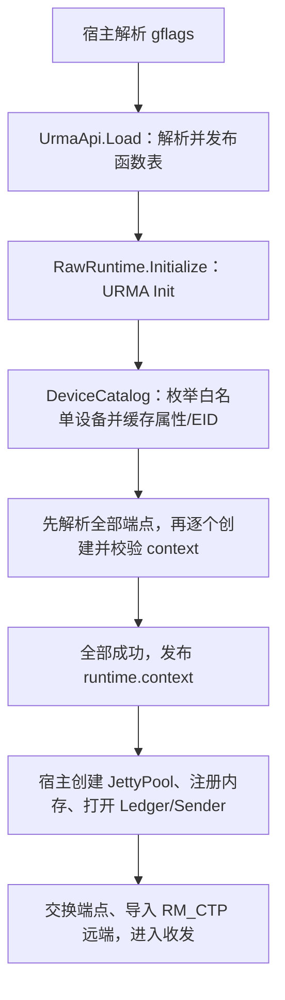

# 当前 Raw 传输流程

[文档入口](README.md)

目前已实现显式裸设备选择、context 生命周期、共享队列池，普通 SEND 的提交和 TX 完成回收，以及 RX buffer 池。双端工具把这些组件与测试用 TCP 控制协议、内存注册和接收循环串成了硬件验证闭环。正式连接协议与 socket/epoll 接入仍未实现；RX 内存管理已进入 raw 层，工具中的控制协议和 payload 校验仍属于测试逻辑。单 SQ TX 排空已通过用户的硬件测试，RX 故障排空尚未实现。

## 组件与所有权

| 组件                  | 拥有的资源                                                      | 借用或引用的资源                      |
|-----------------------|-----------------------------------------------------------------|---------------------------------------|
| UrmaApi               | 动态库加载引用、唯一函数表                                      | 不接管业务硬件资源                    |
| RawRuntime            | URMA 会话、DeviceCatalog、各设备的 UrmaContext                  | 宿主已加载的库                        |
| DeviceCatalog         | 设备属性、EID/index 快照                                        | URMA 会话中的 device 指针             |
| UrmaContext           | 一个通过 EID/index 校验的 context；失败时可能保留待清理 context | 对应设备                              |
| JettyPool             | TX JFC、RX JFC、共享 JFR、多个 jetty、票据槽                    | context                               |
| AttemptLedger         | 固定容量的 attempt 记录                                         | pool、目标指针、buffer/grant 租约标识 |
| TxSender              | 最多 256 条 WR 的固定描述符数组                                 | ledger                                |
| TxCompletionProcessor | 最多 64 条 CQE 的固定轮询数组                                   | ledger 及其 pool                      |
| RxBufferPool          | 4 KiB buffer slab、注册段、接收 WR 和 lease 状态                | JettyPool 及其 context               |
| SendTestSession       | 池、账本、发送器、注册内存和远端导入等测试资源                  | runtime 提供的 context                |

RawRuntime 不包含 JettyPool，账本也不会因保存租约标识而自动管理实际内存。宿主必须使被借用的资源活到最后一次访问和 DMA 终结之后。队列、账本、post 和 poll 由同一 owner 串行推进，不允许并发或重入。

## 初始化路径

四个裸设备配置为四个 `DeviceConfig`，每项选择一个实际 `eid_index`，对应一个 context；当前没有四设备自动调度或故障迁移。目录只在初始化时查询 EID，收发路径不重复枚举。`RawRuntime::context(index)` 的 index 是配置顺序，和 provider 的 EID 索引是两回事。

`UrmaContext::Open` 成功才对外提供可用 context；实际 EID/index 不符时立即尝试删除。删除失败仍保留所有权供后续 Close，但不会通过 get 暴露该 context。初始化回滚同时保留原始错误和清理错误。

会话及退出契约见 [URMA 运行时](urma-runtime.md)，缓存边界见 [DeviceCatalog](device-catalog-reference.md)。

## 一轮双端 SEND

以下对应 [send_test.cpp](../tools/send_test/send_test.cpp) 的现有实现，不是尚未完成的正式连接层。

1. 两端准备一个 jetty、一个共享 JFR 和独立 TX/RX JFC，注册按系统页对齐的内存。工具显式将 TX/RX 深度设为 batch，TX CQ 设为 batch+1。
2. TCP 交换 EID、jetty ID 和测试参数；发送端导入对端 RM_CTP jetty。TCP 地址用于控制通信，EID 用于 UB 数据传输。
3. 接收端通过 `RxBufferPool::Refill(count)` 向 JFR 投递本轮接收 buffer，然后经 TCP 发出 READY。
4. 发送端填充 payload，`TxSender::Send` 通过账本预留整批额度，将 AttemptId 写入 WR 的 user_ctx，再 post 到同一 SQ。每条 WR 可独立指定目标；连接并不独占 jetty。
5. 发送端用 `TxCompletionProcessor::Poll` 处理 TX CQE。合法终结完成通过账本归还池额度，并返回原操作和资源引用。
6. 接收端通过 `RxBufferPool::Poll` 获得完成事件与 lease，检查长度、消息序号及 payload，归还全部 lease 后经 TCP 返回 ACK。
7. 发送端等待本轮所有 TX attempt 退休且收到远端校验 ACK，才复用 buffer 进入下一轮。最后完成控制握手并显式清理。

提交成功、TX 完成、远端 payload 校验是三个不同阶段。TX CQE 不代替远端应用确认。工具的逐批 READY/ACK 避免接收额度不足，因此不能用它推断吞吐、延迟或背压表现。

发送组件之间的调用和失败处理见 [TX 数据路径](tx-pipeline.md)；接收内存及 lease 见 [RX buffer 池](rx-buffer-pool.md)；队列容量、票据和故障隔离见 [JettyPool](jetty-pool.md)。

## 退出路径

正常顺序是停止新操作、排空在途收发、关闭发送器和账本、解除远端导入、关闭 RX buffer 池并注销接收内存、关闭队列池、注销发送内存，再关闭 runtime（context → Uninit），最后 Unload。具体子资源顺序由其依赖决定，不能只看到发送器 Close 就释放 buffer。

出现无法确定接受范围、未终结 DMA 或清理失败时，必须保留依赖资源，不能强行清空账本。测试工具将这类情况判为失败；当前支持 modify ERROR、等待硬件边界、软件 flush 的单 SQ 排空，详见 [TX 故障排空](tx-pipeline.md#error-continue-与单-sq-故障排空)。不自动重放或在线恢复，接受范围不可信的 Prepared 记录仍保留。

对于不能确认 worker 已停止访问的进程退出路径，`GetRawRuntime()` 使用 NoDestructor 避免自动关闭 context。池、账本、注册内存和目标等关联资源也必须保持存活；仅让 runtime 常驻并不足够。显式 Close 仍要求调用方先完成停止和排空协议。

## 已验证范围

用户已反馈按 SEND README 的三组配置在真实双端环境通过：

| 每条字节数 | 总消息数 | batch | 主要覆盖                        |
|------------|----------|-------|---------------------------------|
| 4096       | 1        | 1     | 单条 SEND 闭环                  |
| 4096       | 1000     | 32    | 多轮额度/内存复用及最后不足一批 |
| 4096       | 1024     | 256   | 当前 256 条批次上限             |

接收端报告 payload validated，发送端报告 TX and remote RX confirmed。这支持当前配置下初始化、普通 SEND、完成回收、数据校验和正常清理路径可用。记录来自用户硬件运行反馈，本地未重复进行硬件测试；尚未记录设备型号、驱动/URMA 版本及对应提交号。上述记录早于接入 RxBufferPool，新接收实现尚待同配置硬件回归。

独立 TX 排空工具另已获得用户反馈：accepted=retired=256，ACK_TIMEOUT_ERR=253、RNR_RETRY_CNT_EXC_ERR=3、flush_done=1，ERROR SQ 拒绝新发送且两端资源关闭。该次运行没有非零 FLUSH_ERR 或 WR_UNHANDLED。

未据此验证的能力包括多设备/多远端并行、持续无批间屏障收发、EAGAIN 到 EPOLLOUT 唤醒、非零软件 flush、异步事件及 RX 故障排空。单元测试中的故障注入用于验证代码契约，不能替代这些硬件专项测试。
