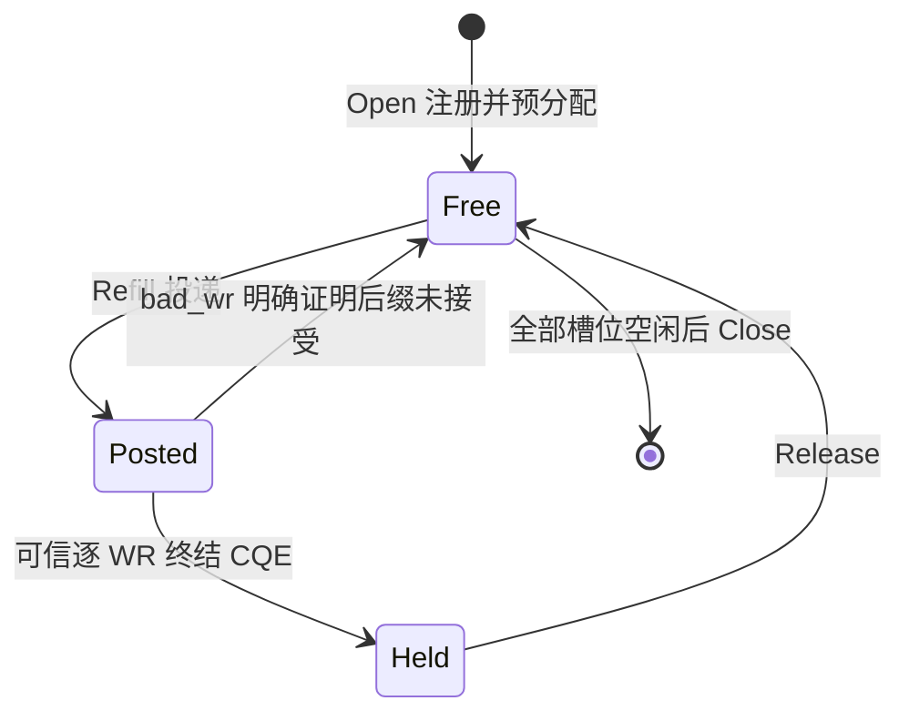

# RX buffer 池

[文档入口](README.md) · [当前 Raw 流程](raw-transport-flow.md)

`RxBufferPool` 为一个 `JettyPool` 的共享 JFR 管理接收内存、投递和完成后的 buffer lease。它是物理接收资源层，不识别逻辑连接，不负责 SN 重排、分片重组或 socket 可读通知。这些边界见 [设计文档第 6 节](design/kbsocket-design-v1.md)。

源码为 [rx_buffer_pool.hpp](../kbsocket/transport/raw/rx_buffer_pool.hpp) 和 [rx_buffer_pool.cpp](../kbsocket/transport/raw/rx_buffer_pool.cpp)，Bazel 依赖 `//kbsocket/transport/raw:rx_buffer_pool`。

## 资源与状态

每个 buffer 固定 4096 字节。`Open(pool, buffer_count)` 一次分配页对齐的 slab，注册地址和长度按系统页对齐，以 READ | WRITE | ATOMIC 权限注册。`buffer_count=0` 默认取 JFR 的 `rx_depth`；可多配 buffer，让上层持有部分数据时仍有空闲 buffer 可补入。

无论配置多少 buffer，在途 WR 都不超过 JFR 深度。`available()` 是空闲内存数量，不等于当前还能投递的 WR 数量；上层的连接接收额度还必须考虑重排、应用持有和其他连接占用，本层计数不能直接作为某个连接的 credit。



所有操作由同一 owner 串行推进，不支持并发或重入。WR/SGE 数组固定为 256 条，poll 暂存数组固定为 64 条；投递、轮询和归还路径不分配内存、不加锁。每个 JFR 只能绑定一个 `RxBufferPool`；绑定后禁止绕过它直接调用 `PostJfrWr` 或 `JettyPool::PollRecv`，否则会破坏额度和完成所有权。

## 调用流程

1. 创建 `JettyPool`，调用 `RxBufferPool::Open(pool)` 注册接收内存。
2. 调用 `Refill(limit)`，最多投递 `min(limit, available(), rx_depth - posted())` 条，`limit` 范围为 1–256。深度更大时分批补充。
3. 调用 `Poll(events)`；返回值是已消费 CQE 对应的事件数，最多 64。逐个检查事件的 `error`、`lease` 与 `payload`。
4. 成功 SEND / SEND_WITH_IMM 的 `payload` 只覆盖 `completion_len` 字节，原始完成记录保留 IMM、远端 ID 等元数据。连接层可以暂存 lease 和 span，等待重排或上层消费。
5. 数据使用完毕后由 owner 调用 `Release(lease)`，再由 `Refill` 补投。`Release` 不隐式调用 provider。

Lease 是校验身份，不是 `shared_ptr`；复制不增加引用计数，只能归还一次。归还后该 lease 的所有副本和 payload span 都失效，不能继续读数据。WR 的 `user_ctx` 包含槽位和递增身份，重复 CQE、迟到 CQE、重复归还、同一对象重新 Open 后的旧 lease 都不能释放当前 buffer。对象本身不能在还有使用者时析构后原址重建。

## 错误与关闭

- `Refill` 返回 0 表示没有空闲 buffer 或 JFR 已满。provider 返回有效 `bad_wr` 时，错误中的 `accepted` 给出已接受前缀，只回收拒绝后缀；EAGAIN 可以在后续进度后重试，其他 post 错误停止新投递。
- 若返回值与 `bad_wr` 矛盾、缺少失败边界或指向批次外，返回 `kProviderContract`、`accepted=nullopt`，停止投递并保留整批内存。只有后续可信终结 CQE 才能使相应 buffer 进入 Held。
- `Poll` 验证 RX 方向、所属 jetty/JFR、逐 WR 终结状态和 buffer 身份。fake CQE 不使用 `user_ctx`，不释放 buffer；未知或重复 CQE 同样不能产生 lease。
- 可信错误完成仍交出 lease，但没有 payload；长度越界或不支持的接收 opcode 也不会暴露数据。调用方必须归还这些 lease。遇到异常会停止新投递，但继续处理同批其他 CQE，后续仍允许 poll/release。
- `Stop()` 仅关闭软件投递入口。它不取消已投递 WR，也不自动切 JFR ERROR。
- `Close()` 要求 `posted()==0 && held()==0`。内存注销成功后才释放 slab 并解绑 JettyPool；注销失败保留资源供重试，并禁止再次投递。JettyPool 在 RX 池仍绑定时返回 `kInUse`。

**RX 硬件故障排空尚未实现。** 空 CQ、对端断开或 TX 的 FLUSH_ERR_DONE 都不证明 RX buffer 安全；不能推测回收仍在 Posted 的槽位。若剩余 WR 没有终结证据，调用方须保留 RX 池、JettyPool、context 和 URMA 会话到进程退出。析构清理失败会记录日志并保留 DMA slab，但不代替让整个依赖链常驻的退出契约。

## 验证

```sh
bazel test //kbsocket/transport/raw:rx_buffer_pool_test //tools/send_test:send_test_test
bazel build //tools/send_test:send_test
```

单元测试使用 gMock，覆盖持有期间不复用、接收额度、乱序/重复/迟到完成、IMM 保留、部分 post、边界不明、错误完成、注册回滚和注销重试。SEND 工具服务端已使用本组件，每轮只投递本轮所需 WR，校验后归还 lease，因而正常结束时不会遗留未使用的接收 WR。

此前三组 SEND 硬件 PASS 属于工具直接管理 RX buffer 的实现；接入本组件后仍需重新运行同样三组配置。当前不包含分片、连接重排或无批间屏障的持续收发验证。
