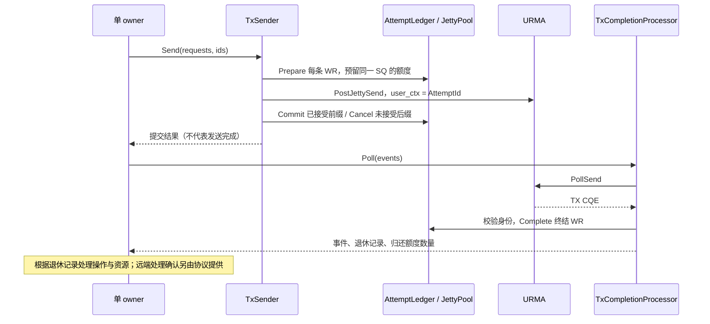

# TX 提交、记账与完成回收

[文档入口](README.md) · [当前代码流程](raw-transport-flow.md)

三个组件共用同一个 owner，分别承担以下职责：

| 组件                                                                           | 负责                                      | 不负责                             |
|--------------------------------------------------------------------------------|-------------------------------------------|------------------------------------|
| [AttemptLedger](../kbsocket/transport/raw/attempt_ledger.hpp)                  | 将 AttemptId 关联到池票据、操作和资源引用 | 投递、解析 CQE、释放真实 buffer    |
| [TxSender](../kbsocket/transport/raw/tx_sender.hpp)                            | 整批预留、构造 WR、post、按接受前缀记账   | poll、自动重试、socket 可写通知    |
| [TxCompletionProcessor](../kbsocket/transport/raw/tx_completion_processor.hpp) | poll TX JFC、核验身份、退休终结 WR        | 远端业务 ACK、软件 flush、故障恢复 |

## 容量与背压的读法

`Prepare` 同时需要账本槽位和 SQ 额度。当前 Sender 要求整批放入同一 SQ；即使池的总剩余额度足够，也可能因选中的 SQ 放不下整批而在 post 前失败。调用方应保留未提交工作，推进完成后再决定何时提交。

单 SQ 的 `tx_depth=256` 限制同时预留/在途的 WR 数量；若每条 WR 是 4 KiB，对应这一时刻最多 1 MiB，并不是连接累计发送量或协议消息大小的上限。持续 poll、回收额度后可以继续发送。拆批及大消息分片仍由上层完成。

已知接受边界的 `URMA_EAGAIN` 是普通提交失败，不会独自令 `blocked_` 置位。`blocked_` 表示接受范围不可信或内部记账失败，此时不能通过重新 Open 就认为旧请求已安全消失。当前没有 `errno=EAGAIN` 的 socket 适配、等待队列或 `NotifyWritable()`；退休额度只是后续实现可写通知的输入。

## AttemptLedger 发送账本

Bazel 目标为 `//kbsocket/transport/raw:attempt_ledger`。账本绑定一个 JettyPool，由相同 owner 推进。`Open(pool, capacity)` 预分配固定数量记录；容量不足在 post 前失败，不动态扩容。通常按池内发送额度总量设置容量。

使用顺序：

1. `Prepare(metadata, optional_lane)` 预留账本和 SQ 额度，返回可写入 WR `user_ctx` 的 `AttemptId`。通过 `Lookup(id)` 读取 ticket，使用 `pool.Get(ticket.lane)` 取得队列。Prepare 失败不接管目标和资源引用。
2. 提交层将 metadata 对应目标、opcode 写入 WR，确保启用完成通知，执行 post；已接受部分调用 `Commit(id, submission_sequence)`，未接受后缀调用 `Cancel(id)`。预留顺序不等于实际提交顺序，提交位置由提交层明确传入。
3. 完成层确认某条 WR 已终结且 DMA 不再访问其资源后调用 `Complete(id)`，取得原始记录，再分发结果并处理 buffer/grant 租约。SQ 额度归还不代表协议 grant 自动撤销；远端授权生命周期仍由上层协议决定。

记录保存连接、操作及其代次、远端目标、opcode、buffer/grant 租约标识，以及 lane epoch、票据、逻辑提交位置。尚无统一资源租约实现，因此账本保存的是引用标识，不会自动释放内存或 unimport 目标。上层资源表必须保持引用直到返回退休记录，且根据协议判断是否可以真正回收。

AttemptId 在同一账本对象存活期间单调增加且不回绕，Close/Open 不重置，按容量取模直接定位槽位；预留跳过仍占用的槽，最坏扫描 capacity 次，查询和退休为 O(1)。不同账本的 id 不保证唯一，CQ 路由必须先确定所属账本；票据仅经账本流转，不能再直接调用池的 Commit/Cancel/Complete。

首版只接受全 signal 记录，不解析 CQE 状态、不自动 post、不实现 selective signaling 或累计成功推导。连接关闭、队列故障、`FLUSH_ERR_DONE` 本身都不能触发账本整体清空。Close 在有预留或在途记录时拒绝关闭；进程退出仍有工作线程时，账本、队列及资源表必须一起常驻。对象销毁后不得再使用旧 id。

## TxSender SEND 提交器

Bazel 目标为 `//kbsocket/transport/raw:tx_sender`。同一个账本由一个 TxSender 管理提交顺序，与 post、poll、账本修改共用单 owner。WR 描述符内嵌于 `std::array`，`Open(ledger)` 仅绑定账本，不分配内存；单次请求数量由调用方传入的 span 决定，硬上限 `TxSender::kMaxBatch = 256` 对齐 UMQ 的 `UMQ_BATCH_SIZE`；之后 `Send(requests, ids, optional_lane)` 不分配内存、不加锁、不自动重试。单条发送使用长度为 1 的 span。

每条请求携带 AttemptMetadata 和本地已注册内存的 SGE。首版仅支持普通非 inline SEND，强制全 signal，不支持 SEND_WITH_IMM、READ/WRITE 或 jetty group。目标必须由宿主正确导入为当前 context 的 RM_CTP 端点，注册段、payload 和目标必须覆盖在途 attempt 生命周期；SGE 描述符仅需覆盖 Send 调用。

一批 WR 在同一个 SQ 上 post，逐条设置远端目标和 `user_ctx = AttemptId`。未指定 lane 时由第一个预留选择 SQ，余下请求固定在该 SQ 上预留；不会跨 SQ 拆分或因容量不足自动换队列。整批预留失败时撤销本批已有预留，不调用 provider；不会影响此前已在途的记录。

调用方预分配至少 requests.size() 个 ids。正常成功返回提交数量；普通 post 失败返回 `TxSendError`，其中 accepted 是硬件已接受的前缀长度，provider_status 保留原始返回值。前缀完成 Commit 并保留 id；后缀被 Cancel，对应 id 为 0，可以由上层决定是否再次提交。发送器只归还未接受请求的额度，不自动释放任何 buffer/grant，也不回放已接受前缀。完成层仍通过账本处理返回 id 对应的最终结果。

输入长度或就绪状态检查失败时 ids 不变；通过这些检查后对应范围会清零并填入仍保留的记录身份。不要将上一批仍需使用的 ids 缓冲区作为下一批输出，须先将其转存到操作记录。不能把 expected 失败统一理解为“零条被接受”。

若 provider 失败却没有有效 `bad_wr`，或成功时返回了矛盾的 `bad_wr`，accepted 为 nullopt：整批身份与 Prepared 记录都保留，SQ 标记故障，发送器停止发送。此时不能自动 Cancel 或重试整批，需获得可信的未提交/终结证据后恢复。记账异常同样保留非零 id 并停止发送。调用方不得在 provider 回调中操作账本或票据；调用方负责保证单 owner 且不可重入，Send 执行期间不得调用 Open/Close，内部不做重入检查。

TxSender 的 Close 只解除绑定，不退休账本请求；关闭提交器后在途 buffer、目标、账本和池仍须继续存活。更换或重新打开账本前先关闭提交器。TX CQE 由下述 TxCompletionProcessor 处理；资源仍由上层回收；基础 SEND 成功路径已通过 [双端硬件测试](../tools/send_test/README.md)，不代表错误和排空路径也已完成硬件验证。

## TX completion 推进与额度回收

`//kbsocket/transport/raw:tx_completion_processor` 提供 `TxCompletionProcessor(ledger)`。同一个 owner 使用它独占消费所属池的 TX JFC，传入预分配的 `TxCompletionEvent` 数组调用 `Poll(events)`，每次最多处理 64 条。内部 CQE 数组固定存储，无动态分配、业务回调或互斥锁。账本必须管理该 TX CQ 的全部 attempt；不能用多个独立账本复用同一 CQ 并各自轮询。

Poll 的 expected 错误表示本次未成功取得 CQE；成功结果包含 `count` 和 `retired`。每个已取出的 CQE 都对应一个输出事件，单条异常不会让后续有效 CQE 被丢弃：

- `kCompleted`：已按 user_ctx、local_id、lane epoch 验证归属，并执行 ledger.Complete 归还额度。record 保存原始连接、操作和资源引用；completion.status 区分成功和具体 WR 错误。仅此类事件增加 retired。
- `kFlushDone` / `kSuspendDone`：公共 URMA 状态定义中的假 CQE 边界，user_ctx 无效；输出中将其清零，不查账本、不退休其他 WR。
- `kRejected`：方向/对象类型不符、未知队列、重复或未知 id、通道不匹配、未提交记录或不支持的状态。原始 CQE 与错误信息交给上层诊断，不猜测完成范围、不释放其资源。

任何已定位 SQ 上的非成功 CQE 都保守隔离该 SQ，首版不做 suspend/resume 或在线恢复；其他在途 WR 仍需各自的终结证据。已隔离队列仍可通过 local_id 查找并处理尾部完成。`WR_FLUSH_ERR` 是具体 WR 的终结错误，可退休对应记录；`FLUSH_ERR_DONE` 不能推导整个账本已经排空。`WR_UNHANDLED` 属于显式 urma_flush_jetty 返回语义，不作为普通 poll 的终结依据。

此层尚不执行软件 flush、处理异步事件或销毁故障队列；收到边界事件后若仍有残留记录，必须保留资源，交由后续故障排空流程处理。错误完成不是连接级 ACK，也不能自动宣称同 SQ 上其他连接全部失败或全部完成。

正常发送闭环为 `TxSender.Send → provider → TxCompletionProcessor.Poll → ledger.Complete → pool 额度归还`。上层可在 retired 非零后推进发送等待队列；这只是资源变化，不保证某个 socket 已满足所有可写条件。当前未接 socket/epoll 的 NotifyWritable，也不自动释放 buffer/grant 或重试未提交工作。
